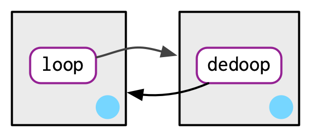

# Environments

### Exercises 7.2.7

**Q1.** List three ways in which an environment differs from a list.

**Q2.** Create an environment as illustrated by this picture.

```{r, echo = FALSE, out.width = NULL}
knitr::include_graphics("diagrams/environments/recursive-1.png")
```

**Q3.** Create a pair of environments as illustrated by this picture.

```{r, echo = FALSE, out.width = NULL}

```

**Q4.** Explain why `e[[1]]` and `e[c("a", "b")]` don't make sense when `e` is an environment.

**Q5.** Create a version of `env_poke()` that will only bind new names, never re-bind old names. Some programming languages only do this, and are known as [single assignment languages][https://en.wikipedia.org/wiki/Assignment_(computer_science)#Single_assignment].

**Q6.** What does this function do? How does it differ from `<<-` and why might you prefer it?
    
```{r, error = TRUE}
rebind <- function(name, value, env = caller_env()) {
  if (identical(env, empty_env())) {
    stop("Can't find `", name, "`", call. = FALSE)
  } else if (env_has(env, name)) {
    env_poke(env, name, value)
  } else {
    rebind(name, value, env_parent(env))
  }
}
rebind("a", 10)
a <- 5
rebind("a", 10)
a
```

### Exercises 7.3.1

**Q1.** Modify `where()` to return _all_ environments that contain a binding for `name`. Carefully think through what type of object the function will need to return.

**Q2.** Write a function called `fget()` that finds only function objects. It  should have two arguments, `name` and `env`, and should obey the regular scoping rules for functions: if there's an object with a matching name that's not a function, look in the parent. For an added challenge, also add an `inherits` argument which controls whether the function recurses up the parents or only looks in one environment.

### Exercises 7.4.5

**Q1.** How is `search_envs()` different from `env_parents(global_env())`?

**Q2.** Draw a diagram that shows the enclosing environments of this function:

```{r, eval = FALSE}
f1 <- function(x1) {
  f2 <- function(x2) {
    f3 <- function(x3) {
      x1 + x2 + x3
    }
    f3(3)
  }
  f2(2)
}
f1(1)
```

**Q3.** Write an enhanced version of `str()` that provides more information about functions. Show where the function was found and what environment it was defined in.

### Exercises 7.5.5

**Q1.** Write a function that lists all the variables defined in the environment in which it was called. It should return the same results as `ls()`.
