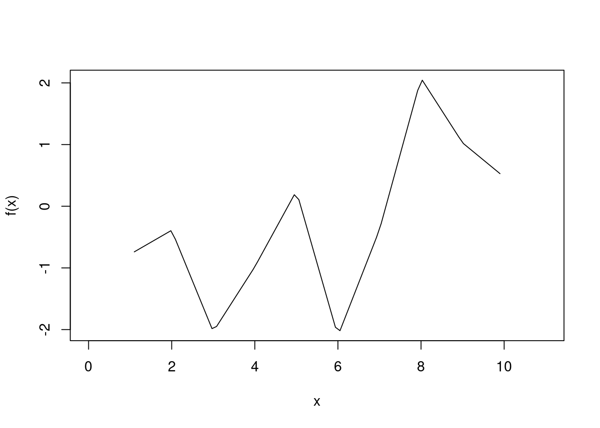
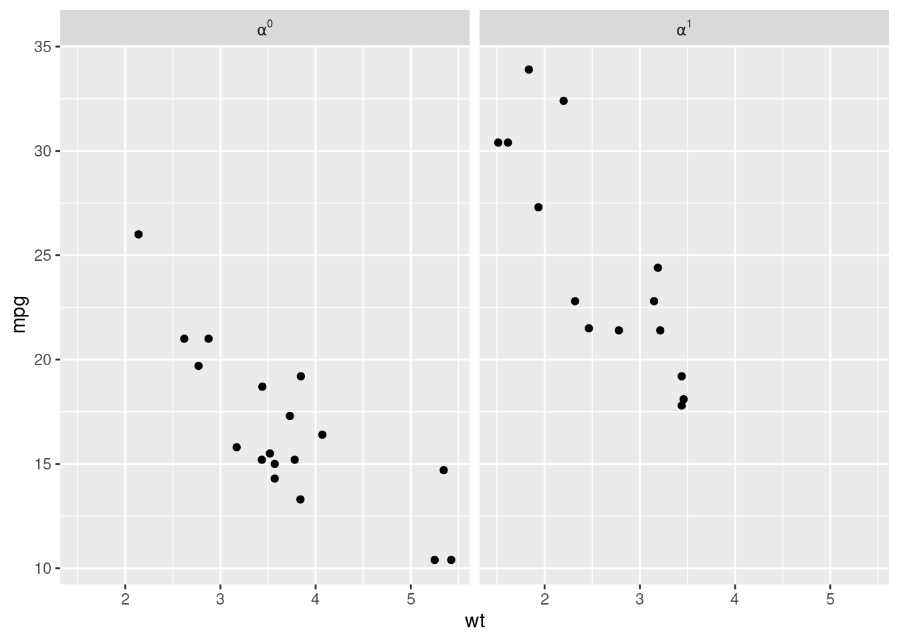
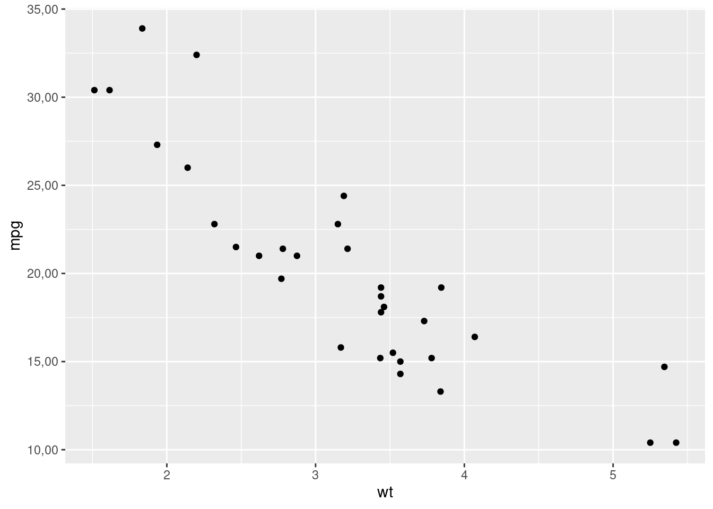
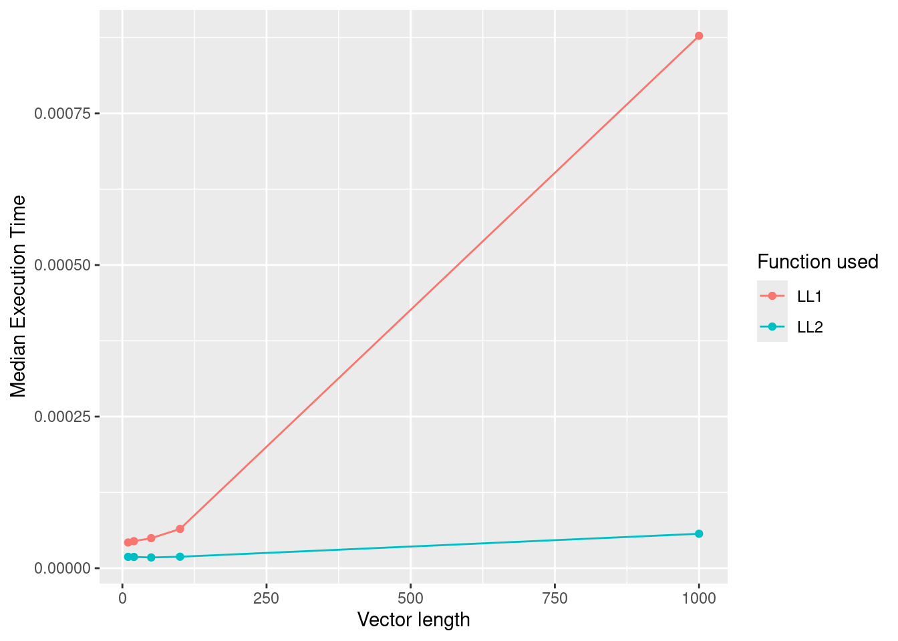

# Function factories


Attaching the needed libraries:


``` r
library(rlang, warn.conflicts = FALSE)
library(ggplot2, warn.conflicts = FALSE)
```

## Factory fundamentals (Exercises 10.2.6)

---

**Q1.** The definition of `force()` is simple:


``` r
force
#> function (x) 
#> x
#> <bytecode: 0x5560fe19ae00>
#> <environment: namespace:base>
```

Why is it better to `force(x)` instead of just `x`?

**A1.** Due to lazy evaluation, argument to a function won't be evaluated until its value is needed. But sometimes we may want to have eager evaluation, and using `force()` makes this intent clearer.

---

**Q2.** Base R contains two function factories, `approxfun()` and `ecdf()`. Read their documentation and experiment to figure out what the functions do and what they return.

**A2.** About the two function factories-

- `approxfun()`

This function factory returns a function performing the linear (or constant) interpolation.


``` r
x <- 1:10
y <- rnorm(10)
f <- approxfun(x, y)
f
#> function (v) 
#> .approxfun(x, y, v, method, yleft, yright, f, na.rm)
#> <bytecode: 0x556102bf3860>
#> <environment: 0x556102bf6d28>
f(x)
#>  [1] -0.7786629 -0.3894764 -2.0337983 -0.9823731  0.2478901
#>  [6] -2.1038646 -0.3814180  2.0749198  1.0271384  0.4730142
curve(f(x), 0, 11)
```



- `ecdf()`

This function factory computes an empirical cumulative distribution function.


``` r
x <- rnorm(12)
f <- ecdf(x)
f
#> Empirical CDF 
#> Call: ecdf(x)
#>  x[1:12] = -1.8793, -1.3221, -1.2392,  ..., 1.1604, 1.7956
f(seq(-2, 2, by = 0.1))
#>  [1] 0.00000000 0.00000000 0.08333333 0.08333333 0.08333333
#>  [6] 0.08333333 0.08333333 0.16666667 0.25000000 0.25000000
#> [11] 0.33333333 0.33333333 0.33333333 0.41666667 0.41666667
#> [16] 0.41666667 0.41666667 0.50000000 0.58333333 0.58333333
#> [21] 0.66666667 0.75000000 0.75000000 0.75000000 0.75000000
#> [26] 0.75000000 0.75000000 0.75000000 0.75000000 0.83333333
#> [31] 0.83333333 0.83333333 0.91666667 0.91666667 0.91666667
#> [36] 0.91666667 0.91666667 0.91666667 1.00000000 1.00000000
#> [41] 1.00000000
```

---

**Q3.** Create a function `pick()` that takes an index, `i`, as an argument and returns a function with an argument `x` that subsets `x` with `i`.


``` r
pick(1)(x)
# should be equivalent to
x[[1]]

lapply(mtcars, pick(5))
# should be equivalent to
lapply(mtcars, function(x) x[[5]])
```

**A3.** To write desired function, we just need to make sure that the argument `i` is eagerly evaluated.


``` r
pick <- function(i) {
  force(i)
  function(x) x[[i]]
}
```

Testing it with specified test cases:


``` r
x <- list("a", "b", "c")
identical(x[[1]], pick(1)(x))
#> [1] TRUE

identical(
  lapply(mtcars, pick(5)),
  lapply(mtcars, function(x) x[[5]])
)
#> [1] TRUE
```

---

**Q4.** Create a function that creates functions that compute the i^th^ [central moment](http://en.wikipedia.org/wiki/Central_moment) of a numeric vector. You can test it by running the following code:


``` r
m1 <- moment(1)
m2 <- moment(2)
x <- runif(100)
stopifnot(all.equal(m1(x), 0))
stopifnot(all.equal(m2(x), var(x) * 99 / 100))
```

**A4.** The following function satisfied the specified requirements:


``` r
moment <- function(k) {
  force(k)

  function(x) (sum((x - mean(x))^k)) / length(x)
}
```

Testing it with specified test cases:


``` r
m1 <- moment(1)
m2 <- moment(2)
x <- runif(100)

stopifnot(all.equal(m1(x), 0))
stopifnot(all.equal(m2(x), var(x) * 99 / 100))
```

---

**Q5.** What happens if you don't use a closure? Make predictions, then verify with the code below.


``` r
i <- 0
new_counter2 <- function() {
  i <<- i + 1
  i
}
```

**A5.** In case closures are not used in this context, the counts are stored in a global variable, which can be modified by other processes or even deleted.


``` r
new_counter2()
#> [1] 1

new_counter2()
#> [1] 2

new_counter2()
#> [1] 3

i <- 20
new_counter2()
#> [1] 21
```

---

**Q6.** What happens if you use `<-` instead of `<<-`? Make predictions, then verify with the code below.


``` r
new_counter3 <- function() {
  i <- 0
  function() {
    i <- i + 1
    i
  }
}
```

**A6.**  In this case, the function will always return `1`.


``` r
new_counter3()
#> function() {
#>     i <- i + 1
#>     i
#>   }
#> <environment: 0x556102add700>

new_counter3()
#> function() {
#>     i <- i + 1
#>     i
#>   }
#> <bytecode: 0x556102c74290>
#> <environment: 0x556102b4d520>
```

---

## Graphical factories (Exercises 10.3.4)

---

**Q1.** Compare and contrast `ggplot2::label_bquote()` with `scales::number_format()`.

**A1.** To compare and contrast, let's first look at the source code for these functions:

- `ggplot2::label_bquote()`


``` r
ggplot2::label_bquote
#> function (rows = NULL, cols = NULL, default) 
#> {
#>     cols_quoted <- substitute(cols)
#>     rows_quoted <- substitute(rows)
#>     call_env <- env_parent()
#>     fun <- function(labels) {
#>         quoted <- resolve_labeller(rows_quoted, cols_quoted, 
#>             labels)
#>         if (is.null(quoted)) {
#>             return(label_value(labels))
#>         }
#>         evaluate <- function(...) {
#>             params <- list(...)
#>             params <- as_environment(params, call_env)
#>             eval(substitute(bquote(expr, params), list(expr = quoted)))
#>         }
#>         list(inject(mapply(evaluate, !!!labels, SIMPLIFY = FALSE)))
#>     }
#>     structure(fun, class = "labeller")
#> }
#> <bytecode: 0x556102fa3218>
#> <environment: namespace:ggplot2>
```

- `scales::number_format()`


``` r
scales::number_format
#> function (accuracy = NULL, scale = 1, prefix = "", suffix = "", 
#>     big.mark = " ", decimal.mark = ".", style_positive = c("none", 
#>         "plus", "space"), style_negative = c("hyphen", "minus", 
#>         "parens"), scale_cut = NULL, trim = TRUE, ...) 
#> {
#>     force_all(accuracy, scale, prefix, suffix, big.mark, decimal.mark, 
#>         style_positive, style_negative, scale_cut, trim, ...)
#>     function(x) {
#>         number(x, accuracy = accuracy, scale = scale, prefix = prefix, 
#>             suffix = suffix, big.mark = big.mark, decimal.mark = decimal.mark, 
#>             style_positive = style_positive, style_negative = style_negative, 
#>             scale_cut = scale_cut, trim = trim, ...)
#>     }
#> }
#> <bytecode: 0x5561037e98f8>
#> <environment: namespace:scales>
```

Both of these functions return formatting functions used to style the facets labels and other labels to have the desired format in `{ggplot2}` plots.

For example, using plotmath expression in the facet label:


``` r
library(ggplot2)

p <- ggplot(mtcars, aes(wt, mpg)) +
  geom_point()
p + facet_grid(. ~ vs, labeller = label_bquote(cols = alpha^.(vs)))
```



Or to display axes labels in the desired format:


``` r
library(scales)

ggplot(mtcars, aes(wt, mpg)) +
  geom_point() +
  scale_y_continuous(labels = number_format(accuracy = 0.01, decimal.mark = ","))
```



The `ggplot2::label_bquote()` adds an additional class to the returned function.

The `scales::number_format()` function is a simple pass-through method that forces evaluation of all its parameters and passes them on to the underlying `scales::number()` function.

---

## Statistical factories (Exercises 10.4.4)

---

**Q1.** In `boot_model()`, why don't I need to force the evaluation of `df` or `model`?

**A1.** We don’t need to force the evaluation of `df` or `model` because these arguments are automatically evaluated by `lm()`:


``` r
boot_model <- function(df, formula) {
  mod <- lm(formula, data = df)
  fitted <- unname(fitted(mod))
  resid <- unname(resid(mod))
  rm(mod)

  function() {
    fitted + sample(resid)
  }
}
```

---

**Q2.** Why might you formulate the Box-Cox transformation like this?


``` r
boxcox3 <- function(x) {
  function(lambda) {
    if (lambda == 0) {
      log(x)
    } else {
      (x^lambda - 1) / lambda
    }
  }
}
```

**A2.** To see why we formulate this transformation like above, we can compare it to the one mentioned in the book:


``` r
boxcox2 <- function(lambda) {
  if (lambda == 0) {
    function(x) log(x)
  } else {
    function(x) (x^lambda - 1) / lambda
  }
}
```

Let's have a look at one example with each:


``` r
boxcox2(1)
#> function(x) (x^lambda - 1) / lambda
#> <environment: 0x5561040d4bc8>

boxcox3(mtcars$wt)
#> function(lambda) {
#>     if (lambda == 0) {
#>       log(x)
#>     } else {
#>       (x^lambda - 1) / lambda
#>     }
#>   }
#> <environment: 0x556103e568b0>
```

As can be seen:

- in `boxcox2()`, we can vary `x` for the same value of `lambda`, while 
- in `boxcox3()`, we can vary `lambda` for the same vector. 

Thus, `boxcox3()` can be handy while exploring different transformations across inputs.

---

**Q3.** Why don't you need to worry that `boot_permute()` stores a copy of the data inside the function that it generates?

**A3.** If we look at the source code generated by the function factory, we notice that the exact data frame (`mtcars`) is not referenced:


``` r
boot_permute <- function(df, var) {
  n <- nrow(df)
  force(var)

  function() {
    col <- df[[var]]
    col[sample(n, replace = TRUE)]
  }
}

boot_permute(mtcars, "mpg")
#> function() {
#>     col <- df[[var]]
#>     col[sample(n, replace = TRUE)]
#>   }
#> <environment: 0x5561001d0920>
```

This is why we don't need to worry about a copy being made because the `df` in the function environment points to the memory address of the data frame. We can confirm this by comparing their memory addresses:


``` r
boot_permute_env <- rlang::fn_env(boot_permute(mtcars, "mpg"))
rlang::env_print(boot_permute_env)
#> <environment: 0x556101ab0ec0>
#> Parent: <environment: global>
#> Bindings:
#> • n: <int>
#> • df: <df[,11]>
#> • var: <chr>

identical(
  lobstr::obj_addr(boot_permute_env$df),
  lobstr::obj_addr(mtcars)
)
#> [1] TRUE
```

We can also check that the values of these bindings are the same as what we entered into the function factory:


``` r
identical(boot_permute_env$df, mtcars)
#> [1] TRUE
identical(boot_permute_env$var, "mpg")
#> [1] TRUE
```

---

**Q4.** How much time does `ll_poisson2()` save compared to `ll_poisson1()`? Use `bench::mark()` to see how much faster the optimisation occurs. How does changing the length of `x` change the results?

**A4.** Let's first compare the performance of these functions with the example in the book:


``` r
ll_poisson1 <- function(x) {
  n <- length(x)

  function(lambda) {
    log(lambda) * sum(x) - n * lambda - sum(lfactorial(x))
  }
}

ll_poisson2 <- function(x) {
  n <- length(x)
  sum_x <- sum(x)
  c <- sum(lfactorial(x))

  function(lambda) {
    log(lambda) * sum_x - n * lambda - c
  }
}

x1 <- c(41, 30, 31, 38, 29, 24, 30, 29, 31, 38)

bench::mark(
  "LL1" = optimise(ll_poisson1(x1), c(0, 100), maximum = TRUE),
  "LL2" = optimise(ll_poisson2(x1), c(0, 100), maximum = TRUE)
)
#> # A tibble: 2 × 6
#>   expression      min   median `itr/sec` mem_alloc `gc/sec`
#>   <bch:expr> <bch:tm> <bch:tm>     <dbl> <bch:byt>    <dbl>
#> 1 LL1          29.1µs   31.1µs    31282.    12.8KB     37.6
#> 2 LL2          15.8µs   16.8µs    56144.        0B     33.7
```

As can be seen, the second version is much faster than the first version.

We can also vary the length of the vector and confirm that across a wide range of vector lengths, this performance advantage is observed.


``` r
generate_ll_benches <- function(n) {
  x_vec <- sample.int(n, n)

  bench::mark(
    "LL1" = optimise(ll_poisson1(x_vec), c(0, 100), maximum = TRUE),
    "LL2" = optimise(ll_poisson2(x_vec), c(0, 100), maximum = TRUE)
  )[1:4] %>%
    dplyr::mutate(length = n, .before = expression)
}

(df_bench <- purrr::map_dfr(
  .x = c(10, 20, 50, 100, 1000),
  .f = ~ generate_ll_benches(n = .x)
))
#> # A tibble: 10 × 5
#>    length expression      min   median `itr/sec`
#>     <dbl> <bch:expr> <bch:tm> <bch:tm>     <dbl>
#>  1     10 LL1          41.2µs   43.7µs    22208.
#>  2     10 LL2          18.9µs   20.1µs    47893.
#>  3     20 LL1          43.4µs   45.7µs    20621.
#>  4     20 LL2          18.1µs     19µs    51570.
#>  5     50 LL1          48.2µs   50.4µs    19538.
#>  6     50 LL2          17.3µs   18.1µs    54207.
#>  7    100 LL1          63.2µs   65.4µs    14949.
#>  8    100 LL2          18.7µs   19.5µs    50458.
#>  9   1000 LL1         861.7µs  880.5µs     1066.
#> 10   1000 LL2          56.9µs   58.5µs    16775.

ggplot(
  df_bench,
  aes(
    x = as.numeric(length),
    y = median,
    group = as.character(expression),
    color = as.character(expression)
  )
) +
  geom_point() +
  geom_line() +
  labs(
    x = "Vector length",
    y = "Median Execution Time",
    colour = "Function used"
  )
```



---

## Function factories + functionals (Exercises 10.5.1)

**Q1.** Which of the following commands is equivalent to `with(x, f(z))`?

    (a) `x$f(x$z)`.
    (b) `f(x$z)`.
    (c) `x$f(z)`.
    (d) `f(z)`.
    (e) It depends.

**A1.** It depends on whether `with()` is used with a data frame or a list.


``` r
f <- mean
z <- 1
x <- list(f = mean, z = 1)

identical(with(x, f(z)), x$f(x$z))
#> [1] TRUE

identical(with(x, f(z)), f(x$z))
#> [1] TRUE

identical(with(x, f(z)), x$f(z))
#> [1] TRUE

identical(with(x, f(z)), f(z))
#> [1] TRUE
```

---

**Q2.** Compare and contrast the effects of `env_bind()` vs. `attach()` for the following code.

**A2.** Let's compare and contrast the effects of `env_bind()` vs. `attach()`.

- `attach()` adds `funs` to the search path. Since these functions have the same names as functions in `{base}` package, the attached names mask the ones in the `{base}` package.


``` r
funs <- list(
  mean = function(x) mean(x, na.rm = TRUE),
  sum = function(x) sum(x, na.rm = TRUE)
)

attach(funs)
#> The following objects are masked from package:base:
#> 
#>     mean, sum

mean
#> function(x) mean(x, na.rm = TRUE)
head(search())
#> [1] ".GlobalEnv"       "funs"             "package:scales"  
#> [4] "package:ggplot2"  "package:rlang"    "package:magrittr"

mean <- function(x) stop("Hi!")
mean
#> function(x) stop("Hi!")
head(search())
#> [1] ".GlobalEnv"       "funs"             "package:scales"  
#> [4] "package:ggplot2"  "package:rlang"    "package:magrittr"

detach(funs)
```

- `env_bind()` adds the functions in `funs` to the global environment, instead of masking the names in the `{base}` package.


``` r
env_bind(globalenv(), !!!funs)
mean
#> function(x) mean(x, na.rm = TRUE)

mean <- function(x) stop("Hi!")
mean
#> function(x) stop("Hi!")
env_unbind(globalenv(), names(funs))
```

Note that there is no `"funs"` in this output.

---

## Session information


``` r
sessioninfo::session_info(include_base = TRUE)
#> ─ Session info ───────────────────────────────────────────
#>  setting  value
#>  version  R version 4.4.1 (2024-06-14)
#>  os       Ubuntu 22.04.4 LTS
#>  system   x86_64, linux-gnu
#>  ui       X11
#>  language (EN)
#>  collate  C.UTF-8
#>  ctype    C.UTF-8
#>  tz       UTC
#>  date     2024-08-18
#>  pandoc   3.3 @ /opt/hostedtoolcache/pandoc/3.3/x64/ (via rmarkdown)
#> 
#> ─ Packages ───────────────────────────────────────────────
#>  package     * version date (UTC) lib source
#>  base        * 4.4.1   2024-08-06 [3] local
#>  bench         1.1.3   2023-05-04 [1] RSPM
#>  bookdown      0.40    2024-07-02 [1] RSPM
#>  bslib         0.8.0   2024-07-29 [1] RSPM
#>  cachem        1.1.0   2024-05-16 [1] RSPM
#>  cli           3.6.3   2024-06-21 [1] RSPM
#>  colorspace    2.1-1   2024-07-26 [1] RSPM
#>  compiler      4.4.1   2024-08-06 [3] local
#>  datasets    * 4.4.1   2024-08-06 [3] local
#>  digest        0.6.36  2024-06-23 [1] RSPM
#>  downlit       0.4.4   2024-06-10 [1] RSPM
#>  dplyr         1.1.4   2023-11-17 [1] RSPM
#>  evaluate      0.24.0  2024-06-10 [1] RSPM
#>  fansi         1.0.6   2023-12-08 [1] RSPM
#>  farver        2.1.2   2024-05-13 [1] RSPM
#>  fastmap       1.2.0   2024-05-15 [1] RSPM
#>  fs            1.6.4   2024-04-25 [1] RSPM
#>  generics      0.1.3   2022-07-05 [1] RSPM
#>  ggplot2     * 3.5.1   2024-04-23 [1] RSPM
#>  glue          1.7.0   2024-01-09 [1] RSPM
#>  graphics    * 4.4.1   2024-08-06 [3] local
#>  grDevices   * 4.4.1   2024-08-06 [3] local
#>  grid          4.4.1   2024-08-06 [3] local
#>  gtable        0.3.5   2024-04-22 [1] RSPM
#>  highr         0.11    2024-05-26 [1] RSPM
#>  htmltools     0.5.8.1 2024-04-04 [1] RSPM
#>  jquerylib     0.1.4   2021-04-26 [1] RSPM
#>  jsonlite      1.8.8   2023-12-04 [1] RSPM
#>  knitr         1.48    2024-07-07 [1] RSPM
#>  labeling      0.4.3   2023-08-29 [1] RSPM
#>  lifecycle     1.0.4   2023-11-07 [1] RSPM
#>  lobstr        1.1.2   2022-06-22 [1] RSPM
#>  magrittr    * 2.0.3   2022-03-30 [1] RSPM
#>  memoise       2.0.1   2021-11-26 [1] RSPM
#>  methods     * 4.4.1   2024-08-06 [3] local
#>  munsell       0.5.1   2024-04-01 [1] RSPM
#>  pillar        1.9.0   2023-03-22 [1] RSPM
#>  pkgconfig     2.0.3   2019-09-22 [1] RSPM
#>  profmem       0.6.0   2020-12-13 [1] RSPM
#>  purrr         1.0.2   2023-08-10 [1] RSPM
#>  R6            2.5.1   2021-08-19 [1] RSPM
#>  rlang       * 1.1.4   2024-06-04 [1] RSPM
#>  rmarkdown     2.27    2024-05-17 [1] RSPM
#>  sass          0.4.9   2024-03-15 [1] RSPM
#>  scales      * 1.3.0   2023-11-28 [1] RSPM
#>  sessioninfo   1.2.2   2021-12-06 [1] RSPM
#>  stats       * 4.4.1   2024-08-06 [3] local
#>  tibble        3.2.1   2023-03-20 [1] RSPM
#>  tidyselect    1.2.1   2024-03-11 [1] RSPM
#>  tools         4.4.1   2024-08-06 [3] local
#>  utf8          1.2.4   2023-10-22 [1] RSPM
#>  utils       * 4.4.1   2024-08-06 [3] local
#>  vctrs         0.6.5   2023-12-01 [1] RSPM
#>  withr         3.0.1   2024-07-31 [1] RSPM
#>  xfun          0.46    2024-07-18 [1] RSPM
#>  xml2          1.3.6   2023-12-04 [1] RSPM
#>  yaml          2.3.10  2024-07-26 [1] RSPM
#> 
#>  [1] /home/runner/work/_temp/Library
#>  [2] /opt/R/4.4.1/lib/R/site-library
#>  [3] /opt/R/4.4.1/lib/R/library
#> 
#> ──────────────────────────────────────────────────────────
```

