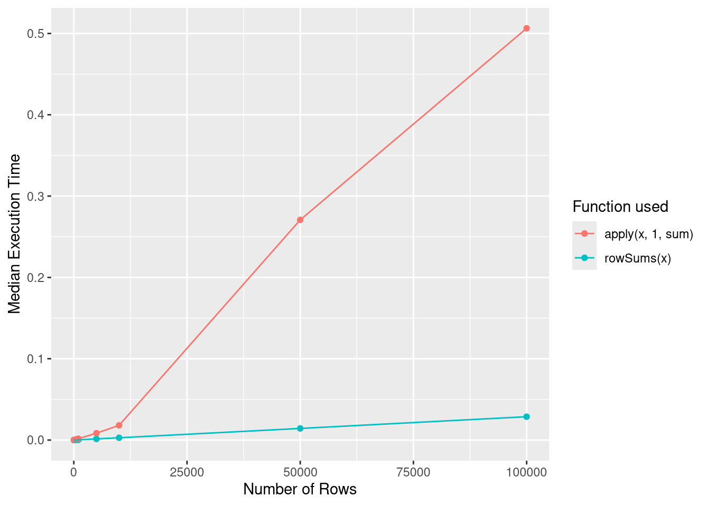

# Improving performance


Attaching the needed libraries:


```r
library(ggplot2)
library(dplyr)
library(purrr)
```

## Exercises 24.3.1

**Q1.** What are faster alternatives to `lm()`? Which are specifically designed to work with larger datasets?

**A1.** Faster alternatives to `lm()` can be found by visiting [CRAN Task View: High-Performance and Parallel Computing with R](https://cran.r-project.org/web/views/HighPerformanceComputing.html) page.

Here are some of the available options:

- `speedglm::speedlm()` (for large datasets)

- `biglm::biglm()` (specifically designed for data too large to fit in memory)

- `RcppEigen::fastLm()` (using the `Eigen` linear algebra library)

High performances can be obtained with these packages especially if R is linked against an optimized BLAS, such as ATLAS. You can check this information using `sessionInfo()`:


```r
sessInfo <- sessionInfo()
sessInfo$matprod
#> [1] "default"
sessInfo$LAPACK
#> [1] "/usr/lib/x86_64-linux-gnu/openblas-pthread/libopenblasp-r0.3.20.so"
```

Comparing performance of different alternatives:


```r
library(gapminder)

# having a look at the data
glimpse(gapminder)
#> Rows: 1,704
#> Columns: 6
#> $ country   <fct> "Afghanistan", "Afghanistan", "Afghanist…
#> $ continent <fct> Asia, Asia, Asia, Asia, Asia, Asia, Asia…
#> $ year      <int> 1952, 1957, 1962, 1967, 1972, 1977, 1982…
#> $ lifeExp   <dbl> 28.801, 30.332, 31.997, 34.020, 36.088, …
#> $ pop       <int> 8425333, 9240934, 10267083, 11537966, 13…
#> $ gdpPercap <dbl> 779.4453, 820.8530, 853.1007, 836.1971, …

bench::mark(
  "lm"       = stats::lm(lifeExp ~ continent * gdpPercap, gapminder),
  "speedglm" = speedglm::speedlm(lifeExp ~ continent * gdpPercap, gapminder),
  "biglm"    = biglm::biglm(lifeExp ~ continent * gdpPercap, gapminder),
  "fastLm"   = RcppEigen::fastLm(lifeExp ~ continent * gdpPercap, gapminder),
  check      = FALSE,
  iterations = 1000
)[1:5]
#> # A tibble: 4 × 5
#>   expression      min   median `itr/sec` mem_alloc
#>   <bch:expr> <bch:tm> <bch:tm>     <dbl> <bch:byt>
#> 1 lm         862.13µs 904.22µs     1081.    1.27MB
#> 2 speedglm     1.57ms   1.62ms      617.   75.03MB
#> 3 biglm      765.26µs 799.54µs     1191.   589.1KB
#> 4 fastLm     982.41µs   1.01ms      979.    4.48MB
```

The results might change depending on the size of the dataset, with the performance benefits accruing bigger the dataset.

You will have to experiment with different algorithms and find the one that fits the needs of your dataset the best.

**Q2.** What package implements a version of `match()` that's faster for repeated look ups? How much faster is it?

**A2.** The package (and the respective function) is `fastmatch::fmatch()`^[In addition to Google search, you can also try [packagefinder](https://www.zuckarelli.de/packagefinder/tutorial.html) to search for CRAN packages.].

The documentation for this function notes:

> It is slightly faster than the built-in version because it uses more specialized code, but in addition it retains the hash table within the table object such that it can be re-used, dramatically reducing the look-up time especially for large table.

With a small vector, `fmatch()` is only slightly faster, but of the same order of magnitude.


```r
library(fastmatch, warn.conflicts = FALSE)

small_vec <- c("a", "b", "x", "m", "n", "y")

length(small_vec)
#> [1] 6

bench::mark(
  "base" = match(c("x", "y"), small_vec),
  "fastmatch" = fmatch(c("x", "y"), small_vec)
)[1:5]
#> # A tibble: 2 × 5
#>   expression      min   median `itr/sec` mem_alloc
#>   <bch:expr> <bch:tm> <bch:tm>     <dbl> <bch:byt>
#> 1 base         1.16µs   1.22µs   767810.     2.8KB
#> 2 fastmatch    1.01µs   1.06µs   904068.    2.66KB
```

But, with a larger vector, `fmatch()` is orders of magnitude faster! ⚡


```r
large_vec <- c(rep(c("a", "b"), 1e4), "x", rep(c("m", "n"), 1e6), "y")

length(large_vec)
#> [1] 2020002

bench::mark(
  "base" = match(c("x", "y"), large_vec),
  "fastmatch" = fmatch(c("x", "y"), large_vec)
)[1:5]
#> # A tibble: 2 × 5
#>   expression      min   median `itr/sec` mem_alloc
#>   <bch:expr> <bch:tm> <bch:tm>     <dbl> <bch:byt>
#> 1 base         20.8ms   22.2ms      39.8    31.4MB
#> 2 fastmatch     982ns   1.04µs  912062.         0B
```

We can also look at the hash table:


```r
fmatch.hash(c("x", "y"), small_vec)
#> [1] "a" "b" "x" "m" "n" "y"
#> attr(,".match.hash")
#> <hash table>
```

Additionally, `{fastmatch}` provides equivalent of the familiar infix operator:


```r
library(fastmatch)

small_vec <- c("a", "b", "x", "m", "n", "y")

c("x", "y") %in% small_vec
#> [1] TRUE TRUE

c("x", "y") %fin% small_vec
#> [1] TRUE TRUE
```

**Q3.** List four functions (not just those in base R) that convert a string into a date time object. What are their strengths and weaknesses?

**A3.** Here are four functions that convert a string into a date time object:

- `base::as.POSIXct()`


```r
base::as.POSIXct("2022-05-05 09:23:22")
#> [1] "2022-05-05 09:23:22 UTC"
```

- `base::as.POSIXlt()`


```r
base::as.POSIXlt("2022-05-05 09:23:22")
#> [1] "2022-05-05 09:23:22 UTC"
```

- `lubridate::ymd_hms()`


```r
lubridate::ymd_hms("2022-05-05-09-23-22")
#> [1] "2022-05-05 09:23:22 UTC"
```

- `fasttime::fastPOSIXct()`


```r
fasttime::fastPOSIXct("2022-05-05 09:23:22")
#> [1] "2022-05-05 09:23:22 UTC"
```

We can also compare their performance:


```r
bench::mark(
  "as.POSIXct" = base::as.POSIXct("2022-05-05 09:23:22"),
  "as.POSIXlt" = base::as.POSIXlt("2022-05-05 09:23:22"),
  "ymd_hms" = lubridate::ymd_hms("2022-05-05-09-23-22"),
  "fastPOSIXct" = fasttime::fastPOSIXct("2022-05-05 09:23:22"),
  check = FALSE,
  iterations = 1000
)
#> # A tibble: 4 × 6
#>   expression       min   median `itr/sec` mem_alloc `gc/sec`
#>   <bch:expr>  <bch:tm> <bch:tm>     <dbl> <bch:byt>    <dbl>
#> 1 as.POSIXct   29.67µs  31.61µs    31345.        0B     0   
#> 2 as.POSIXlt   20.08µs  21.09µs    46013.        0B    46.1 
#> 3 ymd_hms       2.25ms   2.35ms      424.    21.5KB     3.42
#> 4 fastPOSIXct   1.16µs   1.26µs   750570.        0B     0
```

There are many more packages that implement a way to convert from string to a date time object. For more, see [CRAN Task View: Time Series Analysis](https://cran.r-project.org/web/views/TimeSeries.html)

**Q4.** Which packages provide the ability to compute a rolling mean?

**A4.** Here are a few packages and respective functions that provide a way to compute a rolling mean:

- `RcppRoll::roll_mean()`
- `data.table::frollmean()`
- `roll::roll_mean()`
- `zoo::rollmean()`
- `slider::slide_dbl()`

**Q5.** What are the alternatives to `optim()`?

**A5.** The `optim()` function provides general-purpose optimization. As noted in its docs:

> General-purpose optimization based on Nelder–Mead, quasi-Newton and conjugate-gradient algorithms. It includes an option for box-constrained optimization and simulated annealing.

There are many alternatives and the exact one you would want to choose would depend on the type of optimization you would like to do.

Most available options can be seen at [CRAN Task View: Optimization and Mathematical Programming](https://cran.r-project.org/web/views/Optimization.html).

## Exercises 24.4.3

**Q1.** What's the difference between `rowSums()` and `.rowSums()`?

**A1.** The documentation for these functions state:

> The versions with an initial dot in the name (.colSums() etc) are ‘bare-bones’ versions for use in programming: they apply only to numeric (like) matrices and do not name the result.

Looking at the source code,

- `rowSums()` function does a number of checks to validate if the arguments are acceptable


```r
rowSums
#> function (x, na.rm = FALSE, dims = 1L) 
#> {
#>     if (is.data.frame(x)) 
#>         x <- as.matrix(x)
#>     if (!is.array(x) || length(dn <- dim(x)) < 2L) 
#>         stop("'x' must be an array of at least two dimensions")
#>     if (dims < 1L || dims > length(dn) - 1L) 
#>         stop("invalid 'dims'")
#>     p <- prod(dn[-(id <- seq_len(dims))])
#>     dn <- dn[id]
#>     z <- if (is.complex(x)) 
#>         .Internal(rowSums(Re(x), prod(dn), p, na.rm)) + (0+1i) * 
#>             .Internal(rowSums(Im(x), prod(dn), p, na.rm))
#>     else .Internal(rowSums(x, prod(dn), p, na.rm))
#>     if (length(dn) > 1L) {
#>         dim(z) <- dn
#>         dimnames(z) <- dimnames(x)[id]
#>     }
#>     else names(z) <- dimnames(x)[[1L]]
#>     z
#> }
#> <bytecode: 0x562a6cc79fe0>
#> <environment: namespace:base>
```

- `.rowSums()` directly proceeds to computation using an internal code which is built in to the R interpreter


```r
.rowSums
#> function (x, m, n, na.rm = FALSE) 
#> .Internal(rowSums(x, m, n, na.rm))
#> <bytecode: 0x562a7585e470>
#> <environment: namespace:base>
```

But they have comparable performance:


```r
x <- cbind(x1 = 3, x2 = c(4:1e4, 2:1e5))

bench::mark(
  "rowSums" = rowSums(x),
  ".rowSums" = .rowSums(x, dim(x)[[1]], dim(x)[[2]])
)[1:5]
#> # A tibble: 2 × 5
#>   expression      min   median `itr/sec` mem_alloc
#>   <bch:expr> <bch:tm> <bch:tm>     <dbl> <bch:byt>
#> 1 rowSums       820µs   1.28ms      824.     859KB
#> 2 .rowSums      818µs   1.28ms      822.     859KB
```

**Q2.** Make a faster version of `chisq.test()` that only computes the chi-square test statistic when the input is two numeric vectors with no missing values. You can try simplifying `chisq.test()` or by coding from the [mathematical definition](http://en.wikipedia.org/wiki/Pearson%27s_chi-squared_test).

**A2.** If the function is supposed to accept only two numeric vectors without missing values, then we can make `chisq.test()` do less work by removing code corresponding to the following :

- checks for data frame and matrix inputs
- goodness-of-fit test
- simulating *p*-values
- checking for missing values

This leaves us with a much simpler, bare bones implementation:


```r
my_chisq_test <- function(x, y) {
  x <- table(x, y)
  n <- sum(x)

  nr <- as.integer(nrow(x))
  nc <- as.integer(ncol(x))

  sr <- rowSums(x)
  sc <- colSums(x)
  E <- outer(sr, sc, "*") / n
  v <- function(r, c, n) c * r * (n - r) * (n - c) / n^3
  V <- outer(sr, sc, v, n)
  dimnames(E) <- dimnames(x)

  STATISTIC <- sum((abs(x - E))^2 / E)
  PARAMETER <- (nr - 1L) * (nc - 1L)
  PVAL <- pchisq(STATISTIC, PARAMETER, lower.tail = FALSE)

  names(STATISTIC) <- "X-squared"
  names(PARAMETER) <- "df"

  structure(
    list(
      statistic = STATISTIC,
      parameter = PARAMETER,
      p.value = PVAL,
      method = "Pearson's Chi-squared test",
      observed = x,
      expected = E,
      residuals = (x - E) / sqrt(E),
      stdres = (x - E) / sqrt(V)
    ),
    class = "htest"
  )
}
```

And, indeed, this custom function performs slightly better^[Deliberately choosing a larger dataset to stress test the new function.] than its base equivalent:


```r
m <- c(rep("a", 1000), rep("b", 9000))
n <- c(rep(c("x", "y"), 5000))

bench::mark(
  "base" = chisq.test(m, n)$statistic[[1]],
  "custom" = my_chisq_test(m, n)$statistic[[1]]
)[1:5]
#> # A tibble: 2 × 5
#>   expression      min   median `itr/sec` mem_alloc
#>   <bch:expr> <bch:tm> <bch:tm>     <dbl> <bch:byt>
#> 1 base          900µs    929µs     1048.    1.57MB
#> 2 custom        706µs    724µs     1370.    5.24MB
```

**Q3.** Can you make a faster version of `table()` for the case of an input of two integer vectors with no missing values? Can you use it to speed up your chi-square test?

**A3.** In order to make a leaner version of `table()`, we can take a similar approach and trim the unnecessary input checks in light of our new API of accepting just two vectors without missing values. We can remove the following components from the code:

- extracting data from objects entered in `...` argument
- dealing with missing values
- other input validation checks

In addition to this removal, we can also use `fastmatch::fmatch()` instead of `match()`:


```r
my_table <- function(x, y) {
  x_sorted <- sort(unique(x))
  y_sorted <- sort(unique(y))

  x_length <- length(x_sorted)
  y_length <- length(y_sorted)

  bin <-
    fastmatch::fmatch(x, x_sorted) +
    x_length * fastmatch::fmatch(y, y_sorted) -
    x_length

  y <- tabulate(bin, x_length * y_length)

  y <- array(
    y,
    dim = c(x_length, y_length),
    dimnames = list(x = x_sorted, y = y_sorted)
  )

  class(y) <- "table"
  y
}
```

The custom function indeed performs slightly better:


```r
x <- c(rep("a", 1000), rep("b", 9000))
y <- c(rep(c("x", "y"), 5000))

# `check = FALSE` because the custom function has an additional attribute:
# ".match.hash"
bench::mark(
  "base" = table(x, y),
  "custom" = my_table(x, y),
  check = FALSE
)[1:5]
#> # A tibble: 2 × 5
#>   expression      min   median `itr/sec` mem_alloc
#>   <bch:expr> <bch:tm> <bch:tm>     <dbl> <bch:byt>
#> 1 base          638µs    655µs     1514.     960KB
#> 2 custom        355µs    360µs     2728.     489KB
```

We can also use this function in our custom chi-squared test function and see if the performance improves any further:


```r
my_chisq_test2 <- function(x, y) {
  x <- my_table(x, y)
  n <- sum(x)

  nr <- as.integer(nrow(x))
  nc <- as.integer(ncol(x))

  sr <- rowSums(x)
  sc <- colSums(x)
  E <- outer(sr, sc, "*") / n
  v <- function(r, c, n) c * r * (n - r) * (n - c) / n^3
  V <- outer(sr, sc, v, n)
  dimnames(E) <- dimnames(x)

  STATISTIC <- sum((abs(x - E))^2 / E)
  PARAMETER <- (nr - 1L) * (nc - 1L)
  PVAL <- pchisq(STATISTIC, PARAMETER, lower.tail = FALSE)

  names(STATISTIC) <- "X-squared"
  names(PARAMETER) <- "df"

  structure(
    list(
      statistic = STATISTIC,
      parameter = PARAMETER,
      p.value = PVAL,
      method = "Pearson's Chi-squared test",
      observed = x,
      expected = E,
      residuals = (x - E) / sqrt(E),
      stdres = (x - E) / sqrt(V)
    ),
    class = "htest"
  )
}
```

And, indeed, this new version of the custom function performs even better than it previously did:


```r
m <- c(rep("a", 1000), rep("b", 9000))
n <- c(rep(c("x", "y"), 5000))

bench::mark(
  "base" = chisq.test(m, n)$statistic[[1]],
  "custom" = my_chisq_test2(m, n)$statistic[[1]]
)[1:5]
#> # A tibble: 2 × 5
#>   expression      min   median `itr/sec` mem_alloc
#>   <bch:expr> <bch:tm> <bch:tm>     <dbl> <bch:byt>
#> 1 base          911µs    938µs     1059.    1.28MB
#> 2 custom        420µs    428µs     2301.  594.45KB
```

## Exercises 24.5.1

**Q1.** The density functions, e.g., `dnorm()`, have a common interface. Which arguments are vectorised over? What does `rnorm(10, mean = 10:1)` do?

**A1.** The density function family has the following interface:


```r
dnorm(x, mean = 0, sd = 1, log = FALSE)
pnorm(q, mean = 0, sd = 1, lower.tail = TRUE, log.p = FALSE)
qnorm(p, mean = 0, sd = 1, lower.tail = TRUE, log.p = FALSE)
rnorm(n, mean = 0, sd = 1)
```

Reading the documentation reveals that the following parameters are vectorized:
`x`, `q`, `p`, `mean`, `sd`.

This means that something like the following will work:


```r
rnorm(c(1, 2, 3), mean = c(0, -1, 5))
#> [1] 1.124335 0.930398 3.844935
```

But, for functions that don't have multiple vectorized parameters, it won't. For example,


```r
pnorm(c(1, 2, 3), mean = c(0, -1, 5), log.p = c(FALSE, TRUE, TRUE))
#> [1] 0.84134475 0.99865010 0.02275013
```

The following function call generates 10 random numbers (since `n = 10`) with 10 different distributions with means supplied by the vector `10:1`.


```r
rnorm(n = 10, mean = 10:1)
#>  [1]  8.2421770  9.3920474  7.1362118  7.5789906  5.2551688
#>  [6]  6.0143714  4.6147891  1.1096247  2.8759129 -0.6756857
```

**Q2.** Compare the speed of `apply(x, 1, sum)` with `rowSums(x)` for varying sizes of `x`.

**A2.** We can write a custom function to vary number of rows in a matrix and extract a data frame comparing performance of these two functions.


```r
benc_perform <- function(nRow, nCol = 100) {
  x <- matrix(data = rnorm(nRow * nCol), nrow = nRow, ncol = nCol)

  bench::mark(
    rowSums(x),
    apply(x, 1, sum)
  )[1:5]
}

nRowList <- list(10, 100, 500, 1000, 5000, 10000, 50000, 100000)

names(nRowList) <- as.character(nRowList)

benchDF <- map_dfr(
  .x = nRowList,
  .f = ~ benc_perform(.x),
  .id = "nRows"
) %>%
  mutate(nRows = as.numeric(nRows))
```

Plotting this data reveals that `rowSums(x)` has *O*(1) behavior, while *O*(n) behavior.


```r
ggplot(
  benchDF,
  aes(
    x = as.numeric(nRows),
    y = median,
    group = as.character(expression),
    color = as.character(expression)
  )
) +
  geom_point() +
  geom_line() +
  labs(
    x = "Number of Rows",
    y = "Median Execution Time",
    colour = "Function used"
  )
```



**Q3.** How can you use `crossprod()` to compute a weighted sum? How much faster is it than the naive `sum(x * w)`?

**A3.** Both of these functions provide a way to compute a weighted sum:


```r
x <- c(1:6, 2, 3)
w <- rnorm(length(x))

crossprod(x, w)[[1]]
#> [1] 15.94691
sum(x * w)[[1]]
#> [1] 15.94691
```

But benchmarking their performance reveals that the latter is significantly faster than the former!


```r
bench::mark(
  crossprod(x, w)[[1]],
  sum(x * w)[[1]],
  iterations = 1e6
)[1:5]
#> # A tibble: 2 × 5
#>   expression                min   median `itr/sec` mem_alloc
#>   <bch:expr>           <bch:tm> <bch:tm>     <dbl> <bch:byt>
#> 1 crossprod(x, w)[[1]]    891ns    942ns   986284.        0B
#> 2 sum(x * w)[[1]]         470ns    521ns  1713442.        0B
```
