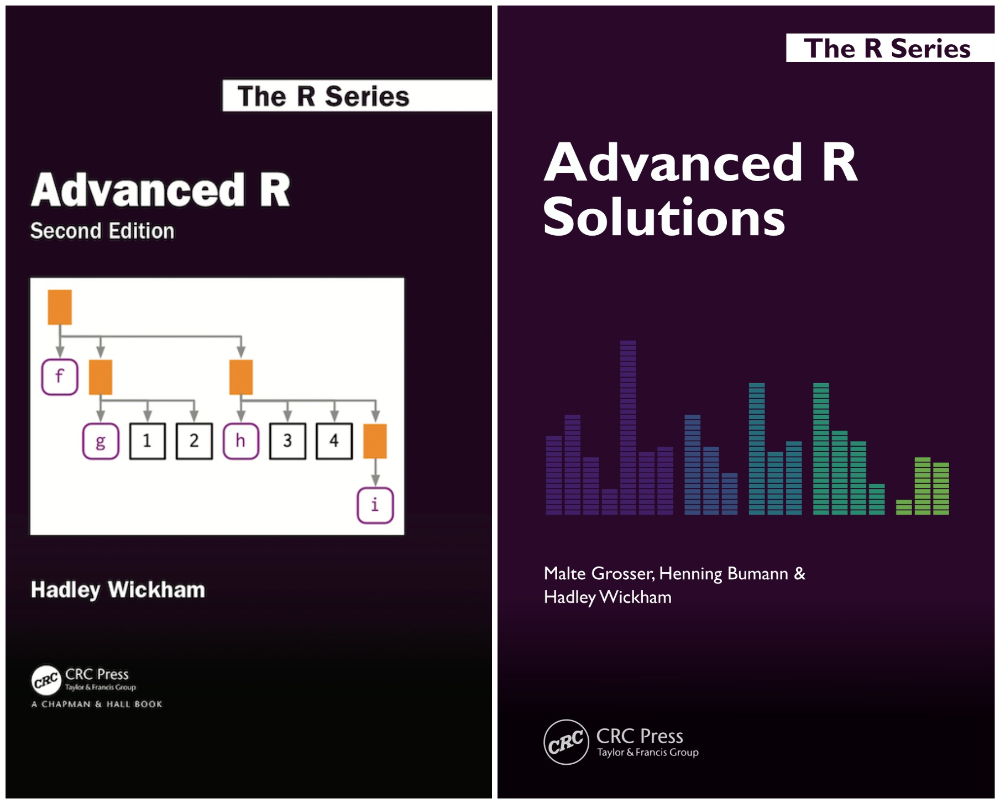

My solutions to exercises from the _Advanced R_ (2nd Edition) [book](https://adv-r.hadley.nz/).

I've tried my best to make sure that I have not included any incorrect solutions by consulting the [official solutions manual](https://advanced-r-solutions.rbind.io/index.html) which is co-authored by the original author. That said, I provide no guarantees that all solutions are correct. Additionally, when I disagreed with the proposed official solutions, I've stuck with my own solutions.

- [My solutions](https://github.com/IndrajeetPatil/Advanced-R-exercises)

- [Official solutions](https://advanced-r-solutions.rbind.io/index.html)

## Code of Conduct

Please note that the Advanced-R-exercises project is released with a [Contributor Code of Conduct](https://contributor-covenant.org/version/2/1/CODE_OF_CONDUCT.html). By contributing to this project, you agree to abide by its terms.
