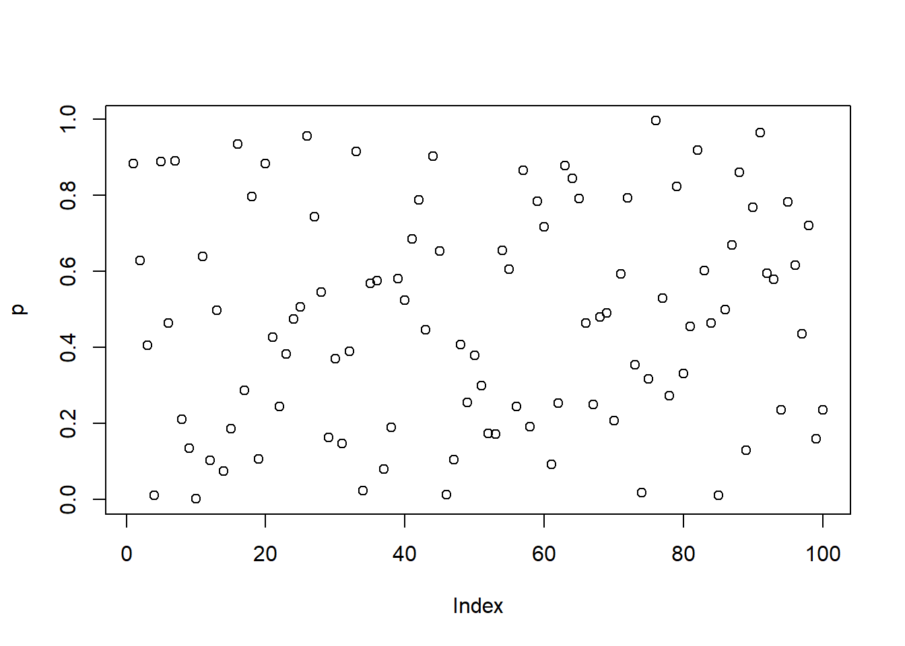

# Functionals


## Exercise 9.2.6

**Q1.** Study `as_mapper()`


```r
library(purrr)

# mapping by position -----------------------

x <- list(1, list(2, 3, list(1, 2)))

map(x, 1)
#> [[1]]
#> [1] 1
#> 
#> [[2]]
#> [1] 2
as_mapper(1)
#> function (x, ...) 
#> pluck(x, 1, .default = NULL)
#> <environment: 0x000000001f711a20>

map(x, list(2, 1))
#> [[1]]
#> NULL
#> 
#> [[2]]
#> [1] 3
as_mapper(list(2, 1))
#> function (x, ...) 
#> pluck(x, 2, 1, .default = NULL)
#> <environment: 0x000000001f94ea48>

# mapping by name -----------------------

y <- list(
  list(m = "a", list(1, m = "mo")),
  list(n = "b", list(2, n = "no"))
)

map(y, "m")
#> [[1]]
#> [1] "a"
#> 
#> [[2]]
#> NULL
as_mapper("m")
#> function (x, ...) 
#> pluck(x, "m", .default = NULL)
#> <environment: 0x000000001fdb06f0>

# mixing position and name
map(y, list(2, "m"))
#> [[1]]
#> [1] "mo"
#> 
#> [[2]]
#> NULL
as_mapper(list(2, "m"))
#> function (x, ...) 
#> pluck(x, 2, "m", .default = NULL)
#> <environment: 0x0000000020018e10>

# compact functions ----------------------------

map(y, ~ length(.x))
#> [[1]]
#> [1] 2
#> 
#> [[2]]
#> [1] 2
as_mapper(~ length(.x))
#> <lambda>
#> function (..., .x = ..1, .y = ..2, . = ..1) 
#> length(.x)
#> attr(,"class")
#> [1] "rlang_lambda_function" "function"
```

You can extract attributes using `purrr::attr_getter()`:


```r
pluck(Titanic, attr_getter("class"))
#> [1] "table"
```

**Q2.** Properly specifying anonymous functions

As shown by `as_mapper()` outputs below, the second call is not appropriate for generating random numbers because it translates to `pluck()` function where the indices for plucking are taken to be randomly generated numbers.


```r
library(purrr)

map(1:3, ~ runif(2))
#> [[1]]
#> [1] 0.3614890 0.7268617
#> 
#> [[2]]
#> [1] 0.5093759 0.3654522
#> 
#> [[3]]
#> [1] 0.3809346 0.8288675
as_mapper(~ runif(2))
#> <lambda>
#> function (..., .x = ..1, .y = ..2, . = ..1) 
#> runif(2)
#> attr(,"class")
#> [1] "rlang_lambda_function" "function"

map(1:3, runif(2))
#> [[1]]
#> NULL
#> 
#> [[2]]
#> NULL
#> 
#> [[3]]
#> NULL
as_mapper(runif(2))
#> function (x, ...) 
#> pluck(x, 0.418575734598562, 0.528997247572988, .default = NULL)
#> <environment: 0x00000000202b0988>
```

**Q3.** Use the appropriate `map()` function

Compute the standard deviation of every column in a numeric data frame.


```r
map_dbl(mtcars, sd)
#>         mpg         cyl        disp          hp        drat 
#>   6.0269481   1.7859216 123.9386938  68.5628685   0.5346787 
#>          wt        qsec          vs          am        gear 
#>   0.9784574   1.7869432   0.5040161   0.4989909   0.7378041 
#>        carb 
#>   1.6152000
```

Compute the standard deviation of every numeric column in a mixed data frame. 


```r
keep(iris, is.numeric) %>%
  map_dbl(sd)
#> Sepal.Length  Sepal.Width Petal.Length  Petal.Width 
#>    0.8280661    0.4358663    1.7652982    0.7622377
```

Compute the number of levels for every factor in a data frame.


```r
modify_if(dplyr::starwars, is.character, as.factor) %>%
  keep(is.factor) %>%
  map_int(~ length(levels(.)))
#>       name hair_color skin_color  eye_color        sex 
#>         87         12         31         15          4 
#>     gender  homeworld    species 
#>          2         48         37
```

**Q4.** Statistics and visualization with `{purrr}`

Extract the *p*-value from each test, then visualise.


```r
trials <- map(1:100, ~ t.test(rpois(10, 10), rpois(7, 10)))

p <- map_dbl(trials, "p.value")

plot(p)
```



**Q5.** Fixing non-functioning code


```r
x <- list(
  list(1, c(3, 9)),
  list(c(3, 6), 7, c(4, 7, 6))
)

triple <- function(x) x * 3
map(x, .f = ~ map(., ~ triple(.)))
#> [[1]]
#> [[1]][[1]]
#> [1] 3
#> 
#> [[1]][[2]]
#> [1]  9 27
#> 
#> 
#> [[2]]
#> [[2]][[1]]
#> [1]  9 18
#> 
#> [[2]][[2]]
#> [1] 21
#> 
#> [[2]][[3]]
#> [1] 12 21 18
```

**Q6.** Use `map()` to fit linear models to the `mtcars` dataset


```r
formulas <- list(
  mpg ~ disp,
  mpg ~ I(1 / disp),
  mpg ~ disp + wt,
  mpg ~ I(1 / disp) + wt
)

map(formulas, ~ lm(formula = ., data = mtcars))
#> [[1]]
#> 
#> Call:
#> lm(formula = ., data = mtcars)
#> 
#> Coefficients:
#> (Intercept)         disp  
#>    29.59985     -0.04122  
#> 
#> 
#> [[2]]
#> 
#> Call:
#> lm(formula = ., data = mtcars)
#> 
#> Coefficients:
#> (Intercept)    I(1/disp)  
#>       10.75      1557.67  
#> 
#> 
#> [[3]]
#> 
#> Call:
#> lm(formula = ., data = mtcars)
#> 
#> Coefficients:
#> (Intercept)         disp           wt  
#>    34.96055     -0.01772     -3.35083  
#> 
#> 
#> [[4]]
#> 
#> Call:
#> lm(formula = ., data = mtcars)
#> 
#> Coefficients:
#> (Intercept)    I(1/disp)           wt  
#>      19.024     1142.560       -1.798
```

**Q7.** Computing R-squared


```r
bootstrap <- function(df) {
  df[sample(nrow(df), replace = TRUE), , drop = FALSE]
}

bootstraps <- map(1:10, ~ bootstrap(mtcars))

map_dbl(
  bootstraps,
  ~ summary(lm(formula = mpg ~ disp, data = .))$r.squared
)
#>  [1] 0.7533189 0.6807466 0.8218359 0.7643049 0.7620959
#>  [6] 0.7370291 0.7084513 0.7087317 0.7560434 0.7164048
```

## Exercise 9.4.6

**Q1.** Explain the results

`modify()` returns the object of type same as the input. Since the input here is a dataframe of certain dimensions and `.f = 1` translates to plucking the first element in each column, it returns a dataframes with the same dimensions with the plucked element recycled across rows.


```r
head(modify(mtcars, 1))
#>                   mpg cyl disp  hp drat   wt  qsec vs am
#> Mazda RX4          21   6  160 110  3.9 2.62 16.46  0  1
#> Mazda RX4 Wag      21   6  160 110  3.9 2.62 16.46  0  1
#> Datsun 710         21   6  160 110  3.9 2.62 16.46  0  1
#> Hornet 4 Drive     21   6  160 110  3.9 2.62 16.46  0  1
#> Hornet Sportabout  21   6  160 110  3.9 2.62 16.46  0  1
#> Valiant            21   6  160 110  3.9 2.62 16.46  0  1
#>                   gear carb
#> Mazda RX4            4    4
#> Mazda RX4 Wag        4    4
#> Datsun 710           4    4
#> Hornet 4 Drive       4    4
#> Hornet Sportabout    4    4
#> Valiant              4    4
```

**Q2.** Use `iwalk()` instead of `walk2()`


```r
# with walk2() -----------------------

cyls <- split(mtcars, mtcars$cyl)
paths <- file.path(temp, paste0("cyl-", names(cyls), ".csv"))
walk2(.x = cyls, .y = paths, .f = write.csv)

# with iwalk --------------------------

cyls <- split(mtcars, mtcars$cyl)
names(cyls) <- file.path(temp, paste0("cyl-", names(cyls), ".csv"))
iwalk(cyls, ~ write.csv(.x, .y))
```

**Q3.** Explain the code

`map2()` supplies the functions defined in `.x = trans` as `f` in the anonymous functions, while the names of the columns defined in  `.y = mtcars[nm]` are picked up by `var` in the anonymous function. Note that the function is iterating over indices for vectors of transformations and column names.


```r
trans <- list(
  disp = function(x) x * 0.0163871,
  am = function(x) factor(x, labels = c("auto", "manual"))
)

nm <- names(trans)
mtcars[nm] <- map2(trans, mtcars[nm], function(f, var) f(var))
```

In the `map` approach, the function is iterating over indices for vectors of column names.


```r
mtcars[nm] <- map(nm, ~ trans[[.x]](mtcars[[.x]]))
```

**Q4.** Difference between `map2()` and `walk2()`

If we use `map2()`, it will work, but it will print `NULL` to the terminal for every element of the list.


```r
bods <- split(BOD, BOD$Time)
nm <- names(bods)
map2(bods, nm, write.csv)
```

## Exercise 9.6.3

**Q1.** Predicate functions

> A predicate is a function that returns a **single** `TRUE` or `FALSE`.

The `is.na()` function does not return a single value, but instead returns a vector and thus isn't a predicate function.


```r
# contrast the following behavior of predicate functions
is.character(c("x", 2))
#> [1] TRUE
is.null(c(3, NULL))
#> [1] FALSE

# with this behavior
is.na(c(NA, 1))
#> [1]  TRUE FALSE
```

The closest equivalent of a predicate function in base-R is `anyNA()` function.


```r
anyNA(c(NA, 1))
#> [1] TRUE
```

**Q2.** Fix `simple_reduce`

Supplied function:


```r
simple_reduce <- function(x, f) {
  out <- x[[1]]
  for (i in seq(2, length(x))) {
    out <- f(out, x[[i]])
  }
  out
}
```

Struggles with inputs of length 0 and 1 because function tries to access out-of-bound values.


```r
simple_reduce(numeric(), sum)
#> Error in x[[1]]: subscript out of bounds
simple_reduce(1, sum)
#> Error in x[[i]]: subscript out of bounds
simple_reduce(1:3, sum)
#> [1] 6
```

This problem can be solved by adding `init` argument, which supplies the default or initial value for the function to operate on:


```r
simple_reduce2 <- function(x, f, init = 0) {
  # initializer will become the first value
  if (length(x) == 0L) {
    return(init)
  }
  if (length(x) == 1L) {
    return(x[[1L]])
  }

  out <- x[[1]]

  for (i in seq(2, length(x))) {
    out <- f(out, x[[i]])
  }
  out
}
```

Let's try it out:


```r
simple_reduce2(numeric(), sum)
#> [1] 0
simple_reduce2(1, sum)
#> [1] 1
simple_reduce2(1:3, sum)
#> [1] 6
```

With a different kind of function:


```r
simple_reduce2(numeric(), `*`, init = 1)
#> [1] 1
simple_reduce2(1, `*`, init = 1)
#> [1] 1
simple_reduce2(1:3, `*`, init = 1)
#> [1] 6
```

And another one:


```r
simple_reduce2(numeric(), `%/%`)
#> [1] 0
simple_reduce2(1, `%/%`)
#> [1] 1
simple_reduce2(1:3, `%/%`)
#> [1] 0
```


## Exercise 9.7.3

**Q1.** 

**Q2.** `eapply()` and `rapply()`

> `eapply()` applies FUN to the named values from an environment and returns the results as a list.

> `rapply()` is a recursive version of lapply with flexibility in how the result is structured (how = "..").
