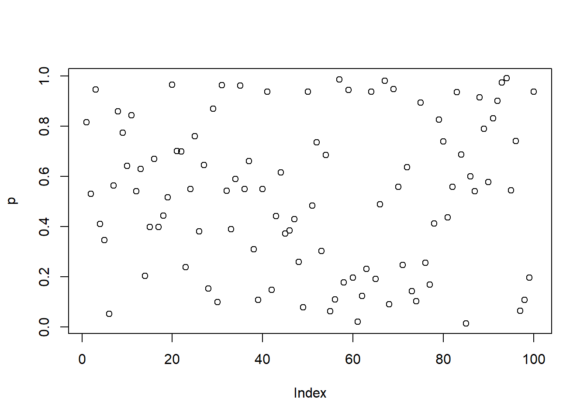

# Functionals


Attaching the needed libraries:


```r
library(purrr, warn.conflicts = FALSE)
```

## My first functional: `map()` (Exercises 9.2.6)

---

**Q1.** Use `as_mapper()` to explore how `{purrr}` generates anonymous functions for the integer, character, and list helpers. What helper allows you to extract attributes? Read the documentation to find out.

**A1.** Let's handle the two parts of the question separately.

- `as_mapper()` and `{purrr}`-generated anonymous functions:

Looking at the experimentation below with `map()` and `as_mapper()`, we can see that, depending on the type of the input, `as_mapper()` creates an extractor function using `pluck()`.


```r
# mapping by position -----------------------

x <- list(1, list(2, 3, list(1, 2)))

map(x, 1)
#> [[1]]
#> [1] 1
#> 
#> [[2]]
#> [1] 2
as_mapper(1)
#> function (x, ...) 
#> pluck(x, 1, .default = NULL)
#> <environment: 0x11a500370>

map(x, list(2, 1))
#> [[1]]
#> NULL
#> 
#> [[2]]
#> [1] 3
as_mapper(list(2, 1))
#> function (x, ...) 
#> pluck(x, 2, 1, .default = NULL)
#> <environment: 0x149665f80>

# mapping by name -----------------------

y <- list(
  list(m = "a", list(1, m = "mo")),
  list(n = "b", list(2, n = "no"))
)

map(y, "m")
#> [[1]]
#> [1] "a"
#> 
#> [[2]]
#> NULL
as_mapper("m")
#> function (x, ...) 
#> pluck(x, "m", .default = NULL)
#> <environment: 0x109c33620>

# mixing position and name
map(y, list(2, "m"))
#> [[1]]
#> [1] "mo"
#> 
#> [[2]]
#> NULL
as_mapper(list(2, "m"))
#> function (x, ...) 
#> pluck(x, 2, "m", .default = NULL)
#> <environment: 0x1496ec920>

# compact functions ----------------------------

map(y, ~ length(.x))
#> [[1]]
#> [1] 2
#> 
#> [[2]]
#> [1] 2
as_mapper(~ length(.x))
#> <lambda>
#> function (..., .x = ..1, .y = ..2, . = ..1) 
#> length(.x)
#> attr(,"class")
#> [1] "rlang_lambda_function" "function"
```

- You can extract attributes using `purrr::attr_getter()`:


```r
pluck(Titanic, attr_getter("class"))
#> [1] "table"
```

---

**Q2.** `map(1:3, ~ runif(2))` is a useful pattern for generating random numbers, but `map(1:3, runif(2))` is not. Why not? Can you explain why it returns the result that it does?

**A2.** As shown by `as_mapper()` outputs below, the second call is not appropriate for generating random numbers because it translates to `pluck()` function where the indices for plucking are taken to be randomly generated numbers, and these are not valid accessors and so we get `NULL`s in return.


```r
map(1:3, ~ runif(2))
#> [[1]]
#> [1] 0.2180892 0.9876342
#> 
#> [[2]]
#> [1] 0.3484619 0.3810470
#> 
#> [[3]]
#> [1] 0.02098596 0.74972687
as_mapper(~ runif(2))
#> <lambda>
#> function (..., .x = ..1, .y = ..2, . = ..1) 
#> runif(2)
#> attr(,"class")
#> [1] "rlang_lambda_function" "function"

map(1:3, runif(2))
#> [[1]]
#> NULL
#> 
#> [[2]]
#> NULL
#> 
#> [[3]]
#> NULL
as_mapper(runif(2))
#> function (x, ...) 
#> pluck(x, 0.597890264587477, 0.587997315218672, .default = NULL)
#> <environment: 0x109eb3980>
```

---

**Q3.** Use the appropriate `map()` function to:

    a) Compute the standard deviation of every column in a numeric data frame.

    a) Compute the standard deviation of every numeric column in a mixed data frame. (Hint: you'll need to do it in two steps.)

    a) Compute the number of levels for every factor in a data frame.

**A3.** Using the appropriate `map()` function to:

- Compute the standard deviation of every column in a numeric data frame:


```r
map_dbl(mtcars, sd)
#>         mpg         cyl        disp          hp        drat 
#>   6.0269481   1.7859216 123.9386938  68.5628685   0.5346787 
#>          wt        qsec          vs          am        gear 
#>   0.9784574   1.7869432   0.5040161   0.4989909   0.7378041 
#>        carb 
#>   1.6152000
```

- Compute the standard deviation of every numeric column in a mixed data frame:


```r
keep(iris, is.numeric) %>%
  map_dbl(sd)
#> Sepal.Length  Sepal.Width Petal.Length  Petal.Width 
#>    0.8280661    0.4358663    1.7652982    0.7622377
```

- Compute the number of levels for every factor in a data frame:


```r
modify_if(dplyr::starwars, is.character, as.factor) %>%
  keep(is.factor) %>%
  map_int(~ length(levels(.)))
#>       name hair_color skin_color  eye_color        sex 
#>         87         12         31         15          4 
#>     gender  homeworld    species 
#>          2         48         37
```

---

**Q4.** The following code simulates the performance of a *t*-test for non-normal data. Extract the *p*-value from each test, then visualise.


```r
trials <- map(1:100, ~ t.test(rpois(10, 10), rpois(7, 10)))
```

**A4.**

- Extract the *p*-value from each test:


```r
trials <- map(1:100, ~ t.test(rpois(10, 10), rpois(7, 10)))

(p <- map_dbl(trials, "p.value"))
#>   [1] 0.81695628 0.53177360 0.94750819 0.41026769 0.34655294
#>   [6] 0.05300287 0.56479901 0.85936864 0.77517391 0.64321161
#>  [11] 0.84462914 0.54144946 0.63070476 0.20325827 0.39824435
#>  [16] 0.67052432 0.39932663 0.44437632 0.51645941 0.96578745
#>  [21] 0.70219557 0.69931716 0.23946786 0.55100566 0.76028958
#>  [26] 0.38105366 0.64544126 0.15379307 0.86945196 0.09965658
#>  [31] 0.96425489 0.54239108 0.38985789 0.59019282 0.96247907
#>  [36] 0.54997487 0.66111391 0.30961551 0.10897334 0.55049635
#>  [41] 0.93882405 0.14836866 0.44307287 0.61583610 0.37284284
#>  [46] 0.38559622 0.42935767 0.26059293 0.07831619 0.93768396
#>  [51] 0.48459268 0.73571291 0.30288560 0.68521609 0.06374636
#>  [56] 0.11007808 0.98758443 0.17831882 0.94471538 0.19711729
#>  [61] 0.02094185 0.12370745 0.23247837 0.93842382 0.19160550
#>  [66] 0.49005550 0.98146240 0.09034183 0.94912080 0.55857523
#>  [71] 0.24692070 0.63658206 0.14290966 0.10309770 0.89516449
#>  [76] 0.25660092 0.16943034 0.41199780 0.82721280 0.74017418
#>  [81] 0.43724631 0.55944024 0.93615100 0.68788872 0.01416627
#>  [86] 0.60120497 0.54125910 0.91581929 0.78949327 0.57887371
#>  [91] 0.83217542 0.90108906 0.97474727 0.99129282 0.54436155
#>  [96] 0.74159859 0.06534957 0.10834529 0.19737786 0.93750342
```

- Visualise the extracted *p*-values:


```r
plot(p)
```



```r

hist(p)
```


---

**Q5.** The following code uses a map nested inside another map to apply a function to every element of a nested list. Why does it fail, and  what do you need to do to make it work?


```r
x <- list(
  list(1, c(3, 9)),
  list(c(3, 6), 7, c(4, 7, 6))
)

triple <- function(x) x * 3
map(x, map, .f = triple)
#> Error in .f(.x[[i]], ...): unused argument (function (.x, .f, ...) 
#> {
#>     .f <- as_mapper(.f, ...)
#>     .Call(map_impl, environment(), ".x", ".f", "list")
#> })
```

**A5.** This function fails because this call effectively evaluates to the following:


```r
map(.x = x, .f = ~ triple(x = .x, map))
```

But `triple()` has only one parameter (`x`), and so the execution fails.

Here is the fixed version:


```r
x <- list(
  list(1, c(3, 9)),
  list(c(3, 6), 7, c(4, 7, 6))
)

triple <- function(x) x * 3
map(x, .f = ~ map(.x, ~ triple(.x)))
#> [[1]]
#> [[1]][[1]]
#> [1] 3
#> 
#> [[1]][[2]]
#> [1]  9 27
#> 
#> 
#> [[2]]
#> [[2]][[1]]
#> [1]  9 18
#> 
#> [[2]][[2]]
#> [1] 21
#> 
#> [[2]][[3]]
#> [1] 12 21 18
```

---

**Q6.** Use `map()` to fit linear models to the `mtcars` dataset using the formulas stored in this list:


```r
formulas <- list(
  mpg ~ disp,
  mpg ~ I(1 / disp),
  mpg ~ disp + wt,
  mpg ~ I(1 / disp) + wt
)
```

**A6.** Fitting linear models to the `mtcars` dataset using the provided formulas:


```r
formulas <- list(
  mpg ~ disp,
  mpg ~ I(1 / disp),
  mpg ~ disp + wt,
  mpg ~ I(1 / disp) + wt
)

map(formulas, ~ lm(formula = ., data = mtcars))
#> [[1]]
#> 
#> Call:
#> lm(formula = ., data = mtcars)
#> 
#> Coefficients:
#> (Intercept)         disp  
#>    29.59985     -0.04122  
#> 
#> 
#> [[2]]
#> 
#> Call:
#> lm(formula = ., data = mtcars)
#> 
#> Coefficients:
#> (Intercept)    I(1/disp)  
#>       10.75      1557.67  
#> 
#> 
#> [[3]]
#> 
#> Call:
#> lm(formula = ., data = mtcars)
#> 
#> Coefficients:
#> (Intercept)         disp           wt  
#>    34.96055     -0.01772     -3.35083  
#> 
#> 
#> [[4]]
#> 
#> Call:
#> lm(formula = ., data = mtcars)
#> 
#> Coefficients:
#> (Intercept)    I(1/disp)           wt  
#>      19.024     1142.560       -1.798
```

---

**Q7.** Fit the model `mpg ~ disp` to each of the bootstrap replicates of `mtcars` in the list below, then extract the $R^2$ of the model fit (Hint: you can compute the $R^2$ with `summary()`.)


```r
bootstrap <- function(df) {
  df[sample(nrow(df), replace = TRUE), , drop = FALSE]
}

bootstraps <- map(1:10, ~ bootstrap(mtcars))
```

**A7.** This can be done using `map_dbl()`:


```r
bootstrap <- function(df) {
  df[sample(nrow(df), replace = TRUE), , drop = FALSE]
}

bootstraps <- map(1:10, ~ bootstrap(mtcars))

bootstraps %>%
  map(~ lm(mpg ~ disp, data = .x)) %>%
  map(summary) %>%
  map_dbl("r.squared")
#>  [1] 0.7864562 0.8110818 0.7956331 0.7632399 0.7967824
#>  [6] 0.7364226 0.7203027 0.6653252 0.7732780 0.6753329
```

---

## Map variants (Exercises 9.4.6)

---

**Q1.** Explain the results of `modify(mtcars, 1)`.

**A1.** `modify()` returns the object of type same as the input. Since the input here is a data frame of certain dimensions and `.f = 1` translates to plucking the first element in each column, it returns a data frame with the same dimensions with the plucked element recycled across rows.


```r
head(modify(mtcars, 1))
#>                   mpg cyl disp  hp drat   wt  qsec vs am
#> Mazda RX4          21   6  160 110  3.9 2.62 16.46  0  1
#> Mazda RX4 Wag      21   6  160 110  3.9 2.62 16.46  0  1
#> Datsun 710         21   6  160 110  3.9 2.62 16.46  0  1
#> Hornet 4 Drive     21   6  160 110  3.9 2.62 16.46  0  1
#> Hornet Sportabout  21   6  160 110  3.9 2.62 16.46  0  1
#> Valiant            21   6  160 110  3.9 2.62 16.46  0  1
#>                   gear carb
#> Mazda RX4            4    4
#> Mazda RX4 Wag        4    4
#> Datsun 710           4    4
#> Hornet 4 Drive       4    4
#> Hornet Sportabout    4    4
#> Valiant              4    4
```

---

**Q2.** Rewrite the following code to use `iwalk()` instead of `walk2()`. What are the advantages and disadvantages?


```r
cyls <- split(mtcars, mtcars$cyl)
paths <- file.path(temp, paste0("cyl-", names(cyls), ".csv"))
walk2(cyls, paths, write.csv)
```

**A2.** Let's first rewrite provided code using `iwalk()`:


```r
cyls <- split(mtcars, mtcars$cyl)
names(cyls) <- file.path(temp, paste0("cyl-", names(cyls), ".csv"))
iwalk(cyls, ~ write.csv(.x, .y))
```

The advantage of using `iwalk()` is that we need to now deal with only a single variable (`cyls`) instead of two (`cyls` and `paths`).

The disadvantage is that the code is difficult to reason about: 
In `walk2()`, it's explicit what `.x` (`= cyls`) and `.y` (`= paths`) correspond to, while this is not so for `iwalk()` (i.e., `.x = cyls` and `.y = names(cyls)`) with the `.y` argument being "invisible".

---

**Q3.** Explain how the following code transforms a data frame using functions stored in a list.


```r
trans <- list(
  disp = function(x) x * 0.0163871,
  am = function(x) factor(x, labels = c("auto", "manual"))
)

nm <- names(trans)
mtcars[nm] <- map2(trans, mtcars[nm], function(f, var) f(var))
```

Compare and contrast the `map2()` approach to this `map()` approach:


```r
mtcars[nm] <- map(nm, ~ trans[[.x]](mtcars[[.x]]))
```

**A3.** `map2()` supplies the functions stored in `trans` as anonymous functions via placeholder `f`, while the names of the columns specified in `mtcars[nm]` are supplied as `var` argument to the anonymous function. Note that the function is iterating over indices for vectors of transformations and column names.


```r
trans <- list(
  disp = function(x) x * 0.0163871,
  am = function(x) factor(x, labels = c("auto", "manual"))
)

nm <- names(trans)
mtcars[nm] <- map2(trans, mtcars[nm], function(f, var) f(var))
```

In the `map()` approach, the function is iterating over indices for vectors of column names.


```r
mtcars[nm] <- map(nm, ~ trans[[.x]](mtcars[[.x]]))
```

The latter approach can't afford passing arguments to placeholders in an anonymous function.

---

**Q4.** What does `write.csv()` return, i.e. what happens if you use it with `map2()` instead of `walk2()`?

**A4.** If we use `map2()`, it will work, but it will print `NULL`s to the console for every list element.


```r
withr::with_tempdir(
  code = {
    ls <- split(mtcars, mtcars$cyl)
    nm <- names(ls)
    map2(ls, nm, write.csv)
  }
)
#> $`4`
#> NULL
#> 
#> $`6`
#> NULL
#> 
#> $`8`
#> NULL
```

---

## Predicate functionals (Exercises 9.6.3)

---

**Q1.** Why isn't `is.na()` a predicate function? What base R function is closest to being a predicate version of `is.na()`?

**A1.** As mentioned in the docs:

> A predicate is a function that returns a **single** `TRUE` or `FALSE`.

The `is.na()` function does not return a `logical` scalar, but instead returns a vector and thus isn't a predicate function.


```r
# contrast the following behavior of predicate functions
is.character(c("x", 2))
#> [1] TRUE
is.null(c(3, NULL))
#> [1] FALSE

# with this behavior
is.na(c(NA, 1))
#> [1]  TRUE FALSE
```

The closest equivalent of a predicate function in base-R is `anyNA()` function.


```r
anyNA(c(NA, 1))
#> [1] TRUE
```

---

**Q2.** `simple_reduce()` has a problem when `x` is length 0 or length 1. Describe the source of the problem and how you might go about fixing it.


```r
simple_reduce <- function(x, f) {
  out <- x[[1]]
  for (i in seq(2, length(x))) {
    out <- f(out, x[[i]])
  }
  out
}
```

**A2.** The supplied function struggles with inputs of length 0 and 1 because function tries to subscript out-of-bound values.


```r
simple_reduce(numeric(), sum)
#> Error in x[[1]]: subscript out of bounds
simple_reduce(1, sum)
#> Error in x[[i]]: subscript out of bounds
simple_reduce(1:3, sum)
#> [1] 6
```

This problem can be solved by adding `init` argument, which supplies the default or initial value:


```r
simple_reduce2 <- function(x, f, init = 0) {
  # initializer will become the first value
  if (length(x) == 0L) {
    return(init)
  }

  if (length(x) == 1L) {
    return(x[[1L]])
  }

  out <- x[[1]]

  for (i in seq(2, length(x))) {
    out <- f(out, x[[i]])
  }

  out
}
```

Let's try it out:


```r
simple_reduce2(numeric(), sum)
#> [1] 0
simple_reduce2(1, sum)
#> [1] 1
simple_reduce2(1:3, sum)
#> [1] 6
```

Depending on the function, we can provide a different `init` argument:


```r
simple_reduce2(numeric(), `*`, init = 1)
#> [1] 1
simple_reduce2(1, `*`, init = 1)
#> [1] 1
simple_reduce2(1:3, `*`, init = 1)
#> [1] 6
```

---

**Q3.** Implement the `span()` function from Haskell: given a list `x` and a predicate function `f`, `span(x, f)` returns the location of the longest sequential run of elements where the predicate is true. (Hint: you might find `rle()` helpful.)

**A3.** Implementation of `span()`:


```r
span <- function(x, f) {
  running_lengths <- purrr::map_lgl(x, ~ f(.x)) %>% rle()

  df <- dplyr::tibble(
    "lengths" = running_lengths$lengths,
    "values" = running_lengths$values
  ) %>%
    dplyr::mutate(rowid = dplyr::row_number()) %>%
    dplyr::filter(values)

  # no sequence where condition is `TRUE`
  if (nrow(df) == 0L) {
    return(integer())
  }

  # only single sequence where condition is `TRUE`
  if (nrow(df) == 1L) {
    return((df$rowid):(df$lengths - 1 + df$rowid))
  }

  # multiple sequences where condition is `TRUE`; select max one
  if (nrow(df) > 1L) {
    df <- dplyr::filter(df, lengths == max(lengths))
    return((df$rowid):(df$lengths - 1 + df$rowid))
  }
}
```

Testing it once:


```r
span(c(0, 0, 0, 0, 0), is.na)
#> integer(0)
span(c(NA, 0, NA, NA, NA), is.na)
#> [1] 3 4 5
span(c(NA, 0, 0, 0, 0), is.na)
#> [1] 1
span(c(NA, NA, 0, 0, 0), is.na)
#> [1] 1 2
```

Testing it twice:


```r
span(c(3, 1, 2, 4, 5, 6), function(x) x > 3)
#> [1] 2 3 4
span(c(3, 1, 2, 4, 5, 6), function(x) x > 9)
#> integer(0)
span(c(3, 1, 2, 4, 5, 6), function(x) x == 3)
#> [1] 1
span(c(3, 1, 2, 4, 5, 6), function(x) x %in% c(2, 4))
#> [1] 2 3
```

---

**Q4.** Implement `arg_max()`. It should take a function and a vector of inputs, and return the elements of the input where the function returns the highest value. For example, `arg_max(-10:5, function(x) x ^ 2)` should return -10. `arg_max(-5:5, function(x) x ^ 2)` should return `c(-5, 5)`. Also implement the matching `arg_min()` function.

**A4.** Here are implementations for the specified functions:

- Implementing `arg_max()`


```r
arg_max <- function(.x, .f) {
  df <- dplyr::tibble(
    original = .x,
    transformed = purrr::map_dbl(.x, .f)
  )

  dplyr::filter(df, transformed == max(transformed))[["original"]]
}

arg_max(-10:5, function(x) x^2)
#> [1] -10
arg_max(-5:5, function(x) x^2)
#> [1] -5  5
```

- Implementing `arg_min()`


```r
arg_min <- function(.x, .f) {
  df <- dplyr::tibble(
    original = .x,
    transformed = purrr::map_dbl(.x, .f)
  )

  dplyr::filter(df, transformed == min(transformed))[["original"]]
}

arg_min(-10:5, function(x) x^2)
#> [1] 0
arg_min(-5:5, function(x) x^2)
#> [1] 0
```

---

**Q5.** The function below scales a vector so it falls in the range [0, 1]. How would you apply it to every column of a data frame? How would you apply it to every numeric column in a data frame?


```r
scale01 <- function(x) {
  rng <- range(x, na.rm = TRUE)
  (x - rng[1]) / (rng[2] - rng[1])
}
```

**A5.** We will use `{purrr}` package to apply this function. Key thing to keep in mind is that a data frame is a list of atomic vectors of equal length.

- Applying function to every column in a data frame: We will use `anscombe` as example since it has all numeric columns.


```r
purrr::map_df(head(anscombe), .f = scale01)
#> # A tibble: 6 × 8
#>      x1    x2    x3    x4    y1     y2     y3    y4
#>   <dbl> <dbl> <dbl> <dbl> <dbl>  <dbl>  <dbl> <dbl>
#> 1 0.333 0.333 0.333   NaN 0.362 0.897  0.116  0.266
#> 2 0     0     0       NaN 0     0.0345 0      0    
#> 3 0.833 0.833 0.833   NaN 0.209 0.552  1      0.633
#> 4 0.167 0.167 0.167   NaN 0.618 0.578  0.0570 1    
#> 5 0.5   0.5   0.5     NaN 0.458 1      0.174  0.880
#> 6 1     1     1       NaN 1     0      0.347  0.416
```

- Applying function to every numeric column in a data frame: We will use `iris` as example since not all of its columns are of numeric type.


```r
purrr::modify_if(head(iris), .p = is.numeric, .f = scale01)
#>   Sepal.Length Sepal.Width Petal.Length Petal.Width Species
#> 1        0.625   0.5555556         0.25           0  setosa
#> 2        0.375   0.0000000         0.25           0  setosa
#> 3        0.125   0.2222222         0.00           0  setosa
#> 4        0.000   0.1111111         0.50           0  setosa
#> 5        0.500   0.6666667         0.25           0  setosa
#> 6        1.000   1.0000000         1.00           1  setosa
```

---

## Base functionals (Exercises 9.7.3)

---

**Q1.** How does `apply()` arrange the output? Read the documentation and perform some experiments.

**A1.** Let's prepare an array and apply a function over different margins:


```r
(m <- as.array(table(mtcars$cyl, mtcars$am, mtcars$vs)))
#> , ,  = 0
#> 
#>    
#>     auto manual
#>   4    0      1
#>   6    0      3
#>   8   12      2
#> 
#> , ,  = 1
#> 
#>    
#>     auto manual
#>   4    3      7
#>   6    4      0
#>   8    0      0

# rows
apply(m, 1, function(x) x^2)
#>       
#>         4  6   8
#>   [1,]  0  0 144
#>   [2,]  1  9   4
#>   [3,]  9 16   0
#>   [4,] 49  0   0

# columns
apply(m, 2, function(x) x^2)
#>       
#>        auto manual
#>   [1,]    0      1
#>   [2,]    0      9
#>   [3,]  144      4
#>   [4,]    9     49
#>   [5,]   16      0
#>   [6,]    0      0

# rows and columns
apply(m, c(1, 2), function(x) x^2)
#> , ,  = auto
#> 
#>    
#>     4  6   8
#>   0 0  0 144
#>   1 9 16   0
#> 
#> , ,  = manual
#> 
#>    
#>      4 6 8
#>   0  1 9 4
#>   1 49 0 0
```

As can be seen, `apply()` returns outputs organised first by the margins being operated over, and only then the results. 

---

**Q2.** What do `eapply()` and `rapply()` do? Does purrr have equivalents?

**A2.** Let's consider them one-by-one.

- `eapply()` 

As mentioned in its documentation:

> `eapply()` applies FUN to the named values from an environment and returns the results as a list.

Here is an example:


```r
library(rlang)
#> 
#> Attaching package: 'rlang'
#> The following objects are masked from 'package:purrr':
#> 
#>     %@%, as_function, flatten, flatten_chr,
#>     flatten_dbl, flatten_int, flatten_lgl,
#>     flatten_raw, invoke, splice
#> The following object is masked from 'package:magrittr':
#> 
#>     set_names

e <- env("x" = 1, "y" = 2)
rlang::env_print(e)
#> <environment: 0x1196499a0>
#> Parent: <environment: global>
#> Bindings:
#> • x: <dbl>
#> • y: <dbl>

eapply(e, as.character)
#> $x
#> [1] "1"
#> 
#> $y
#> [1] "2"
```

`{purrr}` doesn't have any function to iterate over environments.

- `rapply()` 

> `rapply()` is a recursive version of lapply with flexibility in how the result is structured (how = "..").

Here is an example:


```r
X <- list(list(a = TRUE, b = list(c = c(4L, 3.2))), d = 9.0)

rapply(X, as.character, classes = "numeric", how = "replace")
#> [[1]]
#> [[1]]$a
#> [1] TRUE
#> 
#> [[1]]$b
#> [[1]]$b$c
#> [1] "4"   "3.2"
#> 
#> 
#> 
#> $d
#> [1] "9"
```

`{purrr}` has something similar in `modify_depth()`.


```r
X <- list(list(a = TRUE, b = list(c = c(4L, 3.2))), d = 9.0)

purrr::modify_depth(X, .depth = 2L, .f = length)
#> [[1]]
#> [[1]]$a
#> [1] 1
#> 
#> [[1]]$b
#> [1] 1
#> 
#> 
#> $d
#> [1] 1
```

---

**Q3.** Challenge: read about the [fixed point algorithm](https://mitpress.mit.edu/sites/default/files/sicp/full-text/book/book-Z-H-12.html#%25_idx_1096). Complete the exercises using R.

**A3.** As mentioned in the suggested reading material:

> A number $x$ is called a fixed point of a function $f$ if $x$ satisfies the equation $f(x) = x$. For some functions $f$ we can locate a fixed point by beginning with an initial guess and applying $f$ repeatedly, $f(x), f(f(x)), f(f(f(x))), ...$ until the value does not change very much. Using this idea, we can devise a procedure fixed-point that takes as inputs a function and an initial guess and produces an approximation to a fixed point of the function. 

Let's first implement a fixed-point algorithm:


```r
close_enough <- function(x1, x2, tolerance = 0.001) {
  if (abs(x1 - x2) < tolerance) {
    return(TRUE)
  } else {
    return(FALSE)
  }
}

find_fixed_point <- function(.f, .guess, tolerance = 0.001) {
  .next <- .f(.guess)
  is_close_enough <- close_enough(.next, .guess, tol = tolerance)

  if (is_close_enough) {
    return(.next)
  } else {
    find_fixed_point(.f, .next, tolerance)
  }
}
```

Let's check if it works as expected:


```r
find_fixed_point(cos, 1.0)
#> [1] 0.7387603

# cos(x) = x
cos(find_fixed_point(cos, 1.0))
#> [1] 0.7393039
```

We will solve only one exercise from the reading material. Rest are beyond the scope of this solution manual.

> Show that the golden ratio $\phi$ is a fixed point of the transformation $x \mapsto 1 + 1/x$, and use this fact to compute $\phi$ by means of the fixed-point procedure.


```r
golden_ratio_f <- function(x) 1 + (1 / x)

find_fixed_point(golden_ratio_f, 1.0)
#> [1] 1.618182
```

---

## Session information


```r
sessioninfo::session_info(include_base = TRUE)
#> ─ Session info ───────────────────────────────────────────
#>  setting  value
#>  version  R version 4.2.2 (2022-10-31)
#>  os       macOS Ventura 13.0
#>  system   aarch64, darwin20
#>  ui       X11
#>  language (EN)
#>  collate  en_US.UTF-8
#>  ctype    en_US.UTF-8
#>  tz       Europe/Berlin
#>  date     2022-11-12
#>  pandoc   2.19.2 @ /Applications/RStudio.app/Contents/MacOS/quarto/bin/tools/ (via rmarkdown)
#> 
#> ─ Packages ───────────────────────────────────────────────
#>  ! package     * version    date (UTC) lib source
#>    assertthat    0.2.1      2019-03-21 [1] CRAN (R 4.2.0)
#>    base        * 4.2.2      2022-10-31 [?] local
#>    bookdown      0.30       2022-11-09 [1] CRAN (R 4.2.2)
#>    bslib         0.4.1      2022-11-02 [1] CRAN (R 4.2.2)
#>    cachem        1.0.6      2021-08-19 [1] CRAN (R 4.2.0)
#>    cli           3.4.1      2022-09-23 [1] CRAN (R 4.2.0)
#>  P compiler      4.2.2      2022-10-31 [1] local
#>  P datasets    * 4.2.2      2022-10-31 [1] local
#>    DBI           1.1.3.9002 2022-10-17 [1] Github (r-dbi/DBI@2aec388)
#>    digest        0.6.30     2022-10-18 [1] CRAN (R 4.2.1)
#>    downlit       0.4.2      2022-07-05 [1] CRAN (R 4.2.1)
#>    dplyr         1.0.10     2022-09-01 [1] CRAN (R 4.2.1)
#>    evaluate      0.18       2022-11-07 [1] CRAN (R 4.2.2)
#>    fansi         1.0.3      2022-03-24 [1] CRAN (R 4.2.0)
#>    fastmap       1.1.0      2021-01-25 [1] CRAN (R 4.2.0)
#>    fs            1.5.2      2021-12-08 [1] CRAN (R 4.2.0)
#>    generics      0.1.3      2022-07-05 [1] CRAN (R 4.2.1)
#>    glue          1.6.2      2022-02-24 [1] CRAN (R 4.2.0)
#>  P graphics    * 4.2.2      2022-10-31 [1] local
#>  P grDevices   * 4.2.2      2022-10-31 [1] local
#>    highr         0.9        2021-04-16 [1] CRAN (R 4.2.0)
#>    htmltools     0.5.3      2022-07-18 [1] CRAN (R 4.2.1)
#>    jquerylib     0.1.4      2021-04-26 [1] CRAN (R 4.2.0)
#>    jsonlite      1.8.3      2022-10-21 [1] CRAN (R 4.2.1)
#>    knitr         1.40       2022-08-24 [1] CRAN (R 4.2.1)
#>    lifecycle     1.0.3      2022-10-07 [1] CRAN (R 4.2.1)
#>    magrittr    * 2.0.3      2022-03-30 [1] CRAN (R 4.2.0)
#>    memoise       2.0.1      2021-11-26 [1] CRAN (R 4.2.0)
#>  P methods     * 4.2.2      2022-10-31 [1] local
#>    pillar        1.8.1      2022-08-19 [1] CRAN (R 4.2.1)
#>    pkgconfig     2.0.3      2019-09-22 [1] CRAN (R 4.2.0)
#>    purrr       * 0.3.5      2022-10-06 [1] CRAN (R 4.2.1)
#>    R6            2.5.1.9000 2022-10-27 [1] local
#>    rlang       * 1.0.6      2022-09-24 [1] CRAN (R 4.2.1)
#>    rmarkdown     2.18       2022-11-09 [1] CRAN (R 4.2.2)
#>    rstudioapi    0.14       2022-08-22 [1] CRAN (R 4.2.1)
#>    sass          0.4.2      2022-07-16 [1] CRAN (R 4.2.1)
#>    sessioninfo   1.2.2      2021-12-06 [1] CRAN (R 4.2.0)
#>  P stats       * 4.2.2      2022-10-31 [1] local
#>    stringi       1.7.8      2022-07-11 [1] CRAN (R 4.2.1)
#>    stringr       1.4.1      2022-08-20 [1] CRAN (R 4.2.1)
#>    tibble        3.1.8.9002 2022-10-16 [1] local
#>    tidyselect    1.2.0      2022-10-10 [1] CRAN (R 4.2.1)
#>  P tools         4.2.2      2022-10-31 [1] local
#>    utf8          1.2.2      2021-07-24 [1] CRAN (R 4.2.0)
#>  P utils       * 4.2.2      2022-10-31 [1] local
#>    vctrs         0.5.0      2022-10-22 [1] CRAN (R 4.2.1)
#>    withr         2.5.0      2022-03-03 [1] CRAN (R 4.2.0)
#>    xfun          0.34       2022-10-18 [1] CRAN (R 4.2.1)
#>    xml2          1.3.3.9000 2022-10-10 [1] local
#>    yaml          2.3.6      2022-10-18 [1] CRAN (R 4.2.1)
#> 
#>  [1] /Library/Frameworks/R.framework/Versions/4.2-arm64/Resources/library
#> 
#>  P ── Loaded and on-disk path mismatch.
#> 
#> ──────────────────────────────────────────────────────────
```
