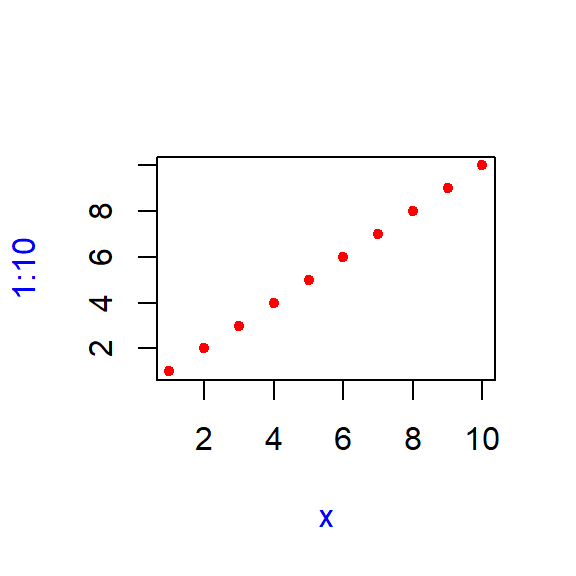

# Functions


Attaching the needed libraries:


```r
library(tidyverse, warn.conflicts = FALSE)
```

## Exercises 6.2.5

**Q1.** Given a name, like `"mean"`, `match.fun()` lets you find a function. Given a function, can you find its name? Why doesn't that make sense in R?

**A1.** Given a name, `match.fun()` lets you find a function.


```r
match.fun("mean")
#> function (x, ...) 
#> UseMethod("mean")
#> <bytecode: 0x0000000018084cb0>
#> <environment: namespace:base>
```

But, given a function, it doesn't make sense to find its name because there can be multiple names bound to the same function.


```r
f1 <- function(x) mean(x)
f2 <- f1

match.fun("f1")
#> function(x) mean(x)

match.fun("f2")
#> function(x) mean(x)
```

**Q2.** It's possible (although typically not useful) to call an anonymous function. Which of the two approaches below is correct? Why?


```r
function(x) 3()
#> function(x) 3()
(function(x) 3)()
#> [1] 3
```

**A2.** The first expression is not correct since the function will evaluate `3()`, which is syntactically not allowed since literals can't be treated like functions.


```r
f <- (function(x) 3())
f
#> function(x) 3()
f()
#> Error in f(): attempt to apply non-function

rlang::is_syntactic_literal(3)
#> [1] TRUE
```

This is the correct way to call an anonymous function.


```r
g <- (function(x) 3)
g
#> function(x) 3
g()
#> [1] 3
```

**Q3.** A good rule of thumb is that an anonymous function should fit on one line and shouldn't need to use `{}`. Review your code. Where could you have used an anonymous function instead of a named function? Where should you have used a named function instead of an anonymous function?

**A3.** Self activity.

**Q4.** What function allows you to tell if an object is a function? What function allows you to tell if a function is a primitive function?

**A4.** Use `is.function()` to check if an *object* is a *function*:


```r
# these are functions
f <- function(x) 3
is.function(mean)
#> [1] TRUE
is.function(f)
#> [1] TRUE

# these aren't
is.function("x")
#> [1] FALSE
is.function(new.env())
#> [1] FALSE
```

Use `is.primitive()` to check if a *function* is *primitive*:


```r
# primitive
is.primitive(sum)
#> [1] TRUE
is.primitive(`+`)
#> [1] TRUE

# not primitive
is.primitive(mean)
#> [1] FALSE
is.primitive(read.csv)
#> [1] FALSE
```

**Q5.** This code makes a list of all functions in the base package. 


```r
objs <- mget(ls("package:base", all = TRUE), inherits = TRUE)
funs <- Filter(is.function, objs)
```

Use it to answer the following questions:

a. Which base function has the most arguments?

b. How many base functions have no arguments? What's special about those functions?

c. How could you adapt the code to find all primitive functions?

**A5.** The provided code is the following:


```r
objs <- mget(ls("package:base", all = TRUE), inherits = TRUE)
funs <- Filter(is.function, objs)
```

a. Which base function has the most arguments?

`scan()` function has the most arguments.


```r
df_formals <- purrr::map_df(funs, ~ length(formals(.))) %>%
  tidyr::pivot_longer(
    cols = dplyr::everything(),
    names_to = "function",
    values_to = "argumentCount"
  ) %>%
  dplyr::arrange(desc(argumentCount))

df_formals
#> # A tibble: 1,328 x 2
#>    `function`       argumentCount
#>    <chr>                    <int>
#>  1 scan                        22
#>  2 format.default              16
#>  3 source                      16
#>  4 formatC                     15
#>  5 library                     13
#>  6 merge.data.frame            13
#>  7 prettyNum                   13
#>  8 system2                     11
#>  9 print.default               10
#> 10 save                        10
#> # ... with 1,318 more rows
#> # i Use `print(n = ...)` to see more rows
```

b. How many base functions have no arguments? What’s special about those functions?

At the time of writing, 253 base functions have no arguments. Most of these are primitive functions


```r
dplyr::filter(df_formals, argumentCount == 0)
#> # A tibble: 253 x 2
#>    `function` argumentCount
#>    <chr>              <int>
#>  1 -                      0
#>  2 !                      0
#>  3 !=                     0
#>  4 $                      0
#>  5 $<-                    0
#>  6 %%                     0
#>  7 %*%                    0
#>  8 %/%                    0
#>  9 &                      0
#> 10 &&                     0
#> # ... with 243 more rows
#> # i Use `print(n = ...)` to see more rows
```

c. How could you adapt the code to find all primitive functions?


```r
objs <- mget(ls("package:base", all = TRUE), inherits = TRUE)
funs <- Filter(is.function, objs)
primitives <- Filter(is.primitive, funs)

names(primitives)
#>   [1] "-"                    "!"                   
#>   [3] "!="                   "$"                   
#>   [5] "$<-"                  "%%"                  
#>   [7] "%*%"                  "%/%"                 
#>   [9] "&"                    "&&"                  
#>  [11] "("                    "*"                   
#>  [13] "...elt"               "...length"           
#>  [15] "...names"             ".C"                  
#>  [17] ".cache_class"         ".Call"               
#>  [19] ".Call.graphics"       ".class2"             
#>  [21] ".External"            ".External.graphics"  
#>  [23] ".External2"           ".Fortran"            
#>  [25] ".Internal"            ".isMethodsDispatchOn"
#>  [27] ".Primitive"           ".primTrace"          
#>  [29] ".primUntrace"         ".subset"             
#>  [31] ".subset2"             "/"                   
#>  [33] ":"                    "::"                  
#>  [35] ":::"                  "@"                   
#>  [37] "@<-"                  "["                   
#>  [39] "[["                   "[[<-"                
#>  [41] "[<-"                  "^"                   
#>  [43] "{"                    "|"                   
#>  [45] "||"                   "~"                   
#>  [47] "+"                    "<"                   
#>  [49] "<-"                   "<<-"                 
#>  [51] "<="                   "="                   
#>  [53] "=="                   ">"                   
#>  [55] ">="                   "abs"                 
#>  [57] "acos"                 "acosh"               
#>  [59] "all"                  "any"                 
#>  [61] "anyNA"                "Arg"                 
#>  [63] "as.call"              "as.character"        
#>  [65] "as.complex"           "as.double"           
#>  [67] "as.environment"       "as.integer"          
#>  [69] "as.logical"           "as.numeric"          
#>  [71] "as.raw"               "asin"                
#>  [73] "asinh"                "atan"                
#>  [75] "atanh"                "attr"                
#>  [77] "attr<-"               "attributes"          
#>  [79] "attributes<-"         "baseenv"             
#>  [81] "break"                "browser"             
#>  [83] "c"                    "call"                
#>  [85] "ceiling"              "class"               
#>  [87] "class<-"              "Conj"                
#>  [89] "cos"                  "cosh"                
#>  [91] "cospi"                "cummax"              
#>  [93] "cummin"               "cumprod"             
#>  [95] "cumsum"               "digamma"             
#>  [97] "dim"                  "dim<-"               
#>  [99] "dimnames"             "dimnames<-"          
#> [101] "emptyenv"             "enc2native"          
#> [103] "enc2utf8"             "environment<-"       
#> [105] "exp"                  "expm1"               
#> [107] "expression"           "floor"               
#> [109] "for"                  "forceAndCall"        
#> [111] "function"             "gamma"               
#> [113] "gc.time"              "globalenv"           
#> [115] "if"                   "Im"                  
#> [117] "interactive"          "invisible"           
#> [119] "is.array"             "is.atomic"           
#> [121] "is.call"              "is.character"        
#> [123] "is.complex"           "is.double"           
#> [125] "is.environment"       "is.expression"       
#> [127] "is.finite"            "is.function"         
#> [129] "is.infinite"          "is.integer"          
#> [131] "is.language"          "is.list"             
#> [133] "is.logical"           "is.matrix"           
#> [135] "is.na"                "is.name"             
#> [137] "is.nan"               "is.null"             
#> [139] "is.numeric"           "is.object"           
#> [141] "is.pairlist"          "is.raw"              
#> [143] "is.recursive"         "is.single"           
#> [145] "is.symbol"            "isS4"                
#> [147] "lazyLoadDBfetch"      "length"              
#> [149] "length<-"             "levels<-"            
#> [151] "lgamma"               "list"                
#> [153] "log"                  "log10"               
#> [155] "log1p"                "log2"                
#> [157] "max"                  "min"                 
#> [159] "missing"              "Mod"                 
#> [161] "names"                "names<-"             
#> [163] "nargs"                "next"                
#> [165] "nzchar"               "oldClass"            
#> [167] "oldClass<-"           "on.exit"             
#> [169] "pos.to.env"           "proc.time"           
#> [171] "prod"                 "quote"               
#> [173] "range"                "Re"                  
#> [175] "rep"                  "repeat"              
#> [177] "retracemem"           "return"              
#> [179] "round"                "seq.int"             
#> [181] "seq_along"            "seq_len"             
#> [183] "sign"                 "signif"              
#> [185] "sin"                  "sinh"                
#> [187] "sinpi"                "sqrt"                
#> [189] "standardGeneric"      "storage.mode<-"      
#> [191] "substitute"           "sum"                 
#> [193] "switch"               "tan"                 
#> [195] "tanh"                 "tanpi"               
#> [197] "tracemem"             "trigamma"            
#> [199] "trunc"                "unclass"             
#> [201] "untracemem"           "UseMethod"           
#> [203] "while"                "xtfrm"
```

**Q6.** What are the three important components of a function?

**A6.** Except for primitive functions, all functions have 3 important components:

* `formals()`
* `body()`
* `environment()`

**Q7.** When does printing a function not show the environment it was created in?

**A7.** All package functions print their environment:


```r
# base
mean
#> function (x, ...) 
#> UseMethod("mean")
#> <bytecode: 0x0000000018084cb0>
#> <environment: namespace:base>

# other package function
purrr::map
#> function (.x, .f, ...) 
#> {
#>     .f <- as_mapper(.f, ...)
#>     .Call(map_impl, environment(), ".x", ".f", "list")
#> }
#> <bytecode: 0x0000000033f47fe0>
#> <environment: namespace:purrr>
```

There are two exceptions to this rule:

- primitive functions


```r
sum
#> function (..., na.rm = FALSE)  .Primitive("sum")
```

- functions created in the global environment


```r
f <- function(x) mean(x)
f
#> function(x) mean(x)
```

## Exercises 6.4.5

**Q1.** What does the following code return? Why? Describe how each of the three `c`'s is interpreted.


```r
c <- 10
c(c = c)
```

**A1.** In `c(c = c)`:

* first *c* is interpreted as a function `c()`
* second *c* as a name for the vector element
* third *c* as a variable with value `10`


```r
c <- 10
c(c = c)
#>  c 
#> 10
```

**Q2.** What are the four principles that govern how R looks for values?

**A2.** Here are the four principles:

1. Name masking (names defined inside a function mask names defined outside a function)

2. Functions vs. variables (the rule above also applies to function names) 

3. A fresh start (every time a function is called a new environment is created to host its execution)

4. Dynamic look-up (R looks for values when the function is run, not when the function is created)

**Q3.** What does the following function return? Make a prediction before 
   running the code yourself.


```r
f <- function(x) {
  f <- function(x) {
    f <- function() {
      x^2
    }
    f() + 1
  }
  f(x) * 2
}
f(10)
```

Correctly predicted 😉😉


```r
f <- function(x) {
  f <- function(x) {
    f <- function() {
      x^2
    }
    f() + 1
  }
  f(x) * 2
}

f(10)
#> [1] 202
```

## Exercises 6.5.4 

**Q1.** What important property of `&&` makes `x_ok()` work?


```r
x_ok <- function(x) {
  !is.null(x) && length(x) == 1 && x > 0
}

x_ok(NULL)
x_ok(1)
x_ok(1:3)
```

What is different with this code? Why is this behaviour undesirable here?
    

```r
x_ok <- function(x) {
  !is.null(x) & length(x) == 1 & x > 0
}

x_ok(NULL)
x_ok(1)
x_ok(1:3)
```

**A1.** `&&` evaluates left to right and short-circuit evaluation, i.e., if the first operand is `TRUE`, R will short-circuit and not even look at the second operand.


```r
x_ok <- function(x) {
  !is.null(x) && length(x) == 1 && x > 0
}

x_ok(NULL)
#> [1] FALSE

x_ok(1)
#> [1] TRUE

x_ok(1:3)
#> [1] FALSE
```

Replacing `&&` is `&` is undesirable because it performs element-wise logical comparisons and returns a vector of values that is not always useful for decision (`TRUE`, `FALSE`, or `NA`).


```r
x_ok <- function(x) {
  !is.null(x) & length(x) == 1 & x > 0
}

x_ok(NULL)
#> logical(0)

x_ok(1)
#> [1] TRUE

x_ok(1:3)
#> [1] FALSE FALSE FALSE
```

**Q2.** What does this function return? Why? Which principle does it illustrate?


```r
f2 <- function(x = z) {
  z <- 100
  x
}
f2()
```

**A2.** The function returns `100`, and the principle at work here is lazy evaluation. When function environment encounters `x`, it evaluates argument `x = z` and since the name `z` is already bound to value 100, `x` is also bound to the same value.

We can check this by looking at the memory addresses:


```r
f2 <- function(x = z) {
  z <- 100
  print(x)

  print(lobstr::obj_addrs(list(x, z)))
}

f2()
#> [1] 100
#> [1] "0x38ca3c20" "0x38ca3c20"
```

**Q3.** What does this function return? Why? Which principle does it illustrate?
  

```r
y <- 10
f1 <- function(x =
                 {
                   y <- 1
                   2
                 },
               y = 0) {
  c(x, y)
}
f1()
y
```

**A3.** Note that in the function call `f1()`, the `x` and `y` arguments are missing. That means, the default arguments are evaluated in the function environment, and not in the environment in which the function is defined. 


```r
y <- 10
f1 <- function(x =
                 {
                   y <- 1
                   2
                 },
               y = 0) {
  print(missing(x))
  print(missing(y))

  c(x, y)
}

f1()
#> [1] TRUE
#> [1] TRUE
#> [1] 2 1

y
#> [1] 10
```

This is why `x` and `y` in function environment are assigned the values we see returned, and the `y` in the global environment remains unchanged.

**Q4.** In `hist()`, the default value of `xlim` is `range(breaks)`, the default value for `breaks` is `"Sturges"`, and


```r
range("Sturges")
#> [1] "Sturges" "Sturges"
```

Explain how `hist()` works to get a correct `xlim` value.

**A4.** The `xlim` defines the range of axes breaks for the histogram.


```r
hist(mtcars$wt, xlim = c(1, 6))
```


The default `c("Sturges", "Sturges")` uses Sturges' algorithm to compute the number of breaks, and thus, the range for axes breaks.


```r
nclass.Sturges(mtcars$wt)
#> [1] 6
```

To see the implementation, run `sloop::s3_get_method("hist.default")`.

**Q5.** Explain why this function works. Why is it confusing?


```r
show_time <- function(x = stop("Error!")) {
  stop <- function(...) Sys.time()
  print(x)
}

show_time()
#> [1] "2022-08-15 12:46:16 CEST"
```

**A5.** Let's take this step-by-step.

The function argument `x` is missing in the function call. This means that `stop("Error!")` is evaluated in the function environment, and not global environment.

But `stop("Error!")` evaluated only when `x` is evaluated, and due to lazy evaluation, this happens only when `print(x)` is called.

`print(x)` leads to `x` being evaluated, which evaluates `stop` in the function environment. But in function environment, the `base::stop()` is masked by a locally defined `stop` function, which returns `Sys.time()` output.

**Q6.** How many arguments are required when calling `library()`?

**A6.** Going solely by its signature, 


```r
formals(library)
#> $package
#> 
#> 
#> $help
#> 
#> 
#> $pos
#> [1] 2
#> 
#> $lib.loc
#> NULL
#> 
#> $character.only
#> [1] FALSE
#> 
#> $logical.return
#> [1] FALSE
#> 
#> $warn.conflicts
#> 
#> 
#> $quietly
#> [1] FALSE
#> 
#> $verbose
#> getOption("verbose")
#> 
#> $mask.ok
#> 
#> 
#> $exclude
#> 
#> 
#> $include.only
#> 
#> 
#> $attach.required
#> missing(include.only)
```

it looks like the following arguments are required:


```r
formals(library) %>%
  purrr::discard(is.null) %>%
  purrr::map_lgl(~ .x == "") %>%
  purrr::keep(~ isTRUE(.x)) %>%
  names()
#> [1] "package"        "help"           "warn.conflicts"
#> [4] "mask.ok"        "exclude"        "include.only"
```

But, in reality, only one argument is required: `package`. The function internally checks if the other arguments are missing and internally chooses necessary defaults.

It would have been better if there arguments were `NULL` instead of missing; that would avoid this confusion.

## Exercises 6.6.1

**Q1.** Explain the following results:


```r
sum(1, 2, 3)
#> [1] 6
mean(1, 2, 3)
#> [1] 1

sum(1, 2, 3, na.omit = TRUE)
#> [1] 7
mean(1, 2, 3, na.omit = TRUE)
#> [1] 1
```

**A1.** Let's look at arguments for these functions:


```r
str(sum)
#> function (..., na.rm = FALSE)
str(mean)
#> function (x, ...)
```

As can be seen, `sum()` function doesn't have `na.omit` argument. So, the input `na.omit = TRUE` is treated as `1` (logical implicitly coerced to numeric), and thus the results. So, the expression evaluates to `sum(1, 2, 3, 1)`.

For `mean()` function, there is only one parameter (`x`) and it's matched by the first argument (`1`). So, the expression evaluates to `mean(1)`.

**Q2.** Explain how to find the documentation for the named arguments in the following function call:


```r
plot(1:10, col = "red", pch = 20, xlab = "x", col.lab = "blue")
```



**A2.** First, check documentation for `plot()`:


```r
str(plot)
#> function (x, y, ...)
```

Since `...` are passed to `par()`, we can look at its documentation:


```r
str(par)
#> function (..., no.readonly = FALSE)
```

The docs for all parameters of interest [reside there](https://rdrr.io/r/graphics/par.html).

**Q3.** Why does `plot(1:10, col = "red")` only colour the points, not the axes or labels? Read the source code of `plot.default()` to find out.

**A3.** Source code can be found [here](https://github.com/wch/r-source/blob/79e73dba5259b25ec30118d45fea64aeac0f41dc/src/library/graphics/R/plot.R#L51-L84).

`plot.default()` passes `...` to `localTitle()`, which passes it to `title()`.

`title()` has four parts: `main`, `sub`, `xlab`, `ylab`.

So having a single argument `col` would not work as it will be ambiguous as to which element to apply this argument to.


```r
localTitle <- function(..., col, bg, pch, cex, lty, lwd) title(...)

title <- function(main = NULL, sub = NULL, xlab = NULL, ylab = NULL,
                  line = NA, outer = FALSE, ...) {
  main <- as.graphicsAnnot(main)
  sub <- as.graphicsAnnot(sub)
  xlab <- as.graphicsAnnot(xlab)
  ylab <- as.graphicsAnnot(ylab)
  .External.graphics(C_title, main, sub, xlab, ylab, line, outer, ...)
  invisible()
}
```

## Exercises 6.7.5

**Q1.** What does `load()` return? Why don't you normally see these values?

**A1.** The `load()` function reloads datasets that were saved using the `save()` function:


```r
save(iris, file = "my_iris.rda")
load("my_iris.rda")
```

We normally don't see any value because the function loads the datasets invisibly.

We can change this by setting `verbose = TRUE`:


```r
load("my_iris.rda", verbose = TRUE)
#> Loading objects:
#>   iris

# cleanup
unlink("my_iris.rda")
```

**Q2.** What does `write.table()` return? What would be more useful?

**A2.** The `write.table()` writes a data frame to a file and returns a `NULL` invisibly.


```r
write.table(BOD, file = "BOD.csv")
```

It would have been more helpful if the function invisibly returned the actual object being written to the file, which could then be further used.


```r
# cleanup
unlink("BOD.csv")
```

**Q3.** How does the `chdir` parameter of `source()` compare to `with_dir()`? Why might you prefer one to the other?

**A3.** The `chdir` parameter of `source()` is described as:

> if `TRUE` and `file` is a pathname, the `R` working directory is temporarily changed to the directory containing file for evaluating

That is, `chdir` allows changing working directory temporarily but *only* to the directory containing file being sourced:

While `withr::with_dir()` temporarily changes the current working directory:


```r
withr::with_dir
#> function (new, code) 
#> {
#>     old <- setwd(dir = new)
#>     on.exit(setwd(old))
#>     force(code)
#> }
#> <bytecode: 0x00000000368d6a50>
#> <environment: namespace:withr>
```

More importantly, its parameters `dir` allows temporarily changing working directory to *any* directory.

**Q4.** Write a function that opens a graphics device, runs the supplied code, and  closes the graphics device (always, regardless of whether or not the plotting code works).

**A4.** Here is a function that opens a graphics device, runs the supplied code, and  closes the graphics device:


```r
with_png_device <- function(filename, code, ...) {
  grDevices::png(filename = filename, ...)
  on.exit(grDevices::dev.off(), add = TRUE)

  force(code)
}
```

**Q5.** We can use `on.exit()` to implement a simple version of `capture.output()`.


```r
capture.output2 <- function(code) {
  temp <- tempfile()
  on.exit(file.remove(temp), add = TRUE, after = TRUE)
  sink(temp)
  on.exit(sink(), add = TRUE, after = TRUE)
  force(code)
  readLines(temp)
}

capture.output2(cat("a", "b", "c", sep = "\n"))
#> Warning in file.remove(temp): cannot remove file 'C:
#> \Users\INDRAJ~1\AppData\Local\Temp\RtmpQfajQa\file34f84a763350',
#> reason 'Permission denied'
#> [1] "a" "b" "c"
```

Compare `capture.output()` to `capture.output2()`. How do the functions differ? What features have I removed to make the key ideas easier to see? How have I rewritten the key ideas so they're easier to understand?

**A5.** The `capture.output()` is significantly more complex, as can be seen by its definition:


```r
capture.output
#> function (..., file = NULL, append = FALSE, type = c("output", 
#>     "message"), split = FALSE) 
#> {
#>     type <- match.arg(type)
#>     rval <- NULL
#>     closeit <- TRUE
#>     if (is.null(file)) 
#>         file <- textConnection("rval", "w", local = TRUE)
#>     else if (is.character(file)) 
#>         file <- file(file, if (append) 
#>             "a"
#>         else "w")
#>     else if (inherits(file, "connection")) {
#>         if (!isOpen(file)) 
#>             open(file, if (append) 
#>                 "a"
#>             else "w")
#>         else closeit <- FALSE
#>     }
#>     else stop("'file' must be NULL, a character string or a connection")
#>     sink(file, type = type, split = split)
#>     on.exit({
#>         sink(type = type, split = split)
#>         if (closeit) close(file)
#>     })
#>     for (i in seq_len(...length())) {
#>         out <- withVisible(...elt(i))
#>         if (out$visible) 
#>             print(out$value)
#>     }
#>     on.exit()
#>     sink(type = type, split = split)
#>     if (closeit) 
#>         close(file)
#>     if (is.null(rval)) 
#>         invisible(NULL)
#>     else rval
#> }
#> <bytecode: 0x0000000036f2fe20>
#> <environment: namespace:utils>
```

Here are few key differences:

- `capture.output()` uses `print()` function to print to console:


```r
capture.output(1)
#> [1] "[1] 1"

capture.output2(1)
#> Warning in file.remove(temp): cannot remove file 'C:
#> \Users\INDRAJ~1\AppData\Local\Temp\RtmpQfajQa\file34f84e9074d6',
#> reason 'Permission denied'
#> character(0)
```

- `capture.output()` can capture messages as well:


```r
capture.output(message("Hi there!"), "a", type = "message")
#> Hi there!
#> [1] "a"
#> character(0)
```

- `capture.output()` takes into account visibility of the expression:


```r
capture.output(1, invisible(2), 3)
#> [1] "[1] 1" "[1] 3"
```

## Exercises 6.8.6

**Q1.** Rewrite the following code snippets into prefix form:


```r
1 + 2 + 3

1 + (2 + 3)

if (length(x) <= 5) x[[5]] else x[[n]]
```

**A1.** Prefix forms for code snippets:


```r
# The binary `+`  operator has left to right associative property.
`+`(`+`(1, 2), 3)

`+`(1, `(`(`+`(2, 3)))

`if`(cond = `<=`(length(x), 5), cons.expr = `[[`(x, 5), alt.expr = `[[`(x, n))
```

**Q2.**  Clarify the following list of odd function calls:


```r
x <- sample(replace = TRUE, 20, x = c(1:10, NA))
y <- runif(min = 0, max = 1, 20)
cor(m = "k", y = y, u = "p", x = x)
```

**A2.** These functions don't have dots (`...`) as parameters, so the argument matching takes place in the following steps:

- exact matching for named arguments
- partial matching
- position-based

**Q3.** Explain why the following code fails:


```r
modify(get("x"), 1) <- 10
#> Error: target of assignment expands to non-language object
```

**A3.** As provided in the book, the replacement function is defined as:


```r
`modify<-` <- function(x, position, value) {
  x[position] <- value
  x
}
```

Let's re-write the provided code in prefix format to understand why it doesn't work:


```r
get("x") <- `modify<-`(x = get("x"), position = 1, value = 10)
```

Although this works:


```r
x <- 5
`modify<-`(x = get("x"), position = 1, value = 10)
#> [1] 10
```

The following doesn't because the code above evaluates to:


```r
`get<-`("x", 10)
#> Error in `get<-`("x", 10): could not find function "get<-"
```

And there is no `get<-` function in R.

**Q4.** Create a replacement function that modifies a random location in a vector.

**A4.** A replacement function that modifies a random location in a vector:


```r
`random_modify<-` <- function(x, value) {
  random_index <- sample(seq_along(x), size = 1)
  x[random_index] <- value
  return(x)
}
```

Let's try it out:


```r
x1 <- rep("a", 10)
random_modify(x1) <- "X"
x1
#>  [1] "a" "a" "a" "a" "X" "a" "a" "a" "a" "a"

x2 <- rep("a", 10)
random_modify(x2) <- "Y"
x2
#>  [1] "a" "a" "a" "a" "a" "Y" "a" "a" "a" "a"

x3 <- rep(0, 15)
random_modify(x3) <- -4
x3
#>  [1]  0  0  0  0 -4  0  0  0  0  0  0  0  0  0  0

x4 <- rep(0, 15)
random_modify(x4) <- -1
x4
#>  [1]  0  0  0  0  0  0  0  0  0  0  0  0 -1  0  0
```

**Q5.** Write your own version of `+` that pastes its inputs together if they are character vectors but behaves as usual otherwise. In other words, make this code work:


```r
1 + 2
#> [1] 3

"a" + "b"
#> [1] "ab"
```

**A5.** Infix operator to re-create the desired output:


```r
`+` <- function(x, y) {
  if (is.character(x) || is.character(y)) {
    paste0(x, y)
  } else {
    base::`+`(x, y)
  }
}

1 + 2
#> [1] 3

"a" + "b"
#> [1] "ab"

rm("+", envir = .GlobalEnv)
```

**Q6.** Create a list of all the replacement functions found in the base package. Which ones are primitive functions? (Hint: use `apropos()`.)

**A6.** Replacement functions always have `<-` at the end of their names.

So, using `apropos()`, we can find all replacement functions in search paths and the filter out the ones that don't belong to `{base}` package:


```r
ls_replacement <- apropos("<-$", where = TRUE, mode = "function")

base_index <- which(grepl("base", searchpaths()))

ls_replacement <- ls_replacement[which(names(ls_replacement) == as.character(base_index))]

unname(ls_replacement)
#>  [1] "$<-"              ".rowNamesDF<-"   
#>  [3] "@<-"              "[[<-"            
#>  [5] "[<-"              "<-"              
#>  [7] "<<-"              "attr<-"          
#>  [9] "attributes<-"     "body<-"          
#> [11] "class<-"          "colnames<-"      
#> [13] "comment<-"        "diag<-"          
#> [15] "dim<-"            "dimnames<-"      
#> [17] "Encoding<-"       "environment<-"   
#> [19] "formals<-"        "is.na<-"         
#> [21] "length<-"         "levels<-"        
#> [23] "mode<-"           "mostattributes<-"
#> [25] "names<-"          "oldClass<-"      
#> [27] "parent.env<-"     "regmatches<-"    
#> [29] "row.names<-"      "rownames<-"      
#> [31] "split<-"          "storage.mode<-"  
#> [33] "substr<-"         "substring<-"     
#> [35] "units<-"
```

The primitive replacement functions can be listed using `is.primitive()`:


```r
mget(ls_replacement, envir = baseenv()) %>%
  purrr::keep(is.primitive) %>%
  names()
#>  [1] "$<-"            "@<-"            "[[<-"          
#>  [4] "[<-"            "<-"             "<<-"           
#>  [7] "attr<-"         "attributes<-"   "class<-"       
#> [10] "dim<-"          "dimnames<-"     "environment<-" 
#> [13] "length<-"       "levels<-"       "names<-"       
#> [16] "oldClass<-"     "storage.mode<-"
```

**Q7.** What are valid names for user-created infix functions?

**A7.**  As mentioned in the respective [section](https://adv-r.hadley.nz/functions.html#infix-functions) of the book:

> The names of infix functions are more flexible than regular R functions: they can contain any sequence of characters except for `%`.

**Q8.** Create an infix `xor()` operator.

**A8.** Exclusive OR  is a logical operation that is `TRUE` if and only if its arguments differ (one is `TRUE`, the other is `FALSE`).


```r
lv1 <- c(TRUE, FALSE, TRUE, FALSE)
lv2 <- c(TRUE, TRUE, FALSE, FALSE)

xor(lv1, lv2)
#> [1] FALSE  TRUE  TRUE FALSE
```

We can create infix operator for exclusive OR like so:


```r
`%xor%` <- function(x, y) {
  !((x & y) | !(x | y))
}

lv1 %xor% lv2
#> [1] FALSE  TRUE  TRUE FALSE

TRUE %xor% TRUE
#> [1] FALSE
```

The function is vectorized over its inputs because the underlying logical operators themselves are vectorized.

**Q9.** Create infix versions of the set functions `intersect()`, `union()`, and `setdiff()`. You might call them `%n%`, `%u%`, and `%/%` to match conventions from mathematics.

**A9.** The required infix operators can be created as following:


```r
`%n%` <- function(x, y) {
  intersect(x, y)
}

`%u%` <- function(x, y) {
  union(x, y)
}

`%/%` <- function(x, y) {
  setdiff(x, y)
}
```

We can check that the outputs agree with the underlying functions:


```r
(x <- c(sort(sample(1:20, 9)), NA))
#>  [1]  4  7  8  9 11 13 15 16 20 NA
(y <- c(sort(sample(3:23, 7)), NA))
#> [1]  9 10 13 15 17 19 20 NA

identical(intersect(x, y), x %n% y)
#> [1] TRUE
identical(union(x, y), x %u% y)
#> [1] TRUE
identical(setdiff(x, y), x %/% y)
#> [1] TRUE
```
