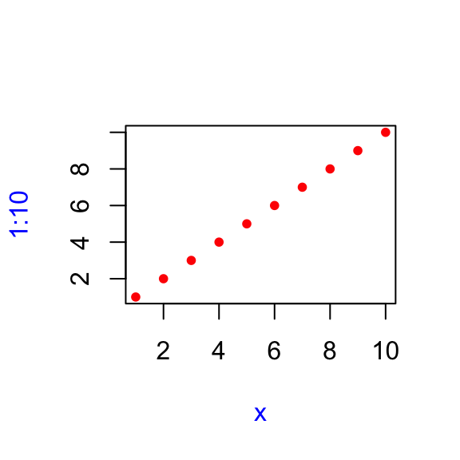

# Functions


## Exercise 6.2.5

**Q1.** Given a name, like `"mean"`, `match.fun()` lets you find a function. Given a function, can you find its name? Why doesn't that make sense in R?

**A1.** Given a name, `match.fun()` lets you find a function.


```r
match.fun("mean")
#> function (x, ...) 
#> UseMethod("mean")
#> <bytecode: 0x10e488230>
#> <environment: namespace:base>
```

But, given a function, it doesn't make sense to find its name in R because there can be multiple names bound to the same function.


```r
f1 <- function(x) mean(x)
f2 <- f1

match.fun("f1")
#> function(x) mean(x)

match.fun("f2")
#> function(x) mean(x)
```

**Q2.** It's possible (although typically not useful) to call an anonymous function. Which of the two approaches below is correct? Why?


```r
function(x) 3()
#> function(x) 3()
(function(x) 3)()
#> [1] 3
```

**A2.** This is not correct since the function will evaluate `3()`, which is syntactically not allowed since literals can't be treated like functions.


```r
(function(x) 3())()
#> Error in (function(x) 3())(): attempt to apply non-function
```

This is correct.


```r
(function(x) 3)()
#> [1] 3
```

**Q3.** A good rule of thumb is that an anonymous function should fit on one line and shouldn't need to use `{}`. Review your code. Where could you have used an anonymous function instead of a named function? Where should you have used a named function instead of an anonymous function?

**A3.** Self activity.

**Q4.** What function allows you to tell if an object is a function? What function allows you to tell if a function is a primitive function?

**A4.** Use `is.function()` to check if an object is a function:


```r
# these are functions
f <- function(x) 3
is.function(mean)
#> [1] TRUE
is.function(f)
#> [1] TRUE

# these aren't
is.function("x")
#> [1] FALSE
is.function(new.env())
#> [1] FALSE
```

Use `is.primitive()` to check if a function is primitive:


```r
# primitive
is.primitive(sum)
#> [1] TRUE
is.primitive(`+`)
#> [1] TRUE

# not primitive
is.primitive(mean)
#> [1] FALSE
is.primitive(read.csv)
#> [1] FALSE
```

**Q5.** This code makes a list of all functions in the base package. 


```r
objs <- mget(ls("package:base", all = TRUE), inherits = TRUE)
funs <- Filter(is.function, objs)
```

    Use it to answer the following questions:

    a. Which base function has the most arguments?
    
    a. How many base functions have no arguments? What's special about those
       functions?
       
    a. How could you adapt the code to find all primitive functions?

**A5.** The provided code is the following:


```r
objs <- mget(ls("package:base", all = TRUE), inherits = TRUE)
funs <- Filter(is.function, objs)
```

- Which base function has the most arguments?

`scan()` function has the most arguments.


```r
library(tidyverse)

df_formals <- purrr::map_df(funs, ~ length(formals(.))) %>%
  tidyr::pivot_longer(
    cols = dplyr::everything(),
    names_to = "function",
    values_to = "argumentCount"
  ) %>%
  dplyr::arrange(desc(argumentCount))
```

- How many base functions have no arguments? What’s special about those functions?

At the time of writing, 253 base functions have no arguments. Most of these are primitive functions


```r
dplyr::filter(df_formals, argumentCount == 0)
#> # A tibble: 251 × 2
#>    `function` argumentCount
#>    <chr>              <int>
#>  1 -                      0
#>  2 :                      0
#>  3 ::                     0
#>  4 :::                    0
#>  5 !                      0
#>  6 !=                     0
#>  7 ...elt                 0
#>  8 ...length              0
#>  9 ...names               0
#> 10 .C                     0
#> # … with 241 more rows
```

- How could you adapt the code to find all primitive functions?


```r
objs <- mget(ls("package:base", all = TRUE), inherits = TRUE)
funs <- Filter(is.function, objs)
primitives <- Filter(is.primitive, funs)

names(primitives)
#>   [1] "-"                    ":"                   
#>   [3] "::"                   ":::"                 
#>   [5] "!"                    "!="                  
#>   [7] "...elt"               "...length"           
#>   [9] "...names"             ".C"                  
#>  [11] ".cache_class"         ".Call"               
#>  [13] ".Call.graphics"       ".class2"             
#>  [15] ".External"            ".External.graphics"  
#>  [17] ".External2"           ".Fortran"            
#>  [19] ".Internal"            ".isMethodsDispatchOn"
#>  [21] ".Primitive"           ".primTrace"          
#>  [23] ".primUntrace"         ".subset"             
#>  [25] ".subset2"             "("                   
#>  [27] "["                    "[["                  
#>  [29] "[[<-"                 "[<-"                 
#>  [31] "{"                    "@"                   
#>  [33] "@<-"                  "*"                   
#>  [35] "/"                    "&"                   
#>  [37] "&&"                   "%*%"                 
#>  [39] "%/%"                  "%%"                  
#>  [41] "^"                    "+"                   
#>  [43] "<"                    "<-"                  
#>  [45] "<<-"                  "<="                  
#>  [47] "="                    "=="                  
#>  [49] ">"                    ">="                  
#>  [51] "|"                    "||"                  
#>  [53] "~"                    "$"                   
#>  [55] "$<-"                  "abs"                 
#>  [57] "acos"                 "acosh"               
#>  [59] "all"                  "any"                 
#>  [61] "anyNA"                "Arg"                 
#>  [63] "as.call"              "as.character"        
#>  [65] "as.complex"           "as.double"           
#>  [67] "as.environment"       "as.integer"          
#>  [69] "as.logical"           "as.numeric"          
#>  [71] "as.raw"               "asin"                
#>  [73] "asinh"                "atan"                
#>  [75] "atanh"                "attr"                
#>  [77] "attr<-"               "attributes"          
#>  [79] "attributes<-"         "baseenv"             
#>  [81] "break"                "browser"             
#>  [83] "c"                    "call"                
#>  [85] "ceiling"              "class"               
#>  [87] "class<-"              "Conj"                
#>  [89] "cos"                  "cosh"                
#>  [91] "cospi"                "cummax"              
#>  [93] "cummin"               "cumprod"             
#>  [95] "cumsum"               "digamma"             
#>  [97] "dim"                  "dim<-"               
#>  [99] "dimnames"             "dimnames<-"          
#> [101] "emptyenv"             "enc2native"          
#> [103] "enc2utf8"             "environment<-"       
#> [105] "exp"                  "expm1"               
#> [107] "expression"           "floor"               
#> [109] "for"                  "forceAndCall"        
#> [111] "function"             "gamma"               
#> [113] "gc.time"              "globalenv"           
#> [115] "if"                   "Im"                  
#> [117] "interactive"          "invisible"           
#> [119] "is.array"             "is.atomic"           
#> [121] "is.call"              "is.character"        
#> [123] "is.complex"           "is.double"           
#> [125] "is.environment"       "is.expression"       
#> [127] "is.finite"            "is.function"         
#> [129] "is.infinite"          "is.integer"          
#> [131] "is.language"          "is.list"             
#> [133] "is.logical"           "is.matrix"           
#> [135] "is.na"                "is.name"             
#> [137] "is.nan"               "is.null"             
#> [139] "is.numeric"           "is.object"           
#> [141] "is.pairlist"          "is.raw"              
#> [143] "is.recursive"         "is.single"           
#> [145] "is.symbol"            "isS4"                
#> [147] "lazyLoadDBfetch"      "length"              
#> [149] "length<-"             "levels<-"            
#> [151] "lgamma"               "list"                
#> [153] "log"                  "log10"               
#> [155] "log1p"                "log2"                
#> [157] "max"                  "min"                 
#> [159] "missing"              "Mod"                 
#> [161] "names"                "names<-"             
#> [163] "nargs"                "next"                
#> [165] "nzchar"               "oldClass"            
#> [167] "oldClass<-"           "on.exit"             
#> [169] "pos.to.env"           "proc.time"           
#> [171] "prod"                 "quote"               
#> [173] "range"                "Re"                  
#> [175] "rep"                  "repeat"              
#> [177] "retracemem"           "return"              
#> [179] "round"                "seq_along"           
#> [181] "seq_len"              "seq.int"             
#> [183] "sign"                 "signif"              
#> [185] "sin"                  "sinh"                
#> [187] "sinpi"                "sqrt"                
#> [189] "standardGeneric"      "storage.mode<-"      
#> [191] "substitute"           "sum"                 
#> [193] "switch"               "tan"                 
#> [195] "tanh"                 "tanpi"               
#> [197] "tracemem"             "trigamma"            
#> [199] "trunc"                "unclass"             
#> [201] "untracemem"           "UseMethod"           
#> [203] "while"                "xtfrm"
```

**Q6.** What are the three important components of a function?

**A6.** Except for primitive functions, all functions have 3 important components:

* `formals()`
* `body()`
* `environment()`

**Q7.** When does printing a function not show the environment it was created in?

**A7.** All package functions print their environment:


```r
# base
mean
#> function (x, ...) 
#> UseMethod("mean")
#> <bytecode: 0x10e488230>
#> <environment: namespace:base>

# other package function
purrr::map
#> function (.x, .f, ...) 
#> {
#>     .f <- as_mapper(.f, ...)
#>     .Call(map_impl, environment(), ".x", ".f", "list")
#> }
#> <bytecode: 0x108bb8aa0>
#> <environment: namespace:purrr>
```

There are two exceptions to this rule:

- primitive functions


```r
sum
#> function (..., na.rm = FALSE)  .Primitive("sum")
```

- functions created in the global environment


```r
f <- function(x) mean(x)
f
#> function(x) mean(x)
```

## Exercise 6.4.5

**Q1.** What does the following code return? Why? Describe how each of the three `c`'s is interpreted.


```r
c <- 10
c(c = c)
```

**A1.** In `c(c = c)`:

* first *c* is interpreted as a function `c()`
* second *c* as a name for the vector element
* third *c* as a variable with value `10`


```r
c <- 10
c(c = c)
#>  c 
#> 10
```

**Q2.** What are the four principles that govern how R looks for values?

**A2.** Here are the four principles:

1. Name masking (names defined inside a function mask names defined outside a function)

2. Functions vs. variables (the rule above also applies to function names) 

3. A fresh start (every time a function is called a new environment is created to host its execution)

4. Dynamic look-up (R looks for values when the function is run, not when the function is created)

**Q3.** What does the following function return? Make a prediction before 
   running the code yourself.


```r
f <- function(x) {
  f <- function(x) {
    f <- function() {
      x^2
    }
    f() + 1
  }
  f(x) * 2
}
f(10)
```

Correctly predicted 😉😉


```r
f <- function(x) {
  f <- function(x) {
    f <- function() {
      x^2
    }
    f() + 1
  }
  f(x) * 2
}

f(10)
#> [1] 202
```

## Exercise 6.5.4 

**Q1.** What important property of `&&` makes `x_ok()` work?


```r
x_ok <- function(x) {
  !is.null(x) && length(x) == 1 && x > 0
}

x_ok(NULL)
x_ok(1)
x_ok(1:3)
```

What is different with this code? Why is this behaviour undesirable here?
    

```r
x_ok <- function(x) {
  !is.null(x) & length(x) == 1 & x > 0
}

x_ok(NULL)
x_ok(1)
x_ok(1:3)
```

**A1.** `&&` evaluates left to right and short-circuit evaluation, i.e., if the first operand is `TRUE`, R will short-circuit and not even look at the second operand.


```r
x_ok <- function(x) {
  !is.null(x) && length(x) == 1 && x > 0
}

x_ok(NULL)
#> [1] FALSE

x_ok(1)
#> [1] TRUE

x_ok(1:3)
#> [1] FALSE
```

Replacing `&&` is `&` is undesirable because it performs element-wise logical comparisons and returns a vector of values that is not always useful for decision (`TRUE`, `FALSE`, or `NA`).


```r
x_ok <- function(x) {
  !is.null(x) & length(x) == 1 & x > 0
}

x_ok(NULL)
#> logical(0)

x_ok(1)
#> [1] TRUE

x_ok(1:3)
#> [1] FALSE FALSE FALSE
```

**Q2.** What does this function return? Why? Which principle does it illustrate?


```r
f2 <- function(x = z) {
  z <- 100
  x
}
f2()
```

**A2.** The function returns `100`, and the principle at work here is lazy evaluation. When function environment encounters `x`, it evaluates argument `x = z` and since the name `z` is already bound to value 100, `x` is also bound to the same value.

We can check this by looking at the memory addresses:


```r
f2 <- function(x = z) {
  z <- 100
  print(x)

  print(lobstr::obj_addrs(list(x, z)))
}

f2()
#> [1] 100
#> [1] "0x11c1097e8" "0x11c1097e8"
```

**Q3.** What does this function return? Why? Which principle does it illustrate?
  

```r
y <- 10
f1 <- function(x =
                 {
                   y <- 1
                   2
                 },
               y = 0)
{
  c(x, y)
}
f1()
y
```

**A3.** TODO:


```r
y <- 10
f1 <- function(x =
                 {
                   y <- 1
                   2
                 },
               y = 0)
{
  c(x, y)
}
f1()
#> [1] 2 1
y
#> [1] 10
```

**Q4.** In `hist()`, the default value of `xlim` is `range(breaks)`, the default value for `breaks` is `"Sturges"`, and


```r
range("Sturges")
#> [1] "Sturges" "Sturges"
```

Explain how `hist()` works to get a correct `xlim` value.

**Q5.** Explain why this function works. Why is it confusing?


```r
show_time <- function(x = stop("Error!")) {
  stop <- function(...) Sys.time()
  print(x)
}
show_time()
#> [1] "2022-03-27 20:30:23 CEST"
```

**Q6.** How many arguments are required when calling `library()`?

## Exercise 6.6.1

**Q1.** Explain the following results:


```r
sum(1, 2, 3)
#> [1] 6
mean(1, 2, 3)
#> [1] 1

sum(1, 2, 3, na.omit = TRUE)
#> [1] 7
mean(1, 2, 3, na.omit = TRUE)
#> [1] 1
```

**A1.** Let's look at arguments for these functions:


```r
str(sum)
#> function (..., na.rm = FALSE)
str(mean)
#> function (x, ...)
```

As can be seen, `sum()` function doesn't have `na.omit` argument. So, the input `na.omit = TRUE` is treated as `1` (logical implicitly coerced to numeric), and thus the results. So, the expression evaluates to `sum(1, 2, 3, 1)`.

For `mean()` function, there is only one parameter (`x`) and it's matched by the first argument (`1`). So, the expression evaluates to `mean(1)`.

**Q2.** Explain how to find the documentation for the named arguments in the following function call:

    
    ```r
    plot(1:10, col = "red", pch = 20, xlab = "x", col.lab = "blue")
    ```
    
    

**A2.** First, check documentation for `plot()`:


```r
str(plot)
#> function (x, y, ...)
```

Since `...` are passed to `par()`, we can look at its documentation:


```r
str(par)
#> function (..., no.readonly = FALSE)
```

The docs for all parameters of interest [reside there](https://rdrr.io/r/graphics/par.html).

**Q3.** Why does `plot(1:10, col = "red")` only colour the points, not the axes or labels? Read the source code of `plot.default()` to find out.

**A3.** Source code can be found [here](https://github.com/wch/r-source/blob/79e73dba5259b25ec30118d45fea64aeac0f41dc/src/library/graphics/R/plot.R#L51-L84).

`plot.default()` passes `...` to `localTitle()`, which passes it to `title()`.

`title()` has four parts: `main`, `sub`, `xlab`, `ylab`.

So having a single argument `col` would not work as it will be ambiguous as to which element to apply this argument to.


```r
localTitle <- function(..., col, bg, pch, cex, lty, lwd) title(...)

title <- function(main = NULL, sub = NULL, xlab = NULL, ylab = NULL,
                  line = NA, outer = FALSE, ...) {
  main <- as.graphicsAnnot(main)
  sub <- as.graphicsAnnot(sub)
  xlab <- as.graphicsAnnot(xlab)
  ylab <- as.graphicsAnnot(ylab)
  .External.graphics(C_title, main, sub, xlab, ylab, line, outer, ...)
  invisible()
}
```
