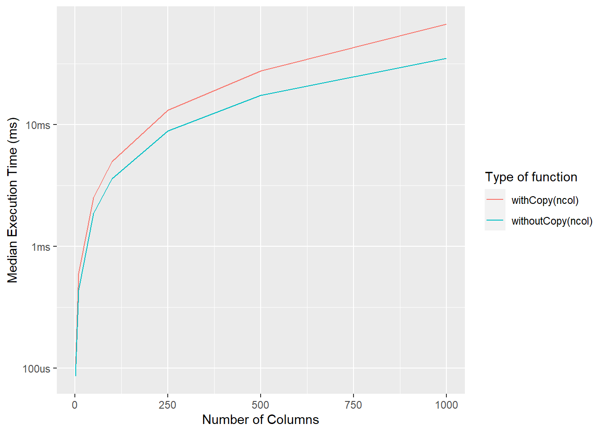

# Names and values


Loading the needed libraries:


```r
library(lobstr)
```

## Binding basics (Exercise 2.2.2)

---

**Q1.** Explain the relationship between `a`, `b`, `c` and `d` in the following code:


```r
a <- 1:10
b <- a
c <- b
d <- 1:10
```

**A1.** The names (`a`, `b`, and `c`) have same values and point to the same object in memory, as can be seen by their identical memory addresses:


```r
obj_addrs <- obj_addrs(list(a, b, c))
unique(obj_addrs)
#> [1] "0x1a571498"
```

Except `d`, which is a different object, even if it has the same value as `a`, `b`, and `c`:


```r
obj_addr(d)
#> [1] "0x1a107110"
```

---

**Q2.** The following code accesses the mean function in multiple ways. Do they all point to the same underlying function object? Verify this with `lobstr::obj_addr()`.


```r
mean
base::mean
get("mean")
evalq(mean)
match.fun("mean")
```

**A2.** All listed function calls point to the same underlying function object in memory, as shown by this object's memory address:


```r
obj_addrs <- obj_addrs(list(
  mean,
  base::mean,
  get("mean"),
  evalq(mean),
  match.fun("mean")
))

unique(obj_addrs)
#> [1] "0x17ff2118"
```

---

**Q3.** By default, base R data import functions, like `read.csv()`, will automatically convert non-syntactic names to syntactic ones. Why might this be problematic? What option allows you to suppress this behaviour?

**A3.** The conversion of non-syntactic names to syntactic ones can sometimes corrupt the data. Some datasets may require non-syntactic names.

To suppress this behavior, one can set `check.names = FALSE`.

---

**Q4.** What rules does `make.names()` use to convert non-syntactic names into syntactic ones?

**A4.** `make.names()` uses following rules to convert non-syntactic names into syntactic ones:

- it prepends non-syntactic names with `X` 
- it converts invalid characters (like `@`) to `.`
- it adds a `.` as a suffix if the name is a [reserved keyword](https://stat.ethz.ch/R-manual/R-devel/library/base/html/Reserved.html)


```r
make.names(c("123abc", "@me", "_yu", "  gh", "else"))
#> [1] "X123abc" "X.me"    "X_yu"    "X..gh"   "else."
```

---

**Q5.** I slightly simplified the rules that govern syntactic names. Why is `.123e1` not a syntactic name? Read `?make.names` for the full details.

**A5.** `.123e1` is not a syntacti name because it is parsed as a number, and not as a string:


```r
typeof(.123e1)
#> [1] "double"
```

And as the docs mention (emphasis mine):

> A syntactically valid name consists of letters, numbers and the dot or underline characters and starts with a letter or **the dot not followed by a number**.

---

## Copy-on-modify (Exercise 2.3.6)

---

**Q1.** Why is `tracemem(1:10)` not useful?

**A1.** `tracemem()` traces copying of objects in R. For example:


```r
x <- 1:10

tracemem(x)
#> [1] "<0000000032AD4C38>"

x <- x + 1

untracemem(x)
```

But since the object created in memory by `1:10` is not assigned a name, it can't be addressed or modified from R, and so there is nothing to trace. 


```r
obj_addr(1:10)
#> [1] "0x32dd4aa0"

tracemem(1:10)
#> [1] "<0000000032E40990>"
```

---

**Q2.** Explain why `tracemem()` shows two copies when you run this code. Hint: carefully look at the difference between this code and the code shown earlier in the section.
     

```r
x <- c(1L, 2L, 3L)
tracemem(x)

x[[3]] <- 4
untracemem(x)
```

**A2.** This is because the initial atomic vector is of type `integer`, but `4` (and not `4L`) is of type `double`. This is why a new copy is created.


```r
x <- c(1L, 2L, 3L)
typeof(x)
#> [1] "integer"
tracemem(x)
#> [1] "<000000003340B468>"

x[[3]] <- 4
#> tracemem[0x000000003340b468 -> 0x00000000335895e8]: eval eval eval_with_user_handlers withVisible withCallingHandlers handle timing_fn evaluate_call <Anonymous> evaluate in_dir in_input_dir eng_r block_exec call_block process_group.block process_group withCallingHandlers process_file <Anonymous> <Anonymous> do.call eval eval eval eval eval.parent local 
#> tracemem[0x00000000335895e8 -> 0x000000003351eb38]: eval eval eval_with_user_handlers withVisible withCallingHandlers handle timing_fn evaluate_call <Anonymous> evaluate in_dir in_input_dir eng_r block_exec call_block process_group.block process_group withCallingHandlers process_file <Anonymous> <Anonymous> do.call eval eval eval eval eval.parent local
untracemem(x)

typeof(x)
#> [1] "double"
```

Trying with an integer should not create another copy:


```r
x <- c(1L, 2L, 3L)
typeof(x)
#> [1] "integer"
tracemem(x)
#> [1] "<000000003390F158>"

x[[3]] <- 4L
#> tracemem[0x000000003390f158 -> 0x0000000033a683f8]: eval eval eval_with_user_handlers withVisible withCallingHandlers handle timing_fn evaluate_call <Anonymous> evaluate in_dir in_input_dir eng_r block_exec call_block process_group.block process_group withCallingHandlers process_file <Anonymous> <Anonymous> do.call eval eval eval eval eval.parent local
untracemem(x)

typeof(x)
#> [1] "integer"
```

To understand why this still produces a copy, here is an explanation from the [official solutions manual](https://advanced-r-solutions.rbind.io/names-and-values.html#copy-on-modify):

> Please be aware that running this code in RStudio will result in additional copies because of the reference from the environment pane.

---

**Q3.** Sketch out the relationship between the following objects:


```r
a <- 1:10
b <- list(a, a)
c <- list(b, a, 1:10)
```

**A3.** We can understand the relationship between these objects by looking at their memory addresses:


```r
a <- 1:10
b <- list(a, a)
c <- list(b, a, 1:10)

ref(a)
#> [1:0x340b2f88] <int>

ref(b)
#> o [1:0x341074d8] <list> 
#> +-[2:0x340b2f88] <int> 
#> \-[2:0x340b2f88]

ref(c)
#> o [1:0x34170908] <list> 
#> +-o [2:0x341074d8] <list> 
#> | +-[3:0x340b2f88] <int> 
#> | \-[3:0x340b2f88] 
#> +-[3:0x340b2f88] 
#> \-[4:0x34172c98] <int>
```

Here is what we learn:

- The name `a` references object `1:10` in the memory.
- The name `b` is bound to a list of two references to the memory address of `a`.
- The name `c` is also bound to a list of references to `a` and `b`, and `1:10` object (not bound to any name).

---

**Q4.** What happens when you run this code?


```r
x <- list(1:10)
x[[2]] <- x
```

Draw a picture.

**A4.**


```r
x <- list(1:10)
x
#> [[1]]
#>  [1]  1  2  3  4  5  6  7  8  9 10
obj_addr(x)
#> [1] "0x229c2fd8"

x[[2]] <- x
x
#> [[1]]
#>  [1]  1  2  3  4  5  6  7  8  9 10
#> 
#> [[2]]
#> [[2]][[1]]
#>  [1]  1  2  3  4  5  6  7  8  9 10
obj_addr(x)
#> [1] "0x324c7b48"

ref(x)
#> o [1:0x324c7b48] <list> 
#> +-[2:0x17472fc0] <int> 
#> \-o [3:0x229c2fd8] <list> 
#>   \-[2:0x17472fc0]
```

I don't have access to OmniGraffle software, so I am including here the figure from the [official solution manual](https://advanced-r-solutions.rbind.io/names-and-values.html#copy-on-modify):


---

## Object size (Exercise 2.4.1) 

---

**Q1.** In the following example, why are `object.size(y)` and `obj_size(y)` so radically different? Consult the documentation of `object.size()`.


```r
y <- rep(list(runif(1e4)), 100)

object.size(y)
obj_size(y)
```

**A1.** As mentioned in the docs for `object.size()`:

> This function...does not detect if elements of a list are shared.

This is why the sizes are so different:


```r
y <- rep(list(runif(1e4)), 100)

object.size(y)
#> 8005648 bytes

obj_size(y)
#> 80.90 kB
```

---

**Q2.**  Take the following list. Why is its size somewhat misleading?


```r
funs <- list(mean, sd, var)
obj_size(funs)
```

**A2.** These functions are not externally created objects in R, but are always available as part of base packages, so doesn't make much sense to measure their size because they are never going to be *not* available.


```r
funs <- list(mean, sd, var)
obj_size(funs)
#> 17.55 kB
```

---

**Q3.** Predict the output of the following code:


```r
a <- runif(1e6)
obj_size(a)

b <- list(a, a)
obj_size(b)
obj_size(a, b)

b[[1]][[1]] <- 10
obj_size(b)
obj_size(a, b)

b[[2]][[1]] <- 10
obj_size(b)
obj_size(a, b)
```

**A3.** Correctly predicted 😉


```r
a <- runif(1e6)
obj_size(a)
#> 8.00 MB

b <- list(a, a)
obj_size(b)
#> 8.00 MB
obj_size(a, b)
#> 8.00 MB

b[[1]][[1]] <- 10
obj_size(b)
#> 16.00 MB
obj_size(a, b)
#> 16.00 MB

b[[2]][[1]] <- 10
obj_size(b)
#> 16.00 MB
obj_size(a, b)
#> 24.00 MB
```

Key pieces of information to keep in mind to make correct predictions:

- Size of empty vector


```r
obj_size(double())
#> 48 B
```

- Size of a single double: 8 bytes


```r
obj_size(double(1))
#> 56 B
```

- Copy-on-modify semantics

---

## Modify-in-place (Exercise 2.5.3)

---

**Q1.** Explain why the following code doesn't create a circular list.


```r
x <- list()
x[[1]] <- x
```

**A1.** Copy-on-modify prevents the creation of a circular list.


```r
x <- list()

obj_addr(x)
#> [1] "0x32983d08"

tracemem(x)
#> [1] "<0000000032983D08>"

x[[1]] <- x
#> tracemem[0x0000000032983d08 -> 0x0000000032a9a0c8]: eval eval eval_with_user_handlers withVisible withCallingHandlers handle timing_fn evaluate_call <Anonymous> evaluate in_dir in_input_dir eng_r block_exec call_block process_group.block process_group withCallingHandlers process_file <Anonymous> <Anonymous> do.call eval eval eval eval eval.parent local

obj_addr(x[[1]])
#> [1] "0x32983d08"
```

---

**Q2.** Wrap the two methods for subtracting medians into two functions, then use the 'bench' package to carefully compare their speeds. How does performance change as the number of columns increase?

**A2.** Let's first microbenchmark functions that do and do not create copies for varying lengths of number of columns.


```r
library(bench)
library(tidyverse)

generateDataFrame <- function(ncol) {
  as.data.frame(matrix(runif(100 * ncol), nrow = 100))
}

withCopy <- function(ncol) {
  x <- generateDataFrame(ncol)
  medians <- vapply(x, median, numeric(1))

  for (i in seq_along(medians)) {
    x[[i]] <- x[[i]] - medians[[i]]
  }

  return(x)
}

withoutCopy <- function(ncol) {
  x <- generateDataFrame(ncol)
  medians <- vapply(x, median, numeric(1))

  y <- as.list(x)

  for (i in seq_along(medians)) {
    y[[i]] <- y[[i]] - medians[[i]]
  }

  return(y)
}

benchComparison <- function(ncol) {
  bench::mark(
    withCopy(ncol),
    withoutCopy(ncol),
    iterations = 100,
    check = FALSE
  ) %>%
    dplyr::select(expression:total_time)
}

nColList <- list(1, 10, 50, 100, 250, 500, 1000)

names(nColList) <- as.character(nColList)

benchDf <- purrr::map_dfr(
  .x = nColList,
  .f = benchComparison,
  .id = "nColumns"
)
```

Plotting these benchmarks reveals how the performance gets increasingly worse as the number of data frames increases:


```r
ggplot(
  benchDf,
  aes(
    x = as.numeric(nColumns),
    y = median,
    group = as.character(expression),
    color = as.character(expression)
  )
) +
  geom_line() +
  labs(
    x = "Number of Columns",
    y = "Median Execution Time (ms)",
    colour = "Type of function"
  )
```



---

**Q3.** What happens if you attempt to use `tracemem()` on an environment?

**A3.** It doesn't work and the documentation for `tracemem()` makes it clear why:

> It is not useful to trace `NULL`, environments, promises, weak references, or external pointer objects, as these are not duplicated


```r
e <- rlang::env(a = 1, b = "3")
tracemem(e)
#> Error in tracemem(e): 'tracemem' is not useful for promise and environment objects
```

---

## Session information


```r
sessioninfo::session_info(include_base = TRUE)
#> - Session info -------------------------------------------
#>  setting  value
#>  version  R version 4.1.3 (2022-03-10)
#>  os       Windows 10 x64 (build 22000)
#>  system   x86_64, mingw32
#>  ui       RTerm
#>  language (EN)
#>  collate  English_United Kingdom.1252
#>  ctype    English_United Kingdom.1252
#>  tz       Europe/Berlin
#>  date     2022-08-29
#>  pandoc   2.19 @ C:/PROGRA~1/Pandoc/ (via rmarkdown)
#> 
#> - Packages -----------------------------------------------
#>  ! package       * version    date (UTC) lib source
#>    assertthat      0.2.1      2019-03-21 [1] CRAN (R 4.1.1)
#>    backports       1.4.1      2021-12-13 [1] CRAN (R 4.1.2)
#>    base          * 4.1.3      2022-03-10 [?] local
#>    bench         * 1.1.2      2021-11-30 [1] CRAN (R 4.1.2)
#>    bookdown        0.28       2022-08-09 [1] CRAN (R 4.1.3)
#>    broom           1.0.0      2022-07-01 [1] CRAN (R 4.1.3)
#>    bslib           0.4.0      2022-07-16 [1] CRAN (R 4.1.3)
#>    cachem          1.0.6      2021-08-19 [1] CRAN (R 4.1.1)
#>    cellranger      1.1.0      2016-07-27 [1] CRAN (R 4.1.1)
#>    cli             3.3.0      2022-04-25 [1] CRAN (R 4.1.3)
#>    colorspace      2.0-3      2022-02-21 [1] CRAN (R 4.1.2)
#>  P compiler        4.1.3      2022-03-10 [2] local
#>    crayon          1.5.1      2022-03-26 [1] CRAN (R 4.1.3)
#>  P datasets      * 4.1.3      2022-03-10 [2] local
#>    DBI             1.1.3      2022-06-18 [1] CRAN (R 4.1.3)
#>    dbplyr          2.2.1      2022-06-27 [1] CRAN (R 4.1.3)
#>    digest          0.6.29     2021-12-01 [1] CRAN (R 4.1.2)
#>    downlit         0.4.2      2022-07-05 [1] CRAN (R 4.1.3)
#>    dplyr         * 1.0.9      2022-04-28 [1] CRAN (R 4.1.3)
#>    ellipsis        0.3.2      2021-04-29 [1] CRAN (R 4.1.0)
#>    evaluate        0.16       2022-08-09 [1] CRAN (R 4.1.3)
#>    fansi           1.0.3      2022-03-24 [1] CRAN (R 4.1.3)
#>    farver          2.1.1      2022-07-06 [1] CRAN (R 4.1.3)
#>    fastmap         1.1.0      2021-01-25 [1] CRAN (R 4.1.1)
#>    forcats       * 0.5.2      2022-08-19 [1] CRAN (R 4.1.3)
#>    fs              1.5.2      2021-12-08 [1] CRAN (R 4.1.2)
#>    gargle          1.2.0      2021-07-02 [1] CRAN (R 4.1.1)
#>    generics        0.1.3      2022-07-05 [1] CRAN (R 4.1.3)
#>    ggplot2       * 3.3.6      2022-05-03 [1] CRAN (R 4.1.3)
#>    glue            1.6.2      2022-02-24 [1] CRAN (R 4.1.2)
#>    googledrive     2.0.0      2021-07-08 [1] CRAN (R 4.1.1)
#>    googlesheets4   1.0.1      2022-08-13 [1] CRAN (R 4.1.3)
#>  P graphics      * 4.1.3      2022-03-10 [2] local
#>  P grDevices     * 4.1.3      2022-03-10 [2] local
#>  P grid            4.1.3      2022-03-10 [2] local
#>    gtable          0.3.0      2019-03-25 [1] CRAN (R 4.1.1)
#>    haven           2.5.1      2022-08-22 [1] CRAN (R 4.1.3)
#>    highr           0.9        2021-04-16 [1] CRAN (R 4.1.1)
#>    hms             1.1.2      2022-08-19 [1] CRAN (R 4.1.3)
#>    htmltools       0.5.3      2022-07-18 [1] CRAN (R 4.1.3)
#>    httr            1.4.4      2022-08-17 [1] CRAN (R 4.1.3)
#>    jquerylib       0.1.4      2021-04-26 [1] CRAN (R 4.1.1)
#>    jsonlite        1.8.0      2022-02-22 [1] CRAN (R 4.1.2)
#>    knitr           1.40       2022-08-24 [1] CRAN (R 4.1.3)
#>    labeling        0.4.2      2020-10-20 [1] CRAN (R 4.1.0)
#>    lifecycle       1.0.1      2021-09-24 [1] CRAN (R 4.1.1)
#>    lobstr        * 1.1.2      2022-06-22 [1] CRAN (R 4.1.3)
#>    lubridate       1.8.0      2021-10-07 [1] CRAN (R 4.1.1)
#>    magrittr      * 2.0.3      2022-03-30 [1] CRAN (R 4.1.3)
#>    memoise         2.0.1      2021-11-26 [1] CRAN (R 4.1.2)
#>  P methods       * 4.1.3      2022-03-10 [2] local
#>    modelr          0.1.9      2022-08-19 [1] CRAN (R 4.1.3)
#>    munsell         0.5.0      2018-06-12 [1] CRAN (R 4.1.1)
#>    pillar          1.8.1      2022-08-19 [1] CRAN (R 4.1.3)
#>    pkgconfig       2.0.3      2019-09-22 [1] CRAN (R 4.1.1)
#>    prettyunits     1.1.1      2020-01-24 [1] CRAN (R 4.1.1)
#>    profmem         0.6.0      2020-12-13 [1] CRAN (R 4.1.1)
#>    purrr         * 0.3.4      2020-04-17 [1] CRAN (R 4.1.1)
#>    R6              2.5.1.9000 2022-08-04 [1] Github (r-lib/R6@87d5e45)
#>    readr         * 2.1.2      2022-01-30 [1] CRAN (R 4.1.2)
#>    readxl          1.4.1      2022-08-17 [1] CRAN (R 4.1.3)
#>    reprex          2.0.2      2022-08-17 [1] CRAN (R 4.1.3)
#>    rlang           1.0.4      2022-07-12 [1] CRAN (R 4.1.3)
#>    rmarkdown       2.16       2022-08-24 [1] CRAN (R 4.1.3)
#>    rstudioapi      0.14       2022-08-22 [1] CRAN (R 4.1.3)
#>    rvest           1.0.3      2022-08-19 [1] CRAN (R 4.1.3)
#>    sass            0.4.2      2022-07-16 [1] CRAN (R 4.1.3)
#>    scales          1.2.1      2022-08-20 [1] CRAN (R 4.1.3)
#>    sessioninfo     1.2.2      2021-12-06 [1] CRAN (R 4.1.2)
#>  P stats         * 4.1.3      2022-03-10 [2] local
#>    stringi         1.7.8      2022-07-11 [1] CRAN (R 4.1.3)
#>    stringr       * 1.4.1      2022-08-20 [1] CRAN (R 4.1.3)
#>    tibble        * 3.1.8      2022-07-22 [1] CRAN (R 4.1.3)
#>    tidyr         * 1.2.0      2022-02-01 [1] CRAN (R 4.1.2)
#>    tidyselect      1.1.2      2022-02-21 [1] CRAN (R 4.1.2)
#>    tidyverse     * 1.3.2      2022-07-18 [1] CRAN (R 4.1.3)
#>  P tools           4.1.3      2022-03-10 [2] local
#>    tzdb            0.3.0      2022-03-28 [1] CRAN (R 4.1.3)
#>    utf8            1.2.2      2021-07-24 [1] CRAN (R 4.1.1)
#>  P utils         * 4.1.3      2022-03-10 [2] local
#>    vctrs           0.4.1      2022-04-13 [1] CRAN (R 4.1.3)
#>    withr           2.5.0      2022-03-03 [1] CRAN (R 4.1.2)
#>    xfun            0.32       2022-08-10 [1] CRAN (R 4.1.3)
#>    xml2            1.3.3      2021-11-30 [1] CRAN (R 4.1.2)
#>    yaml            2.3.5      2022-02-21 [1] CRAN (R 4.1.2)
#> 
#>  [1] C:/Users/IndrajeetPatil/Documents/R/win-library/4.1
#>  [2] C:/Program Files/R/R-4.1.3/library
#> 
#>  P -- Loaded and on-disk path mismatch.
#> 
#> ----------------------------------------------------------
```
