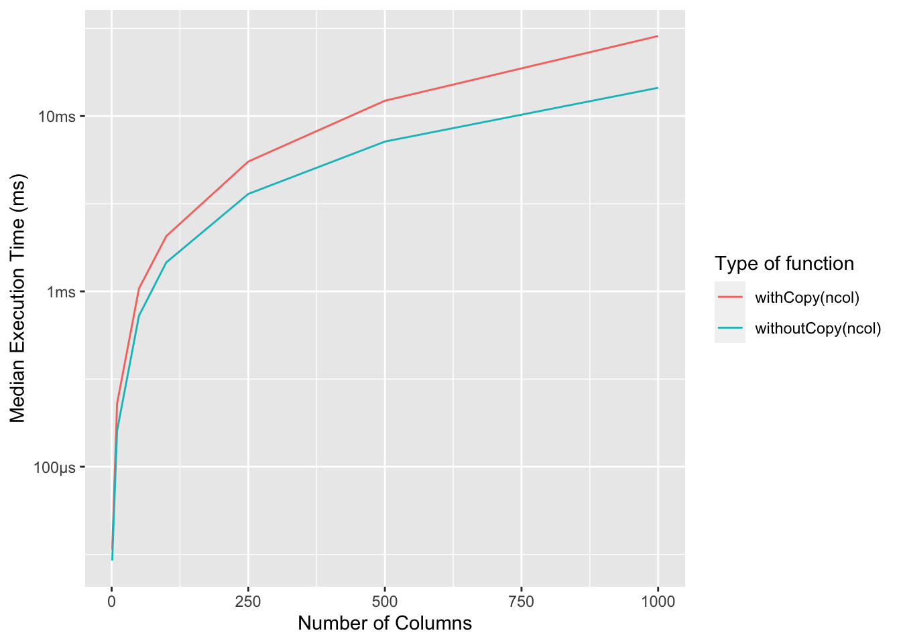

# Names and values


## 2.2.2 Exercises 

**Q1.** Explain the relationship between `a`, `b`, `c` and `d` in the following code:


```r
a <- 1:10
b <- a
c <- b
d <- 1:10
```

**A1.** 


```r
a <- 1:10
b <- a
c <- b
d <- 1:10
```

The names (`a`, `b`, and `c`) are references to the same object in memory, as can be seen by the identical memory address:


```r
library(lobstr)

obj_addrs(list(a, b, c))
#> [1] "0x10aceaac8" "0x10aceaac8" "0x10aceaac8"
```

Except `d`, which is a different object, even if it has the same value:


```r
obj_addr(d)
#> [1] "0x10ab98e80"
```

**Q2.** The following code accesses the mean function in multiple ways. Do they all point to the same underlying function object? Verify this with `lobstr::obj_addr()`.


```r
mean
base::mean
get("mean")
evalq(mean)
match.fun("mean")
```

**A2.** 

Following code verifies that indeed these calls all point to the same underlying function object.


```r
obj_addr(mean)
#> [1] "0x1299664a8"
obj_addr(base::mean)
#> [1] "0x1299664a8"
obj_addr(get("mean"))
#> [1] "0x1299664a8"
obj_addr(evalq(mean))
#> [1] "0x1299664a8"
obj_addr(match.fun("mean"))
#> [1] "0x1299664a8"
```

**Q3.** By default, base R data import functions, like `read.csv()`, will automatically convert non-syntactic names to syntactic ones. Why might this be problematic? What option allows you to suppress this behaviour?

**A3.** 

The conversion of non-syntactic names to syntactic ones can sometimes corrupt the data. Some datasets may require non-syntactic names.

To suppress this behavior, one can set `check.names = FALSE`.

**Q4.** What rules does `make.names()` use to convert non-syntactic names into syntactic ones?

**A4.**

It just prepends `X` in non-syntactic names and invalid characters (like `@`) are converted to `.`.


```r
make.names(c("123abc", "@me", "_yu", "  gh", "else"))
#> [1] "X123abc" "X.me"    "X_yu"    "X..gh"   "else."
```

**Q5.** I slightly simplified the rules that govern syntactic names. Why is `.123e1` not a syntactic name? Read `?make.names` for the full details.

**A5.**

Because it is parsed as a number.


```r
typeof(.123e1)
#> [1] "double"
```

And as the docs mention (emphasis mine):

> A syntactically valid name consists of letters, numbers and the dot or underline characters and starts with a letter or **the dot not followed by a number**.

Here is how `make.names()` will make it syntactic:


```r
make.names(.123e1)
#> [1] "X1.23"
```

## 2.3.6 Exercises 

**Q1.** Why is `tracemem(1:10)` not useful?

**A1.**

`tracemem()` traces copying of objects in R, but since the object created here is not assigned a name, there is nothing to trace. 


```r
tracemem(1:10)
#> [1] "<0x10e12c9e8>"
```

**Q2.** Explain why `tracemem()` shows two copies when you run this code. Hint: carefully look at the difference between this code and the code shown earlier in the section.
     

```r
x <- c(1L, 2L, 3L)
tracemem(x)

x[[3]] <- 4
```

**A2.** 

Were it not for `4` being a double - and not an integer (`4L`) - this would have been modified in place.


```r
x <- c(1L, 2L, 3L)
tracemem(x)
#> [1] "<0x10e28d788>"

x[[3]] <- 4
#> tracemem[0x10e28d788 -> 0x10d3c9788]: eval eval eval_with_user_handlers withVisible withCallingHandlers handle timing_fn evaluate_call <Anonymous> evaluate in_dir in_input_dir eng_r block_exec call_block process_group.block process_group withCallingHandlers process_file <Anonymous> <Anonymous> do.call eval eval eval eval eval.parent local 
#> tracemem[0x10d3c9788 -> 0x10d3fdca8]: eval eval eval_with_user_handlers withVisible withCallingHandlers handle timing_fn evaluate_call <Anonymous> evaluate in_dir in_input_dir eng_r block_exec call_block process_group.block process_group withCallingHandlers process_file <Anonymous> <Anonymous> do.call eval eval eval eval eval.parent local
```

Try with integer:


```r
x <- c(1L, 2L, 3L)
tracemem(x)
#> [1] "<0x10e3b1cc8>"

x[[3]] <- 4L
#> tracemem[0x10e3b1cc8 -> 0x10d4bdcc8]: eval eval eval_with_user_handlers withVisible withCallingHandlers handle timing_fn evaluate_call <Anonymous> evaluate in_dir in_input_dir eng_r block_exec call_block process_group.block process_group withCallingHandlers process_file <Anonymous> <Anonymous> do.call eval eval eval eval eval.parent local
```

As for why this still produces a copy, this is from Solutions manual:

> Please be aware that running this code in RStudio will result in additional copies because of the reference from the environment pane.

**Q3.** Sketch out the relationship between the following objects:


```r
a <- 1:10
b <- list(a, a)
c <- list(b, a, 1:10)
```

**A3.**


```r
a <- 1:10
b <- list(a, a)
c <- list(b, a, 1:10)

ref(a)
#> [1:0x10e71c6a0] <int>

ref(b)
#> █ [1:0x10e727388] <list> 
#> ├─[2:0x10e71c6a0] <int> 
#> └─[2:0x10e71c6a0]

ref(c)
#> █ [1:0x10e76ec08] <list> 
#> ├─█ [2:0x10e727388] <list> 
#> │ ├─[3:0x10e71c6a0] <int> 
#> │ └─[3:0x10e71c6a0] 
#> ├─[3:0x10e71c6a0] 
#> └─[4:0x10c7092d0] <int>
```

**Q4.** What happens when you run this code?


```r
x <- list(1:10)
x[[2]] <- x
```
    
Draw a picture.

**A4.**


```r
x <- list(1:10)
x
#> [[1]]
#>  [1]  1  2  3  4  5  6  7  8  9 10
obj_addr(x)
#> [1] "0x10d72b5a0"

x[[2]] <- x
x
#> [[1]]
#>  [1]  1  2  3  4  5  6  7  8  9 10
#> 
#> [[2]]
#> [[2]][[1]]
#>  [1]  1  2  3  4  5  6  7  8  9 10
obj_addr(x)
#> [1] "0x10f0d27c8"

ref(x)
#> █ [1:0x10f0d27c8] <list> 
#> ├─[2:0x10d7391b0] <int> 
#> └─█ [3:0x10d72b5a0] <list> 
#>   └─[2:0x10d7391b0]
```

Figure from the official solution manual can be found here:
<https://advanced-r-solutions.rbind.io/images/names_values/copy_on_modify_fig2.png>

## 2.4.1 Exercises 

**Q1.** In the following example, why are `object.size(y)` and `obj_size(y)` so radically different? Consult the documentation of `object.size()`.


```r
y <- rep(list(runif(1e4)), 100)

object.size(y)
obj_size(y)
```

**A1.**

> This function...does not detect if elements of a list are shared.


```r
y <- rep(list(runif(1e4)), 100)

object.size(y)
#> 8005648 bytes

obj_size(y)
#> 80,896 B
```

**Q2.**  Take the following list. Why is its size somewhat misleading?


```r
funs <- list(mean, sd, var)
obj_size(funs)
```

**A2.**

These functions are not externally created objects in R, but are always available, so doesn't make much sense to measure their size.


```r
funs <- list(mean, sd, var)
obj_size(funs)
#> 17,608 B
```

Nevertheless, it's still interesting that the addition is not the same as size of list of those objects.


```r
obj_size(mean)
#> 1,184 B
obj_size(sd)
#> 4,480 B
obj_size(var)
#> 12,472 B

obj_size(mean) + obj_size(sd) + obj_size(var)
#> 18,136 B
```

**Q3.** Predict the output of the following code:


```r
a <- runif(1e6)
obj_size(a)

b <- list(a, a)
obj_size(b)
obj_size(a, b)

b[[1]][[1]] <- 10
obj_size(b)
obj_size(a, b)

b[[2]][[1]] <- 10
obj_size(b)
obj_size(a, b)
```

**A3.** Correctly predicted 😉


```r
a <- runif(1e6)
obj_size(a)
#> 8,000,048 B

b <- list(a, a)
obj_size(b)
#> 8,000,112 B
obj_size(a, b)
#> 8,000,112 B

b[[1]][[1]] <- 10
obj_size(b)
#> 16,000,160 B
obj_size(a, b)
#> 16,000,160 B

b[[2]][[1]] <- 10
obj_size(b)
#> 16,000,160 B
obj_size(a, b)
#> 24,000,208 B
```

## 2.5.3 Exercises

**Q1.** Explain why the following code doesn't create a circular list.


```r
x <- list()
x[[1]] <- x
```

**A1.**

Copy-on-modify prevents the creation of a circular list.


```r
x <- list()

obj_addr(x)
#> [1] "0x10b0a4f28"

tracemem(x)
#> [1] "<0x10b0a4f28>"

x[[1]] <- x
#> tracemem[0x10b0a4f28 -> 0x10ac452e0]: eval eval eval_with_user_handlers withVisible withCallingHandlers handle timing_fn evaluate_call <Anonymous> evaluate in_dir in_input_dir eng_r block_exec call_block process_group.block process_group withCallingHandlers process_file <Anonymous> <Anonymous> do.call eval eval eval eval eval.parent local

obj_addr(x[[1]])
#> [1] "0x10b0a4f28"
```

**Q2.** Wrap the two methods for subtracting medians into two functions, then use the 'bench' package to carefully compare their speeds. How does performance change as the number of columns increase?

**A2.**

Let's first microbenchmark functions that do and do not create copies for varying lengths of number of columns.


```r
library(bench)
library(tidyverse)

generateDataFrame <- function(ncol) {
  as.data.frame(matrix(runif(100 * ncol), nrow = 100))
}

withCopy <- function(ncol) {
  x <- generateDataFrame(ncol)
  medians <- vapply(x, median, numeric(1))

  for (i in seq_along(medians)) {
    x[[i]] <- x[[i]] - medians[[i]]
  }

  return(x)
}

withoutCopy <- function(ncol) {
  x <- generateDataFrame(ncol)
  medians <- vapply(x, median, numeric(1))

  y <- as.list(x)

  for (i in seq_along(medians)) {
    y[[i]] <- y[[i]] - medians[[i]]
  }

  return(y)
}

benchComparison <- function(ncol) {
  bench::mark(
    withCopy(ncol),
    withoutCopy(ncol),
    iterations = 100,
    check = FALSE
  ) %>%
    dplyr::select(expression:total_time)
}

nColList <- list(1, 10, 50, 100, 250, 500, 1000)

names(nColList) <- as.character(nColList)

benchDf <- purrr::map_dfr(
  .x = nColList,
  .f = benchComparison,
  .id = "nColumns"
)
```

Plotting these benchmarks reveals how the performance gets increasingly worse as the number of dataframes increases:


```r
ggplot(
  benchDf,
  aes(
    x = as.numeric(nColumns),
    y = median,
    group = as.character(expression),
    color = as.character(expression)
  )
) +
  geom_line() +
  labs(
    x = "Number of Columns",
    y = "Median Execution Time (ms)",
    colour = "Type of function"
  )
```



**Q3.** What happens if you attempt to use `tracemem()` on an environment?

**A3.** 

It doesn't work and the documentation makes it clear as to why:

> It is not useful to trace NULL, environments, promises, weak references, or external pointer objects, as these are not duplicated


```r
e <- rlang::env(a = 1, b = "3")
tracemem(e)
#> Error in tracemem(e): 'tracemem' is not useful for promise and environment objects
```
