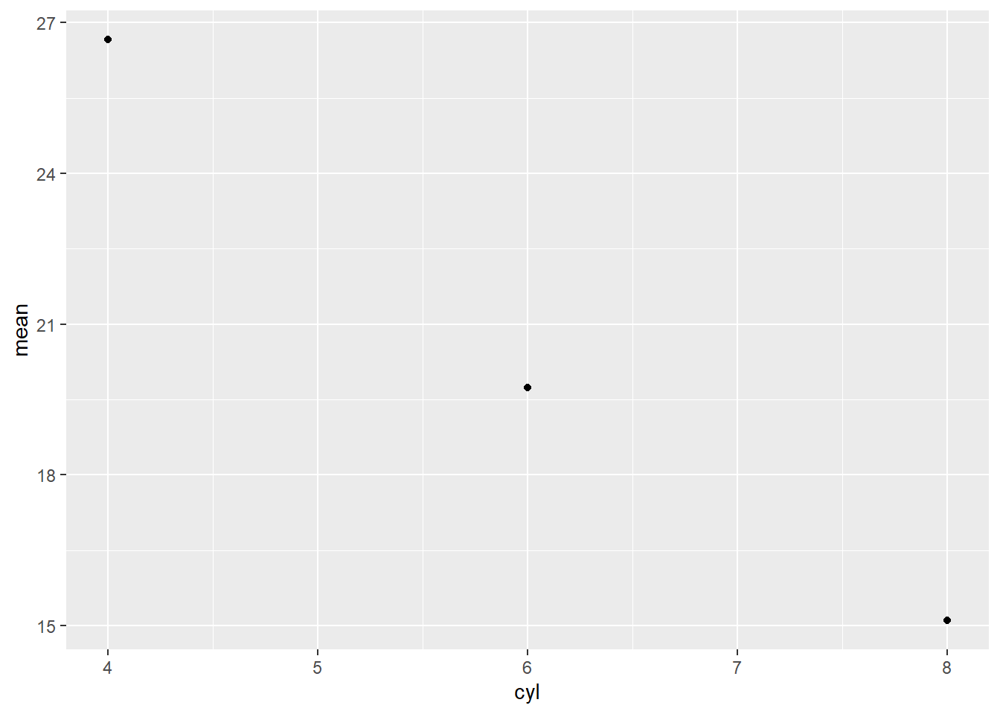

# Quasiquotation


Attaching the needed libraries:


```r
library(rlang)
library(purrr)
library(lobstr)
library(dplyr)
library(ggplot2)
```

## Motivation (Exercises 19.2.2)

---

**Q1.** For each function in the following base R code, identify which arguments are quoted and which are evaluated.


```r
library(MASS)

mtcars2 <- subset(mtcars, cyl == 4)

with(mtcars2, sum(vs))
sum(mtcars2$am)

rm(mtcars2)
```

**A1.** To identify which arguments are quoted and which are evaluated, we can use the trick mentioned in the book:

> If you’re ever unsure about whether an argument is quoted or evaluated, try executing the code outside of the function. If it doesn’t work or does something different, then that argument is quoted.

- `library(MASS)`

The `package` argument in `library()` is quoted:


```r
library(MASS)

MASS
#> Error in eval(expr, envir, enclos): object 'MASS' not found
```

- `subset(mtcars, cyl == 4)`

The argument `x` is evaluated, while the argument `subset` is quoted.


```r
mtcars2 <- subset(mtcars, cyl == 4)

invisible(mtcars)

cyl == 4
#> Error in eval(expr, envir, enclos): object 'cyl' not found
```

- `with(mtcars2, sum(vs))`

The argument `data` is evaluated, while `expr` argument is quoted.


```r
with(mtcars2, sum(vs))
#> [1] 10

invisible(mtcars2)

sum(vs)
#> Error in eval(expr, envir, enclos): object 'vs' not found
```

- `sum(mtcars2$am)`

The argument `...` is evaluated.


```r
sum(mtcars2$am)
#> [1] 8

mtcars2$am
#>  [1] 1 0 0 1 1 1 0 1 1 1 1
```

- `rm(mtcars2)`

The trick we are using so far won't work here since trying to print `mtcars2` will always fail after `rm()` has made a pass at it.


```r
rm(mtcars2)
```

We can instead look at the docs for `...`:

> ... the objects to be removed, as names (unquoted) or character strings (quoted).

Thus, this argument is not evaluated, but rather quoted.

---

**Q2.** For each function in the following tidyverse code, identify which arguments are quoted and which are evaluated.


```r
library(dplyr)
library(ggplot2)

by_cyl <- mtcars %>%
  group_by(cyl) %>%
  summarise(mean = mean(mpg))

ggplot(by_cyl, aes(cyl, mean)) +
  geom_point()
```

**A2.** As seen in the answer for **Q1.**, `library()` quotes its first argument:


```r
library(dplyr)
library(ggplot2)
```

In the following code:

- `%>%` (lazily) evaluates its argument
- `group_by()` and `summarise()` quote their arguments


```r
by_cyl <- mtcars %>%
  group_by(cyl) %>%
  summarise(mean = mean(mpg))
```

In the following code:

- `ggplot()` evaluates the `data` argument
- `aes()` quotes its arguments


```r
ggplot(by_cyl, aes(cyl, mean)) +
  geom_point()
```



---

## Quoting (Exercises 19.3.6)

---

**Q1.** How is `expr()` implemented? Look at its source code.

**A1.** Looking at the source code, we can see that `expr()` is a simple wrapper around `enexpr()`, and captures and returns the user-entered expressions:


```r
rlang::expr
#> function (expr) 
#> {
#>     enexpr(expr)
#> }
#> <bytecode: 0x10bfa7b30>
#> <environment: namespace:rlang>
```

For example:


```r
x <- expr(x <- 1)
x
#> x <- 1
```

---

**Q2.** Compare and contrast the following two functions. Can you predict the output before running them?


```r
f1 <- function(x, y) {
  exprs(x = x, y = y)
}
f2 <- function(x, y) {
  enexprs(x = x, y = y)
}
f1(a + b, c + d)
f2(a + b, c + d)
```

**A2.** The `exprs()` captures and returns the expressions specified by the developer instead of their values:


```r
f1 <- function(x, y) {
  exprs(x = x, y = y)
}

f1(a + b, c + d)
#> $x
#> x
#> 
#> $y
#> y
```

On the other hand, `enexprs()` captures the user-entered expressions and returns their values:


```r
f2 <- function(x, y) {
  enexprs(x = x, y = y)
}

f2(a + b, c + d)
#> $x
#> a + b
#> 
#> $y
#> c + d
```

---

**Q3.** What happens if you try to use `enexpr()` with an expression (i.e. `enexpr(x + y)`? What happens if `enexpr()` is passed a missing argument?

**A3.** If you try to use `enexpr()` with an expression, it fails because it works only with types `symbol` and `character` (which is converted to `symbol`).


```r
enexpr(x + y)
#> Error in `enexpr()`:
#> ! `arg` must be a symbol
```

If `enexpr()` is passed a missing argument, it returns a missing argument:


```r
arg <- missing_arg()

enexpr(arg)

is_missing(enexpr(arg))
#> [1] TRUE
```

---

**Q4.** How are `exprs(a)` and `exprs(a = )` different? Think about both the input and the output.

**A4.** The key difference here is that the former will return an unnamed list, while the latter will return a named list. This is because the former is interpreted as an unnamed argument, while the latter a named argument.


```r
exprs(a)
#> [[1]]
#> a

exprs(a = )
#> $a
```

In both cases, `a` is treated as a symbol:


```r
purrr::map_lgl(exprs(a), is_symbol)
#>      
#> TRUE

purrr::map_lgl(exprs(a = ), is_symbol)
#>    a 
#> TRUE
```

But, the argument is missing only in the latter case, since only the name but no corresponding value is provided:


```r
purrr::map_lgl(exprs(a), is_missing)
#>       
#> FALSE

purrr::map_lgl(exprs(a = ), is_missing)
#>    a 
#> TRUE
```

---

**Q5.** What are other differences between `exprs()` and `alist()`? Read the  documentation for the named arguments of `exprs()` to find out.

**A5.** Here are some additional differences between `exprs()` and `alist()`.

- Names: If the inputs are not named, `exprs()` provides a way to name them automatically using `.named` argument.


```r
alist("x" = 1, TRUE, "z" = expr(x + y))
#> $x
#> [1] 1
#> 
#> [[2]]
#> [1] TRUE
#> 
#> $z
#> expr(x + y)

exprs("x" = 1, TRUE, "z" = expr(x + y), .named = TRUE)
#> $x
#> [1] 1
#> 
#> $`TRUE`
#> [1] TRUE
#> 
#> $z
#> expr(x + y)
```

- Ignoring empty arguments: The `.ignore_empty` argument in `exprs()` gives you a much finer control over what to do with the empty arguments, while `alist()` always ignores none of such arguments.


```r
alist("x" = 1, , TRUE, )
#> $x
#> [1] 1
#> 
#> [[2]]
#> 
#> 
#> [[3]]
#> [1] TRUE
#> 
#> [[4]]

exprs("x" = 1, , TRUE, , .ignore_empty = "trailing")
#> $x
#> [1] 1
#> 
#> [[2]]
#> 
#> 
#> [[3]]
#> [1] TRUE

exprs("x" = 1, , TRUE, , .ignore_empty = "none")
#> $x
#> [1] 1
#> 
#> [[2]]
#> 
#> 
#> [[3]]
#> [1] TRUE
#> 
#> [[4]]

exprs("x" = 1, , TRUE, , .ignore_empty = "all")
#> $x
#> [1] 1
#> 
#> [[2]]
#> [1] TRUE
```

- Names injection: Using `.unquote_names` argument in `exprs()`, we can inject a name for the argument.


```r
alist(foo := bar)
#> [[1]]
#> `:=`(foo, bar)

exprs(foo := bar, .unquote_names = FALSE)
#> [[1]]
#> `:=`(foo, bar)

exprs(foo := bar, .unquote_names = TRUE)
#> $foo
#> bar
```

---

**Q6.** The documentation for `substitute()` says:

    > Substitution takes place by examining each component of the parse tree 
    > as follows: 
    > 
    > * If it is not a bound symbol in `env`, it is unchanged. 
    > * If it is a promise object (i.e., a formal argument to a function) 
    >   the expression slot of the promise replaces the symbol. 
    > * If it is an ordinary variable, its value is substituted, unless 
    > `env` is .GlobalEnv in which case the symbol is left unchanged.
  
Create examples that illustrate each of the above cases.

**A6.** See below examples that illustrate each of the above-mentioned cases.

> If it is not a bound symbol in `env`, it is unchanged. 

Symbol `x` is not bound in `env`, so it remains unchanged. 


```r
substitute(x + y, env = list(y = 2))
#> x + 2
```

> If it is a promise object (i.e., a formal argument to a function) 
> the expression slot of the promise replaces the symbol. 


```r
msg <- "old"
delayedAssign("myVar", msg) # creates a promise
substitute(myVar)
#> myVar
msg <- "new!"
myVar
#> [1] "new!"
```

> If it is an ordinary variable, its value is substituted, unless 
> `env` is .GlobalEnv in which case the symbol is left unchanged.


```r
x <- 2
y <- 1
substitute(x + y, env = .GlobalEnv)
#> x + y
```

---

## Unquoting (Exercises 19.4.8)

---

**Q1.** Given the following components:


```r
xy <- expr(x + y)
xz <- expr(x + z)
yz <- expr(y + z)
abc <- exprs(a, b, c)
```

Use quasiquotation to construct the following calls:


```r
(x + y) / (y + z)
-(x + z)^(y + z)
(x + y) + (y + z) - (x + y)
atan2(x + y, y + z)
sum(x + y, x + y, y + z)
sum(a, b, c)
mean(c(a, b, c), na.rm = TRUE)
foo(a = x + y, b = y + z)
```

**A1.** Using quasiquotation to construct the specified calls:


```r
xy <- expr(x + y)
xz <- expr(x + z)
yz <- expr(y + z)
abc <- exprs(a, b, c)

expr((!!xy) / (!!yz))
#> (x + y)/(y + z)

expr(-(!!xz)^(!!yz))
#> -(x + z)^(y + z)

expr(((!!xy)) + (!!yz) - (!!xy))
#> (x + y) + (y + z) - (x + y)

call2("atan2", expr(!!xy), expr(!!yz))
#> atan2(x + y, y + z)

call2("sum", expr(!!xy), expr(!!xy), expr(!!yz))
#> sum(x + y, x + y, y + z)

call2("sum", !!!abc)
#> sum(a, b, c)

expr(mean(c(!!!abc), na.rm = TRUE))
#> mean(c(a, b, c), na.rm = TRUE)

call2("foo", a = expr(!!xy), b = expr(!!yz))
#> foo(a = x + y, b = y + z)
```

---

**Q2.** The following two calls print the same, but are actually different:


```r
(a <- expr(mean(1:10)))
#> mean(1:10)
(b <- expr(mean(!!(1:10))))
#> mean(1:10)
identical(a, b)
#> [1] FALSE
```

What's the difference? Which one is more natural?

**A2.** We can see the difference between these two expression if we convert them to lists:


```r
as.list(expr(mean(1:10)))
#> [[1]]
#> mean
#> 
#> [[2]]
#> 1:10

as.list(expr(mean(!!(1:10))))
#> [[1]]
#> mean
#> 
#> [[2]]
#>  [1]  1  2  3  4  5  6  7  8  9 10
```

As can be seen, the second element of `a` is a `call` object, while that in `b` is an integer vector:


```r
waldo::compare(a, b)
#> `old[[2]]` is a call
#> `new[[2]]` is an integer vector (1, 2, 3, 4, 5, ...)
```

The same can also be noticed in ASTs for these expressions:


```r
ast(expr(mean(1:10)))
#> █─expr 
#> └─█─mean 
#>   └─█─`:` 
#>     ├─1 
#>     └─10

ast(expr(mean(!!(1:10))))
#> █─expr 
#> └─█─mean 
#>   └─<inline integer>
```

The first call is more natural, since the second one inlines a vector directly into the call, something that is rarely done.

---

## `...` (dot-dot-dot) (Exercises 19.6.5)

---

**Q1.** One way to implement `exec()` is shown below. Describe how it works. What are the key ideas?


```r
exec <- function(f, ..., .env = caller_env()) {
  args <- list2(...)
  do.call(f, args, envir = .env)
}
```

**A1.** The keys ideas that underlie the `exec()` function 

- The function constructs a call using function `f` and its argument `...`, and evaluates the call in the environment `.env`.

- The function uses [dynamic dots](https://rlang.r-lib.org/reference/dyn-dots.html) via `list2()`, which means that you ca splice argument using `!!!`, you can inject names using `:=`, and trailing commas are not a problem.

Here is an example:


```r
vec <- c(1:5, NA)
args_list <- list(trim = 0, na.rm = TRUE)

exec(mean, vec, !!!args_list, , .env = caller_env())
#> [1] 3

rm("exec")
```

---

**Q2.** Carefully read the source code for `interaction()`, `expand.grid()`, and `par()`. Compare and contrast the techniques they use for switching between dots and list behaviour.

**A2.** Source code reveals the following comparison table:

| Function        | Capture the dots    | Handle list input                                                    |
| :-------------- | :------------------ | :------------------------------------------------------------------- |
| `interaction()` | `args <- list(...)` | `length(args) == 1L && is.list(args[[1L]])`                          |
| `expand.grid()` | `args <- list(...)` | `length(args) == 1L && is.list(args[[1L]])`                          |
| `par()`         | `args <- list(...)` | `length(args) == 1L && (is.list(args[[1L]] || is.null(args[[1L]])))` |

All functions capture the dots in a list.

Using these dots, the functions check if a list was entered as an argument by checking the number of arguments and, if the count is 1, checking if the argument is a list.

---

**Q3.** Explain the problem with this definition of `set_attr()`


```r
set_attr <- function(x, ...) {
  attr <- rlang::list2(...)
  attributes(x) <- attr
  x
}
set_attr(1:10, x = 10)
#> Error in attributes(x) <- attr: attributes must be named
```

**A3.** The `set_attr()` function signature has a parameter called `x`, and additionally it uses dynamic dots to pass multiple arguments to specify additional attributes for `x`.

But, as shown in the example, this creates a problem when the attribute is itself named `x`. Naming the arguments won't help either:


```r
set_attr <- function(x, ...) {
  attr <- rlang::list2(...)
  attributes(x) <- attr
  x
}
set_attr(x = 1:10, x = 10)
#> Error in set_attr(x = 1:10, x = 10): formal argument "x" matched by multiple actual arguments
```

We can avoid these issues by renaming the parameter:


```r
set_attr <- function(.x, ...) {
  attr <- rlang::list2(...)
  attributes(.x) <- attr
  .x
}

set_attr(.x = 1:10, x = 10)
#>  [1]  1  2  3  4  5  6  7  8  9 10
#> attr(,"x")
#> [1] 10
```

---

## Case studies (Exercises 19.7.5)

---

**Q1.** In the linear-model example, we could replace the `expr()` in `reduce(summands, ~ expr(!!.x + !!.y))` with `call2()`: `reduce(summands, call2, "+")`. Compare and contrast the two approaches. Which do you think is easier to read?

**A1.** We can rewrite the `linear()` function from this chapter using `call2()` as follows:


```r
linear <- function(var, val) {
  var <- ensym(var)
  coef_name <- map(seq_along(val[-1]), ~ expr((!!var)[[!!.x]]))

  summands <- map2(val[-1], coef_name, ~ expr((!!.x * !!.y)))
  summands <- c(val[[1]], summands)

  reduce(summands, ~ call2("+", .x, .y))
}

linear(x, c(10, 5, -4))
#> 10 + (5 * x[[1L]]) + (-4 * x[[2L]])
```

I personally find the version with `call2()` to be much more readable since the `!!` syntax is a bit esoteric.

---

**Q2.** Re-implement the Box-Cox transform defined below using unquoting and `new_function()`:


```r
bc <- function(lambda) {
  if (lambda == 0) {
    function(x) log(x)
  } else {
    function(x) (x^lambda - 1) / lambda
  }
}
```

**A2.** Re-implementation of the Box-Cox transform using unquoting and `new_function()`:


```r
bc_new <- function(lambda) {
  lambda <- enexpr(lambda)

  if (!!lambda == 0) {
    new_function(
      exprs(x = ),
      expr(log(x))
    )
  } else {
    new_function(
      exprs(x = ),
      expr((x^(!!lambda) - 1) / (!!lambda))
    )
  }
}
```

Let's try it out to see if it produces the same output as before:


```r
bc(0)(1)
#> [1] 0
bc_new(0)(1)
#> [1] 0

bc(2)(2)
#> [1] 1.5
bc_new(2)(2)
#> [1] 1.5
```

---

**Q3.**  Re-implement the simple `compose()` defined below using quasiquotation and `new_function()`:


```r
compose <- function(f, g) {
  function(...) f(g(...))
}
```

**A3.** Following is a re-implementation of `compose()` using quasiquotation and `new_function()`:


```r
compose_new <- function(f, g) {
  f <- enexpr(f) # or ensym(f)
  g <- enexpr(g) # or ensym(g)

  new_function(
    exprs(... = ),
    expr((!!f)((!!g)(...)))
  )
}
```

Checking that the new version behaves the same way as the original version:


```r
not_null <- compose(`!`, is.null)
not_null(4)
#> [1] TRUE

not_null2 <- compose_new(`!`, is.null)
not_null2(4)
#> [1] TRUE
```

---

## Session information


```r
sessioninfo::session_info(include_base = TRUE)
#> ─ Session info ───────────────────────────────────────────
#>  setting  value
#>  version  R version 4.2.1 (2022-06-23)
#>  os       macOS Monterey 12.5.1
#>  system   aarch64, darwin20
#>  ui       X11
#>  language (EN)
#>  collate  en_US.UTF-8
#>  ctype    en_US.UTF-8
#>  tz       Europe/Berlin
#>  date     2022-09-25
#>  pandoc   2.19.2 @ /usr/local/bin/ (via rmarkdown)
#> 
#> ─ Packages ───────────────────────────────────────────────
#>  ! package     * version    date (UTC) lib source
#>    assertthat    0.2.1      2019-03-21 [1] CRAN (R 4.2.0)
#>    base        * 4.2.1      2022-06-24 [?] local
#>    bookdown      0.29       2022-09-12 [1] CRAN (R 4.2.1)
#>    bslib         0.4.0.9000 2022-08-20 [1] Github (rstudio/bslib@fa2e03c)
#>    cachem        1.0.6      2021-08-19 [1] CRAN (R 4.2.0)
#>    cli           3.4.1      2022-09-23 [1] CRAN (R 4.2.1)
#>    colorspace    2.0-3      2022-02-21 [1] CRAN (R 4.2.0)
#>  P compiler      4.2.1      2022-06-24 [1] local
#>    crayon        1.5.1      2022-03-26 [1] CRAN (R 4.2.0)
#>  P datasets    * 4.2.1      2022-06-24 [1] local
#>    DBI           1.1.3      2022-06-18 [1] CRAN (R 4.2.0)
#>    diffobj       0.3.5      2021-10-05 [1] CRAN (R 4.2.0)
#>    digest        0.6.29     2021-12-01 [1] CRAN (R 4.2.0)
#>    downlit       0.4.2      2022-07-05 [1] CRAN (R 4.2.1)
#>    dplyr       * 1.0.10     2022-09-01 [1] CRAN (R 4.2.1)
#>    evaluate      0.16       2022-08-09 [1] CRAN (R 4.2.1)
#>    fansi         1.0.3      2022-03-24 [1] CRAN (R 4.2.0)
#>    farver        2.1.1      2022-07-06 [1] CRAN (R 4.2.1)
#>    fastmap       1.1.0      2021-01-25 [1] CRAN (R 4.2.0)
#>    fs            1.5.2      2021-12-08 [1] CRAN (R 4.2.0)
#>    generics      0.1.3      2022-07-05 [1] CRAN (R 4.2.1)
#>    ggplot2     * 3.3.6      2022-05-03 [1] CRAN (R 4.2.0)
#>    glue          1.6.2      2022-02-24 [1] CRAN (R 4.2.0)
#>  P graphics    * 4.2.1      2022-06-24 [1] local
#>  P grDevices   * 4.2.1      2022-06-24 [1] local
#>  P grid          4.2.1      2022-06-24 [1] local
#>    gtable        0.3.1      2022-09-01 [1] CRAN (R 4.2.1)
#>    highr         0.9        2021-04-16 [1] CRAN (R 4.2.0)
#>    htmltools     0.5.3      2022-07-18 [1] CRAN (R 4.2.1)
#>    jquerylib     0.1.4      2021-04-26 [1] CRAN (R 4.2.0)
#>    jsonlite      1.8.0      2022-02-22 [1] CRAN (R 4.2.0)
#>    knitr         1.40       2022-08-24 [1] CRAN (R 4.2.1)
#>    labeling      0.4.2      2020-10-20 [1] CRAN (R 4.2.0)
#>    lifecycle     1.0.2      2022-09-09 [1] CRAN (R 4.2.1)
#>    lobstr      * 1.1.2      2022-06-22 [1] CRAN (R 4.2.0)
#>    magrittr    * 2.0.3      2022-03-30 [1] CRAN (R 4.2.0)
#>    MASS        * 7.3-58.1   2022-08-03 [1] CRAN (R 4.2.1)
#>    memoise       2.0.1      2021-11-26 [1] CRAN (R 4.2.0)
#>  P methods     * 4.2.1      2022-06-24 [1] local
#>    munsell       0.5.0      2018-06-12 [1] CRAN (R 4.2.0)
#>    pillar        1.8.1      2022-08-19 [1] CRAN (R 4.2.1)
#>    pkgconfig     2.0.3      2019-09-22 [1] CRAN (R 4.2.0)
#>    purrr       * 0.3.4      2020-04-17 [1] CRAN (R 4.2.0)
#>    R6            2.5.1.9000 2022-08-06 [1] Github (r-lib/R6@87d5e45)
#>    rematch2      2.1.2      2020-05-01 [1] CRAN (R 4.2.0)
#>    rlang       * 1.0.6      2022-09-24 [1] CRAN (R 4.2.1)
#>    rmarkdown     2.16       2022-08-24 [1] CRAN (R 4.2.1)
#>    rstudioapi    0.14       2022-08-22 [1] CRAN (R 4.2.1)
#>    sass          0.4.2      2022-07-16 [1] CRAN (R 4.2.1)
#>    scales        1.2.1      2022-08-20 [1] CRAN (R 4.2.1)
#>    sessioninfo   1.2.2      2021-12-06 [1] CRAN (R 4.2.0)
#>  P stats       * 4.2.1      2022-06-24 [1] local
#>    stringi       1.7.8      2022-07-11 [1] CRAN (R 4.2.1)
#>    stringr       1.4.1      2022-08-20 [1] CRAN (R 4.2.1)
#>    tibble        3.1.8      2022-07-22 [1] CRAN (R 4.2.1)
#>    tidyselect    1.1.2      2022-02-21 [1] CRAN (R 4.2.0)
#>  P tools         4.2.1      2022-06-24 [1] local
#>    utf8          1.2.2      2021-07-24 [1] CRAN (R 4.2.0)
#>  P utils       * 4.2.1      2022-06-24 [1] local
#>    vctrs         0.4.1      2022-04-13 [1] CRAN (R 4.2.0)
#>    waldo         0.4.0      2022-03-16 [1] CRAN (R 4.2.0)
#>    withr         2.5.0      2022-03-03 [1] CRAN (R 4.2.0)
#>    xfun          0.33       2022-09-12 [1] CRAN (R 4.2.1)
#>    xml2          1.3.3      2021-11-30 [1] CRAN (R 4.2.0)
#>    yaml          2.3.5      2022-02-21 [1] CRAN (R 4.2.0)
#> 
#>  [1] /Library/Frameworks/R.framework/Versions/4.2-arm64/Resources/library
#> 
#>  P ── Loaded and on-disk path mismatch.
#> 
#> ──────────────────────────────────────────────────────────
```
