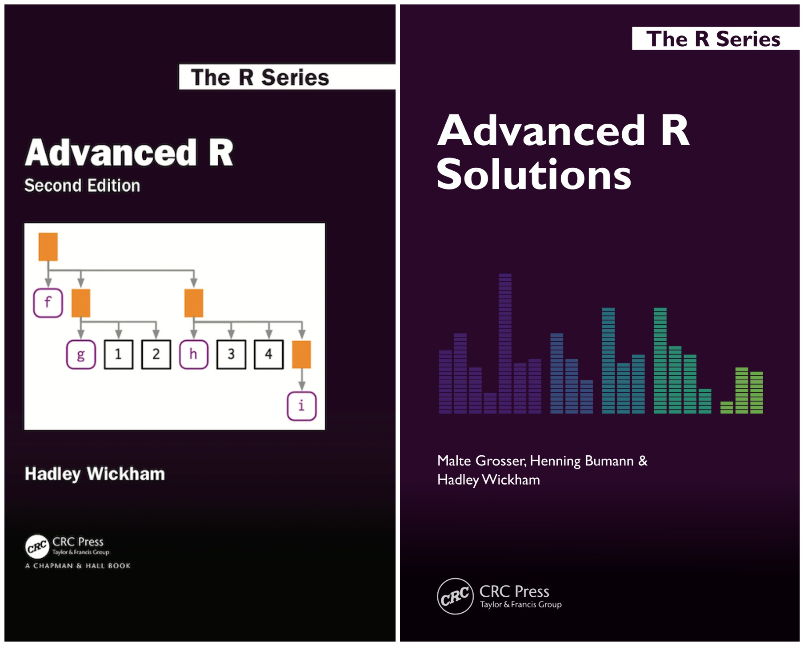

--- 
title: "Advanced R Exercises"
author: "Indrajeet Patil"
date: "2022-02-22"
site: bookdown::bookdown_site
documentclass: book
bibliography: [book.bib, packages.bib]
# url: your book url like https://bookdown.org/yihui/bookdown
cover-image: cover.jpg
description: |
  My solutions to exercises in *Advanced R* book.
biblio-style: apalike
csl: chicago-fullnote-bibliography.csl
---

# About {-}

My solutions to exercises from the _Advanced R_ (2nd Edition) [book](https://adv-r.hadley.nz/). 

Note that you **should be** reading the [official solutions manual](https://advanced-r-solutions.rbind.io/index.html), which has more detailed explanations and are guaranteed to have correct solutions as the original author was also involved in writing these solutions. I provide no such guarantees. 😬

- [My solutions](https://github.com/IndrajeetPatil/Advanced-R-exercises)

- [Official solutions](https://advanced-r-solutions.rbind.io/index.html)
